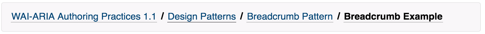

## Accessibility

### Introduction

Implementing accessibility for a component will be done according to the following checklist:
1) **WAI-ARIA role**: a role markup attribute (i.e. role="button") which sets the type of the component. Attaching a role gives assistive technologies information about how to handle the element. Some roles can be achieved automatically by using HTML5 section elements (such as nav, form). For a full listing of roles see [Roles Categorization](https://www.w3.org/TR/wai-aria-1.1/#roles_categorization).
2) **WAI-ARIA state & property**: aria-prefixed markup attribute which sets the state of a component (i.e. "aria-checked" for a checkbox) or a property of it (i.e. aria-label). When combined with a role, it helps the assistive technology convey information to the user. Note that the difference between a state and property is semantic when considering the code implementation - states usually change a lot while properties do not. For a full listing see [States & Properties](https://www.w3.org/TR/wai-aria-1.1/#states_and_properties).
3) **Implementing keyboard support**: a set of keyboard behaviors implemented for the component. For each component type, the w3 organization has provided clear instructions on how to correctly implement them ([Accordion example](https://www.w3.org/TR/wai-aria-practices/#accordion)).
4) **Focus**: in order for an interactive component to be supported by assistive technologies, its ability to gain focus is crucial. It is important for a composite component (i.e. dropdown, radio group) to gain focus through tab and to explicitly set the tabindex on its children. See [Keyboard navigation inside components](https://www.w3.org/TR/wai-aria-practices/#kbd_general_within) for an explanation on the correct use of tabindex in composite components.

### Aria-prefixed Markup Attributes

There are two types of aria-* attributes that need to be supported for a component:

* User supplied attributes - are placed on a component by the developer who uses it in an application. All supported attributes need to be explicitly added in the props interface of the component (as optional) and are copied to the root element of the component using a decorator utility.

    The current relevant attributes for all components are the text content attributes, used in interactive components, components with landmark roles and components with widget roles (see [explanation](https://www.paciellogroup.com/blog/2017/07/short-note-on-aria-label-aria-labelledby-and-aria-describedby/)). The attributes are aria-label, aria-labelledby, and aria-describedby.

* Internal Implementation Attributes - are placed by the component code either on the root or on the relevant children in a composite component. Examples for these attributes are aria-autocomplete, aria-current, aria-checked and so on. The relevant attributes for a component will be added in the spec by the product manager.

### Implementing Accessibility

* Read the documentation for the component in the spec, using <a href="https://www.w3.org/TR/wai-aria-practices/" target="_blank">WAI-ARIA Practices</a> to fill in the details.
* Use the decorator provided by Amir to copy the needed user-supplied attributes
* Verify that you complete the above checklist (all 4 items are probably applicable to all components).
* Verify that you use the general a11y contract test and write specific tests per component.

    Note:
    * When a component is not listed in the w3 draft, implement accessibility traits according to a similar component.
    * There is no need to implement a corresponding hidden native HTML element in a component when correctly implementing accessibility.

### Sample Implementation

The following is a partial BreadCrumbs component to show accessibility implementation:



```
// Added text attributes to the interface
export interface BreadCrumbsProps {
    children?: any;
    className?: string;
    style?: string;
    ariaLabel?: string;
    ariaLabelledby?: string;
    ariaDescribedBy?: string;
}

export interface BreadCrumbProps {
    className?: string;
    style?: string;
    active?: boolean;
    label: string;
    onClick?: React.EventHandler<HTMLElement>;
}

@ARIA(ariaLabel, ariaLabelledby, ariaDescribedBy)
export class BreadCrumbs extends React.Component<BreadCrumbsProps, {}>{
    render(){
        <nav class="root"> // navigation landmark region
            <ol>
                {this.props.children}
            </ol>
        </nav>
    }
}

const BreadCrumb: React.SFC<BreadCrumbProps> = ({label, active, style, className, onClick}) => {
    return (
        <li>
            <a aria-current={active ? 'page' : null}>{label}</a>
        </li>
    );
}

// Usage

<BreadCrumbs aria-label="my breadcrumbs" aria-describedby="My great breadcrumbs">
    <BreadCrumb onClick={() => console.log('first')} label="Authoring Practice" />
    <BreadCrumb onClick={() => console.log('second')} label="Cats" active={true} />
</BreadCrumbs>

```

## Controlled component

We follow the pattern of [controlled components.](https://facebook.github.io/react/docs/forms.html#controlled-components)
It is considered best-practise, as it provides clean and simple guidelines and integrates well
with forms and form validation patterns. We are aware of the shortcomings (especially the fact
that if the component is not bound to some kind of parent state, it seems to be "not working".)
and a generic solution for automagical "uncontrolled" use is under development.
