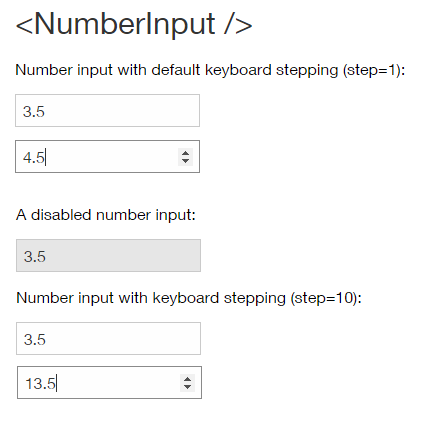

# NumberInput Component

**NumberInput** is a form-element component that enables inputting values of the type number. The values can be confined to a specific range, and the "step" (or increment) between the values can be defined.



The NumberInput component improves upon the native `<input type="number">`:

* provides ability to customize the stepper arrows design
* provides a common React+Typescript API
* works out the kinks of native implementations

## Component API

> tbd :: add method definition

### Component Props

| name        | type                                  | defaultValue | isRequired | description                              |
| ----------- | ------------------------------------- | ------------ | ---------- | ---------------------------------------- |
| value       | number |              | yes        | Used to set and change the value of the input |
| placeholder | string  |              |            | Text to display if the value is null.     |
| min         | number  | 1            |            |                                          |
| max         | number  | 100          |            |                                          |
| step        | number  | 1            |            |                                          |
| required    | boolean    | false        |            | Whether or not filling the value is required in a form. |
| disabled    | boolean    | false        |            | If true, the component will not be interactive. |
| label       | string  |              |            | Text to display in accessibility mode.   |
| name        | string  |              |            | The name of the component. Behaves like the name attribute of an input element. |
| onChange    | function |              | yes        | Callback function that is fired when the component's value is changed. Signature:function(event: object, newValue: number) => voidevent: KeyDown event targeting the slider. newValue: The new value of the slider. |
| prefix      | node    | null         |            | Allows to prepend HTML content or a React component. |
| suffix      | node    | null         |            | Allows to append HTML content or a React component. |
| rtl         | boolean    | false     |            | Makes the component RTL                  |

### Code Example

```jsx
//TODO: code guys - fix code example!
import * as React from 'react';
import { NumberInput } from './components/NumberInput';
import style from './style.st.css'; // link to Style file - see examples of style files below

export class ComponentsDemo extends React.Component<{}, {}>{
    constructor() {
        super();
    }

    render() {
        return <NumberInput 
        		 value="{this.state.numberInputValue}"
                 onChange={/* something */} 
                 />;
    }
}
```

## Style API

### Subcomponents (pseudo elements)

| selector   | description                              | type                                     |
| ---------- | ---------------------------------------- | ---------------------------------------- |
| ::stepper | Allows you to style the stepper arrows. | Style the internal `<Stepper/>` component. This component exposes some internal styles. Consult the (Link to Documentation) to see which subcomponents and states are available. |

### Custom CSS States (pseudo-classes)

| state                          | description                              |
| ------------------------------ | ---------------------------------------- |
| :disabled           | Allows you to style the slider when it's disabled. |
| :hover, :focus, etc | Standard CSS pseudo classes.              |


### Style Code Example

```css
@import * from './components/NumberInput'; /* TODO: fix the correct syntax */
/* style.st.css 
Adding rules here (which may be shared between different components) allows us to 	    override specific parts; or even change the whole theme
*/

NumberInput {
  background: #bada55;
}

NumberInput::stepper {
  background-color: transparent;
}

NumberInput::stepper::prev, NumberInput::stepper::next {
  color:blue;
}

NumberInput::stepper::prev:hover, NumberInput::stepper::next:hover {
  background-color:lightblue;
}
```
