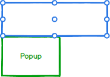
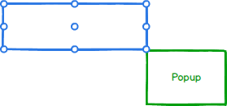
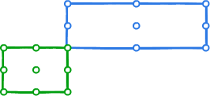

# Popup Component

**Popup** is a component that pops up content and positions it next to an anchor element. A Popup is overlayed over the page. A Popup is a temporary view and only one popup can be rendered on the page at one time.

## Position and Collision

### Position - The point and pivot for popup to anchor alignment

  * Anchor Position - Horizontal:
    * **left** - the left point of the anchor element
    * **center** - the center point of the anchor element
    * **right** - the right point of the anchor element
  * Anchor Position - Vertical:
    * **top** - the top point of the anchor element
    * **center** - the center point of the anchor element
    * **bottom** - the bottom point of the anchor element
  * Popup Position - Horizontal:
    * **left** - the left point of the popup element
    * **center** - the center point of the popup element
    * **right** - the right point of the popup element
  * Popup Position - Vertical:
    * **top** - the top point of the popup element
    * **center** - the center point of the popup element
    * **bottom** - the bottom point of the popup element

### Positioning

* Points of reference

    There are 9 points on the anchor and popup element to be used as reference to where the popup will open. The chosen anchor point will be the location on which the popup will pivot. The popup point will be the location on the popup element which will be anchored to the point on the anchor element.

    

* Anchor default

    

  * Anchor { vertical: 'bottom', horizontal: 'left'}
  * Popup { vertical: 'top', horizontal: 'left'}

* Anchor sample position

    

  * Anchor { vertical: 'bottom', horizontal: 'right'}
  * Popup { vertical: 'top', horizontal: 'left'}

* Anchor sample position

    

  * Anchor { vertical: 'center', horizontal: 'center'}
  * Popup { vertical: 'top', horizontal: 'left'}

* Popup sample position

    

  * Anchor { vertical: 'bottom', horizontal: 'left'}
  * Popup { vertical: 'bottom', horizontal: 'left'}

* Popup sample position

    

  * Anchor { vertical: 'bottom', horizontal: 'left'}
  * Popup { vertical: 'top, horizontal: 'right}

* Collision - The behavior of the popup when viewport limitations collide with the the position property. Applies to both vertical and horizontal collisions.
	
	* **flip** - Checks if the opposite side of the anchor has more space and if so flips it.
	* **fit** - Shifts the popup away from the edge of the viewport until it has enough space or reaches other side of viewport
	* **flipfit** - Applies flip logic and then fit logic
	* **none** - no collision detection

## Component API

> tbd :: add method definition

### Component Props

| name        | type                                  | defaultValue | isRequired | description                              |
| ----------- | ------------------------------------- | ------------ | ---------- | ---------------------------------------- |
| anchor | Node \| Point | none | Yes | The element to be used as an anchor for the popup (will open next to it). |
| open | boolean | false | no | Whether to show or hide the Popup |
| onOpen | Triggered when the popup is opened | NOOP | no | Triggered when the popup is shown. |
| onClose | Triggered when popup is closed | NOOP | no | Triggered when the popup is closed. |

The following props should be placed in an IPopupProps interface since they will need to be passed from higher order components.

| name        | type                                  | defaultValue&nbsp;&nbsp;&nbsp;&nbsp;&nbsp;&nbsp;&nbsp;&nbsp; | isRequired | description                              |
| --- | --- | --- | --- | --- |
| anchorPosition | IPositionPoint | { vertical: 'bottom', horizontal: 'left' } | no | The point on the anchor element to which the popupPosition will attach to |
| popupPosition | IPositionPoint | { vertical: 'top', horizontal: 'left' } | no | The point from which the popupPosition will pivot |
| collision | ICollision| { vertical: 'none', horizontal: 'none' } | No | Specify the collision behavior of the component. |
| syncWidth	| boolean |	true | no | If true, the width of the popup will be set to the width of the anchor. If false, it will be set to the width of the children. |
| maxHeight | number | 500 | no | The max height in pixels of the popup. If set to 0, the property will be ignored and the compenent receives height from its content. |

### Code Example

Given a popup is attached to an element, when it's rendered it should appear on the screen.

    ```
    <div ref="anchor">Anchor</div>
    <Popup anchor={this.refs.anchor}>
        <label>Popup Header</label>
        <div>Popup Body</div>
    </Popup>
    ```

## Input Handling

### Keyboard

key | action
--- | ---
Esc | Closes the popup.

### Mouse

event | action
--- | ---
click outside | Closes the popup.

## Style API

> TBD