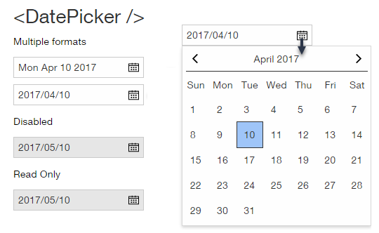

# Date Picker Component

**DatePicker** is a form element that is used to select a single date as input.

## Elements

**DatePicker** has the following elements (subcomponents):

* Input component containing an icon component.
* Popup component which displays the calendar view.

## API

### Properties

| name | type | default | required | description |
| --- | --- | --- | --- | --- |
| openOnFocus | function | false | no  | Whether the Calendar View is opened when the input component gains focus. |
| autoFocus | boolean |   | no | Automatically focused when a page is loaded.
| disabled | boolean | false | no  | Whether the DatePicker is disabled. |
| readonly | boolean | false | no   | Whether the DatePicker is readonly. |
| tabIndex | number | 0 | no   | Position in which component participates in sequential keyboard navigation. |
| placeholder | string |   | no  | Text to display if `value` is `null`. |
| firstDayOfWeek | number | 1 (Monday) | no   | Accepts the values 0 through 6. |
| minDate | Date (ISO&nbsp;8601) |     | no   | Used to set the minimal date shown in the Calendar View and accepted in the input. |
| maxDate | Date (ISO&nbsp;8601) |     | no   | Used to set the maximum date shown in the Calendar View and accepted in the input. |
| value |  Date (ISO&nbsp;8601) *or* empty string | current date | no   | Sets the selected date. A `Date` can be set or an empty string. |
| inputFormat | string | "YYYY-MM-DD" |    | The format used to parse the input. |
| displayFormat |    | toLocaleDateString (locale dependent) |    | locale options |
| disabledDates | Date\[]&nbsp;(ISO&nbsp;8601) |    |    | List of dates that are disabled (cannot be selected) in the Calendar View. |
| disableWeekends | boolean | false |    | Weekends cannot be selected in the Calendar View. |
| weekendDays | number[] | [0,6] |    | List of days defined as the weekend. |
| locale |    |   |   | user agent locale |   |
| dayLabels | string[]   | English day labels |    | User may enter different labels. |
| monthLabels | string[]   | English month labels |    | User may enter different labels. |
| calendarIcon |   |    |    | Replace the calendar SVG with another. |
| prevIcon |   |    |    | Replace the calendar prev icon SVG with another. |
| nextIcon |   |    |    | Replace the calendar next icon SVG with another. |
| showPrevNextDays | boolean | false |    | Show the days of the previous and next months in the calendar display. |
| showDivider | boolean | true |   | Whether to show the divider in the Calendar View. |

### Exports

| export | description |
| --- | --- |
| getDisplayValue(value, options) | Formats the value according to options.

### Events

| name | description |
| --- | --- |
| onFocus | Triggered when the DatePicker gets focus. |
| onChange | Triggered when a new date has been selected in the calendar view. |
| onBlur | Triggered when focus is lost from the input component. |
| onClose | Triggered when the Calendar View is closed. |
| onOpen | Triggered when the Calendar View is opened. |

### Code Example

> TBD

## Style API

### Style Classes

| name | description |
| --- | --- |
| inputStyle | Used for the input component |
| iconStyle | Used for the icon component |
| calendarViewStyle | Used for the Calendar View |
| itemStyle | For an item in the Calendar View |
| calendarTitleStyle | For changing the look of the month/year title |
| calendarIconStyle | For changing the icons style |
| calendarDividerStyle | Control appearance of the title divider |

### Subcomponents (pseudo elements)

### Custom CSS States (pseudo-classes)

### Style Code Example

> TBD