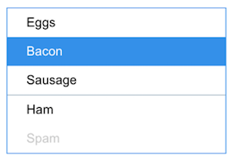

# SelectionList Component

**SelectionList** is a component which allows the user to take action by choosing an item from a list. **SelectionList** will usually be displayed inside of a **Popup** component.

## Elements

## Component API

> tbd :: add method definition

### Component Props

| name        | type                                  | default | required | description                              |
| ----------- | ------------------------------------- | ------------ | ---------- | ---------------------------------------- |
| value | string *or* Array\<string> | null | no | IDs of the selected items. |
| onChange | (value:&nbsp;string)&nbsp;=>&nbsp;void | NOP | no | Triggered when an item is selected in the list. |
| multiple | boolean | false | no | Whether the selection list supports a single or multiple selections. When true, adds `aria-multiselectable='true'` on the root element.
| orientation | enum | Vertical | no | The orientation is used mostly for assistive technologies. Changing to Horizontal will change the behavior of keyboard navigation and adds `aria-orientation='horizontal'` to the root. |
| typeAhead | boolean | false | no | Enables keyboard type-ahead. |
| children | any | null | no | Children to be rendered in the list. |

##### The following props should be placed in an OptionList interface since they will need to be passed from higher order components.

| name        | type                                  | default | required | description                              |
| ----------- | ------------------------------------- | ------------ | ---------- | ---------------------------------------- |
| dataSource | SelectionItem[] | [] | no | A few options are accepted as a datasource. |
| dataSchema | object | { id: 'id', displayText:&nbsp;'displayText'&nbsp;} | no | Maps the object properties to the relevant properties required by the ItemRenderer. |
| itemRenderer | Component | default itemRenderer | no | Renders an item in the list. |

> Note: If both datasource and children are present, the children are rendered first and then the dataSource items.

### Input Handling

Keyboard and mouse navigation have different styling behaviors.

#### Keyboard Navigation

key | action
--- | ---
Home | Highlights the first item in the SelectionList.
End | Highlights the last item in the SelectionList.
Up | Highlights previous item.
Down | Highlights next item.
Enter | Selects current highlighted item.
Space | Toggles the selected state of the focused option (multi-select) or selects the option (single select).

Non-selectable items (items without `data-value` on the root element) are skipped during the keyboard traversal.

##### When `Type-ahead` is enabled, it applies to all character and number keys (ASCII ordering):

Upon input, focus moves to the next item with a name that starts with the typed character.
Upon multiple input in rapid succession (with a small delay after last input before moving focus), the focus moves to the next item that starts with the characters typed.

#### Mouse

event | action
--- | ---
Left-click | Selects an item.
Mouse over | Gives mouse hover to an item.

### Accessibility

#### Roles

* **Root Role:** listbox (identifies the focusable element that has listbox behaviors and contains listbox options)
* **Child role:** option (identifies a selectable element)

#### Aria

* **aria-activedescendant="ID_REF":** Applied to the element with the listbox role, tells assistive technologies which of the options, if any, is visually indicated as having keyboard focus. `idref`, refers to the ID of the focused option in the list. When navigation keys, such as `Down Arrow`, are pressed, JavaScript changes the value. When the listbox is empty, then `aria-activedescendant=""`.
* **aria-selected="true":** Applied to elements with role option that are visually styled as selected to inform assistive technologies that the options are selected. When multiple selections are allowed, this attribute is applied to all selected items.

#### Focus

* When **tab** moves the focus into the listbox:
  * If none of the options is selected, focus is set to first option.
  * If an option is selected, focus moves to the first selected option.

### Code Example

> TBD

## Style API

### Subcomponents (pseudo elements)

selector   | description
--- | ---
item | Selector applying to items in the list.

### Custom CSS States (pseudo-classes)

The following states apply to the items. They are passed as corresponding props of the ItemRenderer and added as an attribute with the prefix `data-`.

state | type | default | description
--- | --- | --- | ---
selected | boolean | false | Whether the item is selected.
focused | boolean | false | Whether the item is focused by keyboard navigation.
hidden | boolean | false | Whether the item appears in the list.
disabled | boolean | false | Whether the item is enabled for selection or not.

The only exception is `hover` which doesn't correspond to an attribute. Rather, it should be styled with the `:hover` CSS pseudoselector.

### Style Code Example

> TBD