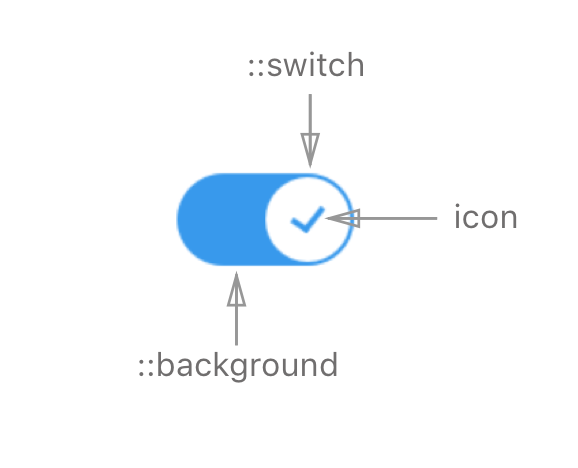
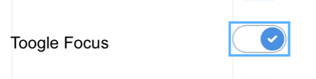
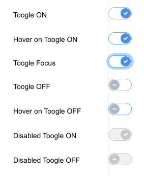

# Toggle Component

**Toggle** is a component representing a physical switch that allows users to turn things on or off, like a light switch. Use **Toggle** to present users with two mutually exclusive options (such as on/off, black/white, yes/no), where choosing an option provides immediate results.

## Elements



**Toggle** consists of:  **switch**, **icon**, and **background**. The **switch** moves across the **background** in order to set the value to On/Off, and **icon** indicates the state of the value.

## API

### Component Props

| name        | type                                  | defaultValue | isRequired | description                              |
| ----------- | ------------------------------------- | ------------ | ---------- | ---------------------------------------- |
| checked  | boolean   | false        |            |                                          |
| onChange | function   |              |            | Callback function when user changes the value of the component. |
| required | boolean   | false        |            | Whether or not filling the value is required in a form. |
| name     | string |              |            | The name of the toggle. Behaves like the name attribute of an input element. |
| disabled | boolean   | false        |            | If `true`, the toggle will not be interactive. |
| label    | string |              |            | Text to display in accessibility mode.    |
| error    | boolean   | false        |            | Sets the `:error` CSS state on the `<toggle/>`. |
| rtl      | boolean   | false        |            | Makes the component RTL.
  
### Input Handling

#### Keyboard

| key        | action                                   |
| ----------- | ---------------------------------------- |
| tab         | moves to next element                    |
| shift + tab | moves to previous element                |
| enter       | -                                        |
| space       | switch toggle to On / Off correspondingly (if toggle is in focus) |
| esc         | removes focus (if in focus)              |

**RTL** orientation does not change keyboard behavior

#### Mouse

| event                 | action                                   | note                                     |
| --------------------- | ---------------------------------------- | ---------------------------------------- |
| hover                 | highlight toggle (both switch & background) | Event triggers on both switch & background hover |
| click (on switch)     | switch toggle to On / Off correspondingly | Event triggers on Mouse Release event    |
| click (on background) | switch toggle to On / Off correspondingly | Event triggers on Mouse Release event    |

#### Touch

| event               | action                                   | note                            |
| ------------------- | ---------------------------------------- | ------------------------------- |
| tap (on handle)     | switch toggle to On / Off correspondingly | Event triggers on Touch Release |
| tap (on background) | switch toggle to On / Off correspondingly | Event triggers on Touch Release |

### Accessibility

#### Keyboard

For now accessibility for toggle is covered with keyboard behavior and label prop that shows text hint.

#### Focus

Toggle should have a focus state. Focus state looks like a square border around the entire component.



### Code Example

```jsx
//TODO: code guys - fix code example!
import * as React from 'react';
import { Toggle } from './components/toggle';
import style from './style.st.css'; // link to Style file - see examples of style files below

type State = {
  toggleValue: boolean
}

export class ComponentsDemo extends React.Component<{}, State>{
  	state: State,
    
    constructor() {
        super();
    },
          
     render() {
        return <toggle
        		 value="{this.state.toggleValue}"
                 onChange={newValue => this.setState({toggleValue: newValue})}
               />;
    }
}
```

## Style API

### Subcomponents (pseudo elements)

| selector   | description                              | type                                     |
| ---------- | ---------------------------------------- | ---------------------------------------- |
| ::switch     | Allows styling the switch of the toggle. | HTML Element - This subcomponent has no subcomponents of its own. |

### Custom CSS States (pseudo-classes)

| state                          | description                              |
| ------------------------------ | ---------------------------------------- |
| :error                         | Style the component on error, i.e. when the `error` prop is true. |
| :checked                       | Style the toggle element in checked state. |
| :hover, :focus, :disabled, etc | Standard CSS states                       |

### Visual States

| State          | Description                         |
| -------------- | ----------------------------------- |
| On             | Toggle is on / checked              |
| Off            | Toggle is off / unchecked           |
| On + hover     | Toggle is on / checked & hovered    |
| Off + hover    | Toggle is off / unchecked & hovered |
| On + disabled  | Toggle is on & disabled             |
| Off + disabled | Toggle is off & disabled            |



### Style Code Example

```css
@import * from './components/toggle'; /* TODO: fix the correct syntax */
/* style.st.css 
Adding rules here (which may be shared between different components) allows us to 	    override specific parts; or even change the whole theme
*/

Toggle {
  background-color: grey; /* styles the toggle in unchecked state */
}

Toggle:checked {
  background-color: blue; /* styles the togle in checked state */
}

Toggle::switch {
  background-color: white; /* styles the switch bg */
}

Toggle::switch {
    background-image: url('unckecked-icon.svg'); /* adds icon for unchecked state */
}
Toggle:checked::switch {
    background-image: url('ckecked-icon.svg'); /* adds icon for checked state */
}

```
