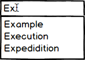

# AutoComplete Component Specification

* [Description](#description)
* [Elements](#elements)
* [Properties](#properties)
* [Styles](#styles)
* [Accessibility](#accessibility)
* [Behavior](#behavior)
* [Examples](#examples)
* [Design](#design)

## Description
Part of the selectionList family. This is a dropdown menu which incorporates free text to filter items from the menu list.

## Elements

## Properties

AutoComplete uses the following interfaces:

* [Selectionlist component properties](../selectionlist/selectionlist.md)

* [Dropdown component properties](../dropdown/dropdowns.md)

The AutoComplete is an extension of an input field of type text, thereby expanding its props.

| Name | Type | Default | Required | Description |
| -- | -- | -- | -- | -- |
| allowFreeText | boolean | true | no | Allows user to enter text which does not appear in the suggestion list |
| noSuggestionsNotice | string \| func | "No Results" | no | Message to show in popup when there are no suggestions for the user. If function used then it renders an element in the popup |
| value | string | null | no | id of the selected item |
| filter | func | prefix search function | no | Function used to filter results according to input |
| minCharacters | number | 0 | no | Number of characters required in input before suggestions appear |
| maxShownSuggestions | number | 0 (unlimited) | Maximum number of results to show for a filter match |

## Styles

See [SelectionList](../selectionlist/selectionlist.md) for further styles. The following are relevant for AutoComplete:

| Name | Description |
| -- | -- |
| input | The dropdown input container |
| list | The list of possible results |

### States

| Name | Description |
| -- | -- |
| active | self explanatory |
| focus | self explanatory |
| disabled | self explanatory |
| readonly | self explanatory |
| hover | self explanatory |

## Accessibility

Based on the old w3 [spec](https://rawgit.com/w3c/aria-practices/master/aria-practices-DeletedSectionsArchive.html#combobox).

#### Roles

* Root role - *combobox*
* Input role - *textbox*

#### Aria Attributes

* aria-expanded=true if the popup is open, otherwise aria-expanded=false. Placed on the root element.
* aria-haspopup=true on the root element
* User provided props: aria-label, aria-labelledby, aria-describedby copied to root
* aria-autocomplete=list on the input element (the one with the *textbox* role)
* aria-selected=true on the option selected in the SelectionList

#### Focus

The autocomplete manages 2 focus states, one for the input element, the *real* focus, and one in the list (seen through CSS highlighting).

* Focus resides on the input element (user sees a caret in the input element). When a character is entered, focus stays on the input element, however a focus state appears on the SelectionList in the following manner:
    * The first item that is matched is highlighted. If no such item exists then the focus is only on the input.
 

## Behavior

### Keyboard Navigation

Studied examples from [React Widgets](http://jquense.github.io/react-widgets/docs/#/dropdownlist?_k=p7z1pg) and [Kendo](http://demos.telerik.com/kendo-ui/dropdownlist/keyboard-navigation) which exhibit excellent accessibility features and are comparable to the w3 specs. If the details below are not clear, look at these examples to verify you understand the required behavior.

* <kbd style="display: inline-block; padding: .1em .3em; color: #555; vertical-align: middle; background-color: #fcfcfc; border: solid 1px #ccc;border-bottom-color: #bbb;border-radius: .2em;box-shadow: inset 0 -1px 0 #bbb;">alt</kbd> + <kbd style="display: inline-block; padding: .1em .3em; color: #555; vertical-align: middle; background-color: #fcfcfc; border: solid 1px #ccc;border-bottom-color: #bbb;border-radius: .2em;box-shadow: inset 0 -1px 0 #bbb;">down</kbd> -> Opens the popup
* <kbd style="display: inline-block; padding: .1em .3em; color: #555; vertical-align: middle; background-color: #fcfcfc; border: solid 1px #ccc;border-bottom-color: #bbb;border-radius: .2em;box-shadow: inset 0 -1px 0 #bbb;">alt</kbd>  + <kbd style="display: inline-block; padding: .1em .3em; color: #555; vertical-align: middle; background-color: #fcfcfc; border: solid 1px #ccc;border-bottom-color: #bbb;border-radius: .2em;box-shadow: inset 0 -1px 0 #bbb;">up</kbd> -> Closes the popup (when opened of course)
* <kbd style="display: inline-block; padding: .1em .3em; color: #555; vertical-align: middle; background-color: #fcfcfc; border: solid 1px #ccc;border-bottom-color: #bbb;border-radius: .2em;box-shadow: inset 0 -1px 0 #bbb;">down</kbd> -> When the popup is closed changes selection to the next item in the list. If the current selected item is not valid, the first item in the list is selected.
* <kbd style="display: inline-block; padding: .1em .3em; color: #555; vertical-align: middle; background-color: #fcfcfc; border: solid 1px #ccc;border-bottom-color: #bbb;border-radius: .2em;box-shadow: inset 0 -1px 0 #bbb;">up</kbd> -> When the popup is closed changes selection to the previous item in the list if there is a valid selected item. If there is no valid selection (the input container being empty is such a case) then nothing happens.
* <kbd style="display: inline-block; padding: .1em .3em; color: #555; vertical-align: middle; background-color: #fcfcfc; border: solid 1px #ccc;border-bottom-color: #bbb;border-radius: .2em;box-shadow: inset 0 -1px 0 #bbb;">left</kbd> -> Moves the caret to the left
* <kbd style="display: inline-block; padding: .1em .3em; color: #555; vertical-align: middle; background-color: #fcfcfc; border: solid 1px #ccc;border-bottom-color: #bbb;border-radius: .2em;box-shadow: inset 0 -1px 0 #bbb;">right</kbd> -> Moves the caret to the right
* <kbd style="display: inline-block; padding: .1em .3em; color: #555; vertical-align: middle; background-color: #fcfcfc; border: solid 1px #ccc;border-bottom-color: #bbb;border-radius: .2em;box-shadow: inset 0 -1px 0 #bbb;">Esc</kbd> -> Closes dropdown if opened. Focus returns to the input container.
* <kbd style="display: inline-block; padding: .1em .3em; color: #555; vertical-align: middle; background-color: #fcfcfc; border: solid 1px #ccc;border-bottom-color: #bbb;border-radius: .2em;box-shadow: inset 0 -1px 0 #bbb;">Home</kbd> -> When the popup is open, selects the first item in the filtered SelectionList
* <kbd style="display: inline-block; padding: .1em .3em; color: #555; vertical-align: middle; background-color: #fcfcfc; border: solid 1px #ccc;border-bottom-color: #bbb;border-radius: .2em;box-shadow: inset 0 -1px 0 #bbb;">End</kbd> -> When the popup is open selects the last item in the filtered SelectionList
* Any other characters are entered in the input element, filtering the list of available options or showing the no suggestions element when relevant (see autocomplete focus section for details).

The following behaviors are implemented in the SelectionList (relevant when a popup is opened and focus is in the SelectionList:

* <kbd style="display: inline-block; padding: .1em .3em; color: #555; vertical-align: middle; background-color: #fcfcfc; border: solid 1px #ccc;border-bottom-color: #bbb;border-radius: .2em;box-shadow: inset 0 -1px 0 #bbb;">Home</kbd> -> highlights the first item in the SelectionList
* <kbd style="display: inline-block; padding: .1em .3em; color: #555; vertical-align: middle; background-color: #fcfcfc; border: solid 1px #ccc;border-bottom-color: #bbb;border-radius: .2em;box-shadow: inset 0 -1px 0 #bbb;">End</kbd> -> highlights the last item in the SelectionList
* <kbd style="display: inline-block; padding: .1em .3em; color: #555; vertical-align: middle; background-color: #fcfcfc; border: solid 1px #ccc;border-bottom-color: #bbb;border-radius: .2em;box-shadow: inset 0 -1px 0 #bbb;">down</kbd> -> Highlights the next item in the list.
* <kbd style="display: inline-block; padding: .1em .3em; color: #555; vertical-align: middle; background-color: #fcfcfc; border: solid 1px #ccc;border-bottom-color: #bbb;border-radius: .2em;box-shadow: inset 0 -1px 0 #bbb;">up</kbd> -> Highlights the previous item in the list.
* <kbd style="display: inline-block; padding: .1em .3em; color: #555; vertical-align: middle; background-color: #fcfcfc; border: solid 1px #ccc;border-bottom-color: #bbb;border-radius: .2em;box-shadow: inset 0 -1px 0 #bbb;">Enter</kbd> -> Selects the highlighted item, closes the popup.
* <kbd style="display: inline-block; padding: .1em .3em; color: #555; vertical-align: middle; background-color: #fcfcfc; border: solid 1px #ccc;border-bottom-color: #bbb;border-radius: .2em;box-shadow: inset 0 -1px 0 #bbb;">Tab</kbd> -> Moves focus to the next focusable component and popup is closed.

### Mouse Handling

* Click outside:
  * When popup is closed, focus is lost
  * When popup is opened, focus is lost and popup is closed
* Click on an option (SelectionList) - option is selected and popup is closed

### Touch Handling

Same as click behavior, apart from touchdown behavior which will be implemented in the next iteration.

## Examples

TBD

## Design

See in [zeplin](https://app.zeplin.io/project/590ed391cb8bde641789e1cb/screen/5964cdbfd24b9b50926c8ed0).

