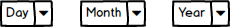

# BirthdayPicker Components Specification

* [Definition](#definition)
* [Elements](#elements)
* [Properties](#properties)
* [Styles](#styles)
* [Accessibility](#accessibility)
* [Behavior](#behavior)
* [Examples](#examples)
* [Design](#design)

## Definition

The birthday picker is a three-dropdown component allowing the user to choose a valid date of birth.

## Elements

The picker has 3 dropdowns, the order of which can be determined by the user.

## Properties

| Name | Type | Default | Required | Description |
| -- | -- | -- | -- | -- |
| disabled | boolean | false | no | disables all input elements |
| autoFocus | boolean | false | no | sets focus to leftmost element |
| readonly | boolean | false | no | Sets dropdowns to readonly| tabIndex | number | null | no | Tab order of the component |
| value | date | null | no | The value of the component (has to be a valid date)
| onChange | func | Just returns the date | no | Triggered when a legal date is entered |
| maxAge | number | 110 | no | The maximum age the user is allowed to choose |
| minAge | number | 0 | no | The minimum age the user is allowed to choose |
| order | enum | MonthDayYear | no | Three values are available: MonthDayYear, DayMonthYear and YearMonthDay | Sets the order the components are rendered in the UI, can be overridden by CSS |

Regarding globalization and localization, we will be adding specs in a future stage.

## Styles

| Name | Description |
| -- | -- |
| root | The main element of the birthday picker, the place to decide on the layout of the dropdowns, spacing, etc.|
| dayPicker | The dropdown for the day |
| monthPicker | The dropdown for the month |
| yearPicker | The dropdown for the year |

### States

| Name | Description |
| -- | -- |
| active | self explanatory |
| focus | self explanatory |
| disabled | self explanatory |
| readonly | Relevant for AutoComplete and MultiSelect
| hover | self explanatory |

## Accessibility

TBD

## Behavior

### Keyboard Handling

* 'tab' key -> moves focus between components from left to right (unless rtl in which it is reversed). Tab from last element will lose focus from the component.

## Examples

Already done.

## Design

See dropdowns on Zeplin.
