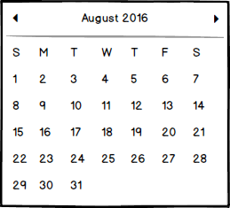
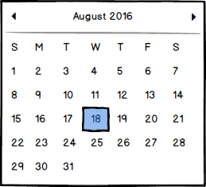
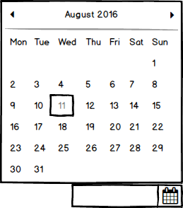

# DatePicker Components Specification

urik9/datepickerupdate
* [Description](#description)
* [Elements](#elements)
* [Properties](#properties)
* [Styles](#styles)
* [Accessibility](#accessibility)
* [Behavior](#behavior)
* [Examples](#examples)
* [Design](#design)

## Description
A date picker allows users to select dates by using an input or a popup calendar.

## Elements
* Input Component with Icon Component
* Calendar View for selecting dates


UI presentation of Calendar View behaviors:

* *Nothing selected or focused*



* *Same date selected and focused*



* *Current day focused, not selected*


* *Selected and focused on different days* - 18th selected, 20th focused


* *Selected, focused and current on different days* - 18th selected, 20th current day, 11th focused


* *Changing the first day of the week* - In this example the first day of the week is set to Monday.


* *Show prev/next days* - the days are not clickable, just shown and considered disabled


* *Disable Weekends* - the days are not clickable, just shown and considered disabled


* *Disable specific dates* - the days are not clickable, just shown and considered disabled


* *Calendar View open - Bottom Left*


* *Calendar View open - Bottom Right*


* *Calendar View open - Top Left*


* *Calendar View open - Top Right*



## Properties

DatePicker extends formInputProps

| Name | Type | Default| Required | Description |
| --- | --- | --- | --- | --- |
| openOnFocus | boolean | false | no | Whether the Calendar View is opened when the input component gains focus. |
| inputPlaceholder | string | empty string | no |Placeholder text for the input |
| firstDayOfWeek | number | Defaults to 0 (Sunday), accepts 0 - 6 | no | define starting day of the week |
| minDate | ISO 8601 date | empty date | no | Used to set the minimal date shown in the Calendar View and accepted in the input |
| maxDate | ISO 8601 date | empty date | no | Used to set the maximum date shown in the Calendar View and accepted in the input |
| inputFormat | string | browser implementation of javascript date object constructor | no | The format used to parse the input | 
| disabledDates | Array [ISO 8601 date] | empty array | | List of ISO 8601 dates that are disabled (cannot be selected) in the Calendar View |
| disableWeekends | boolean | false | no | Weekends cannot be selected in the Calendar View |
| weekendDays | number | 1 | no |Defaults to [0,6], list of days set as weekend |
| locale | string | user agent locale | no | Locale
| dayLabels | Array[String] | english weekdays | no | Default in English, user may enter different labels (maybe can be done with code, in which case we change implementation - R&D)|
| monthLabels | Array[String] | english month names| no | Default in English, user may enter different labels (maybe can be done with code, in which case we change implementation- R&D)|
| showPrevNextDays | boolean | true | no | Defaults to false, in the calendar month show previous and next days. |

## Styles

### Subcomponents (psuedo elemnts)
| Name | Description |
| --- | --- |
| input | Used for the input component |
| icon| Used for the icon component |
| calendarTitle | For changing the look of the month/year title |
| calendarView | Used for the Calendar View |
| fullYearView | Used in full year view (time range extension) |
| decadeView | Used in decade view (time range extension) |

### States
| Name | Description |
| --- | --- |
| Error | style component on error |
| Focus, Disabled, Hover, etc | Standard style |


## Elements
* Input with Calendar Icon
* Calendar
* Expand Scope button


## Accessibility

### Role

* Root role - *combobox*
* Input element role - *textbox*
* Calendar role - *group*
* Each day label has the role *columnheader*
* Each day cell has the role *gridcell*

### Aria Attributes

* aria-expanded=true if the popup is open, otherwise aria-expanded=false. Placed on the root element.
* aria-haspopup=true on the root element
* aria-live=assertive on the section encompassing the header date. This means that when the month is changed, the assistive technology will proclaim the new month/year combination to the the user.
* grid should be labelled
* aria-label, aria-describedby, aria-labelledby copied to the root element
* aria-selected=true is placed on the day selected by the user.
* Inside the calendar, each day is required to have an aria-label which includes the day of the week, and specific date. The label should be constructed according to the locale format including this information.

A calendar view aria example:

```html
<div class="DatePicker2408660667💠dropdown" role="group">
	<div class="DatePicker2408660667💠header">
		<span class="DatePicker2408660667💠arrowWrapper DatePicker2408660667💠arrowWrapperPrev">
			<i class="DatePicker2408660667💠headerArrow DatePicker2408660667💠headerArrowPrev"></i>
		</span>
		<span class="DatePicker2408660667💠headerDate" aria-live="assertive">
			<span data-automation-id="MONTH_NAME">August</span>
			<span data-automation-id="YEAR">2017</span>
		</span>
		<span class="DatePicker2408660667💠arrowWrapper DatePicker2408660667💠arrowWrapperNext">
			<i class="DatePicker2408660667💠headerArrow DatePicker2408660667💠headerArrowNext"></i>
		</span>
	</div>
	<div role="grid" class="DatePicker2408660667💠calendar">
        <span role="row">
            <span role="columnheader">Sun</span>
            <span role="columnheader">Mon</span>
            <span role="columnheader">Tue</span>
            <span role="columnheader">Wed</span>
            <span role="columnheader">Thu</span>
            <span role="columnheader">Fri</span>
            <span role="columnheader">Sat</span>
        </span>
        <span role="row">
            <span role="gridcell" data-datepicker2408660667-inactive="true" aria-label="Sunday, 30 July 2017">30</span>
            <span role="gridcell" data-datepicker2408660667-inactive="true" aria-label="Monday, 31 July 2017">31</span>
            <span role="gridcell" data-automation-id=" DAY_1" aria-label="Tuesday, 1 August 2017">1</span>
            <span role="gridcell" data-automation-id=" DAY_2" aria-label="Wednesday, 2 August 2017">2</span>
            <span role="gridcell" data-automation-id=" DAY_3" aria-label="Thursday, 3 August 2017">3</span>
            <span role="gridcell" data-automation-id=" DAY_4" aria-label="Friday, 4 August 2017">4</span>
            <span role="gridcell" data-automation-id=" DAY_4" aria-label="Saturday, 5 August 2017">5</span>
        </span>
        ...
            <span role="gridcell" data-automation-id=" DAY_30">30</span>
            <span role="gridcell" data-automation-id=" DAY_31">31</span>
            <span role="gridcell" data-datepicker2408660667-inactive="true">1</span>
            <span role="gridcell" data-datepicker2408660667-inactive="true">2</span>
        </span>
	</div>
</div>
```

### Focus

The DatePicker manages 2 focus states, one for the input element, the *real* focus, and one in the calendar view (seen through CSS highlighting). When the popup is opened, it gains focus and grabs the right and left arrow events from the input element. Numbers entered in the input are written there in the location the caret was when the pop was opened.

## Behavior

### Keyboard Navigation

* alt + <kbd style="display: inline-block; padding: .1em .3em; color: #555; vertical-align: middle; background-color: #fcfcfc; border: solid 1px #ccc;border-bottom-color: #bbb;border-radius: .2em;box-shadow: inset 0 -1px 0 #bbb;">down</kbd> -> Opens the popup
* alt + <kbd style="display: inline-block; padding: .1em .3em; color: #555; vertical-align: middle; background-color: #fcfcfc; border: solid 1px #ccc;border-bottom-color: #bbb;border-radius: .2em;box-shadow: inset 0 -1px 0 #bbb;">up</kbd> -> Closes the popup (when opened of course)
* <kbd style="display: inline-block; padding: .1em .3em; color: #555; vertical-align: middle; background-color: #fcfcfc; border: solid 1px #ccc;border-bottom-color: #bbb;border-radius: .2em;box-shadow: inset 0 -1px 0 #bbb;">left</kbd> -> Moves the caret to the left (when the popup is closed)
* <kbd style="display: inline-block; padding: .1em .3em; color: #555; vertical-align: middle; background-color: #fcfcfc; border: solid 1px #ccc;border-bottom-color: #bbb;border-radius: .2em;box-shadow: inset 0 -1px 0 #bbb;">right</kbd> -> Moves the caret to the right (when the popup is closed)
* <kbd style="display: inline-block; padding: .1em .3em; color: #555; vertical-align: middle; background-color: #fcfcfc; border: solid 1px #ccc;border-bottom-color: #bbb;border-radius: .2em;box-shadow: inset 0 -1px 0 #bbb;">Esc</kbd> -> Closes dropdown if opened. Focus returns to the input container.

Input handling inside the calendar:

* <kbd style="display: inline-block; padding: .1em .3em; color: #555; vertical-align: middle; background-color: #fcfcfc; border: solid 1px #ccc;border-bottom-color: #bbb;border-radius: .2em;box-shadow: inset 0 -1px 0 #bbb;">down</kbd> -> Focus goes to the same day of the week in the previous week (switches to previous month when relevant). If date is disabled, then focus moves to a week before. If no valid date is found, then focus does not change.
* <kbd style="display: inline-block; padding: .1em .3em; color: #555; vertical-align: middle; background-color: #fcfcfc; border: solid 1px #ccc;border-bottom-color: #bbb;border-radius: .2em;box-shadow: inset 0 -1px 0 #bbb;">up</kbd> -> Focus goes to the same day of the week in the next week (switches to previous month when relevant). If date is disabled, then focus moves to a week before. If no valid date is found, then focus does not change.
* <kbd style="display: inline-block; padding: .1em .3em; color: #555; vertical-align: middle; background-color: #fcfcfc; border: solid 1px #ccc;border-bottom-color: #bbb;border-radius: .2em;box-shadow: inset 0 -1px 0 #bbb;">left</kbd> -> Focus goes to the previous day (switches to previous month when relevant). If date is disabled, then focus moves to a day before. If no valid date is found, then focus does not change.
* <kbd style="display: inline-block; padding: .1em .3em; color: #555; vertical-align: middle; background-color: #fcfcfc; border: solid 1px #ccc;border-bottom-color: #bbb;border-radius: .2em;box-shadow: inset 0 -1px 0 #bbb;">right</kbd> -> Focus goes to the next day (switches to next month when relevant). If date is disabled, then focus moves to a day after. If no valid date is found, then focus does not change.
* ctrl + <kbd style="display: inline-block; padding: .1em .3em; color: #555; vertical-align: middle; background-color: #fcfcfc; border: solid 1px #ccc;border-bottom-color: #bbb;border-radius: .2em;box-shadow: inset 0 -1px 0 #bbb;">left</kbd> -> Focus goes to the same day in the previous month. If date is disabled, then focus moves to a day before. If no valid date is found, then focus does not change.
* ctrl + <kbd style="display: inline-block; padding: .1em .3em; color: #555; vertical-align: middle; background-color: #fcfcfc; border: solid 1px #ccc;border-bottom-color: #bbb;border-radius: .2em;box-shadow: inset 0 -1px 0 #bbb;">right</kbd> -> Focus goes to the same day in the next month. If date is disabled, then focus moves to a day after. If no valid date is found, then focus does not change.
* <kbd style="display: inline-block; padding: .1em .3em; color: #555; vertical-align: middle; background-color: #fcfcfc; border: solid 1px #ccc;border-bottom-color: #bbb;border-radius: .2em;box-shadow: inset 0 -1px 0 #bbb;">home</kbd> -> Focus goes to the first non-disabled day in the month
* <kbd style="display: inline-block; padding: .1em .3em; color: #555; vertical-align: middle; background-color: #fcfcfc; border: solid 1px #ccc;border-bottom-color: #bbb;border-radius: .2em;box-shadow: inset 0 -1px 0 #bbb;">end</kbd> -> Focus goes to the last non-disabled day in the month.
* <kbd style="display: inline-block; padding: .1em .3em; color: #555; vertical-align: middle; background-color: #fcfcfc; border: solid 1px #ccc;border-bottom-color: #bbb;border-radius: .2em;box-shadow: inset 0 -1px 0 #bbb;">enter</kbd> -> Selects the highlighted date. Popup closes after selection.

### Mouse Handling

* Popup does not close when user right-clicks on it!
* Mouse click selects the focused date in the calendar view (popup closes after selection)
* Mouse click opens/closes the popup when done on the widget (and only on the widget)
* Mouse click on the input element moves the caret to the clicked location.
* Mouse over the calendar banner reveals the Expand Scope button.
* Clicking on the expand scope button changes the calendar view to be based on month, year or decade.

### Touch Handling

* Tap selects the date touched (popup closes after selection)
* Tap opens/closes the popup when done on the widget (and only on the widget)
* Tap on the input element moves the caret to the touched location.


### Time Range Extension Dialogs

On mouse over the banner of calendar view, the year and month appear to be selectable desite not being so through keyboard navigation
When clicking on the banner calendar view changes to show all twelve months (full year view) instead of dates within a month and callendar view banner show only the year
Selecting a month from the display returns the view to be regular calendar view showing the dates of the selected month
Clicking on the banner displaying while in full year view changes it to display a the decade this year belongs to (decade view) the banner changes to display the the decade marked as XXX0-XXX9
Selecting a year from the display returns the view to be be full year view
Pressing on the banner displaying the decade shifts the view to show ten decade groupings (century view). The banner displays the century in the folloewing fashion XX00-XX99
Selecting a decade shifts the view to decade view


## Examples
TBD

## Design 
See in [Zeplin](https://app.zeplin.io/project/5864e02695b5754a69f56150/screen/58b28d00efec796080acbd70)
=======

