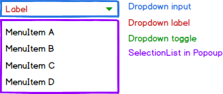

# Dropdown Component Specification

* [Definition](#definition)
* [Elements](#elements)
* [Properties](#properties)
* [Styles](#styles)
* [Accessibility](#accessibility)
* [Behavior](#behavior)
* [Examples](#examples)
* [Design](#design)

## Definition

The Dropdown is a menu which you can expand and collapse. 

## Elements

The Dropdown is composed of an input element to show the currently selected option, and upon click it expands to reveal a list of options to choose from.
Under the hood the list is a SelectionList components that abstracts the list management from the Dropdown itself.

## Properties

The Dropdown conforms to the following interfaces:

* PopupProps

    See Popup specifications.

* Optionlist

    See SelectionList specifications.

| Name | Type | Default | Required | Description |
| -- | -- | -- | -- | -- |
| disabled | boolean | false | no | see HTML specs |
| autoFocus | boolean | false | no | see HTML specs |
| open | boolean | false | no | Whether the Popup is shown |
| openOnFocus | boolean | false | no | Whether the Popup opens automatically when focus is gained |
| onChange | (id: string) => void | NOP | no | Triggered when an item is selected in the list |
| hideSelected | boolean | false | no | Hides selected values so that they do not appear in the selection list |
| children | any | null | no | Children to be rendered in the list, see SelectionList for further details |
| toggleIcon | React.SFC | default toggle | no | User can replace the default SVG with another one |

* Dropdown Props

| Name | Type | Default | Required | Description |
| ---- | ---- | ------- | -------- | ----------- |
| value | string | null | no | id of the selected item |

## Styles

See SelectionList for further styles.

| Name | Description |
| ---- | ----------- |
| input | The dropdown input container |
| toggle | The toggle used in the input container |

### States

| Name | Description |
| ---- | ----------- |
| active | toggled when the dropdown is active |
| focus | toggled when the dropdown is focused |
| disabled | toggled when the dropdown is disabled |
| hover | toggled when the dropdown is hovered |

## Accessibility

Based on the old w3 [spec](https://rawgit.com/w3c/aria-practices/master/aria-practices-DeletedSectionsArchive.html#autocomplete).

#### Roles
* Root role - *combobox*
* Caret role - *button*
* SelectionList role - *listbox*, each item in the list having the role *option*

#### Aria Attributes
* aria-expanded=true if the popup is open, otherwise aria-expanded=false. Placed on the root element.
* aria-haspopup=true on the root element
* User provided props: aria-label, aria-labelledby, aria-describedby copied to root
* aria-selected=true on the option selected in the SelectionList

#### Focus
* Current focus implementation gives focus to the input container (which has tabindex=0) and controls focus between the input container and the list using js code. This means that it is not accessible. To be changed in the next version.
* Focus (for the purpose of handling keyboard navigation) can be either in the input container or in the selectionlist.
* The caret should **not** be in the tab order

## Behavior

### Keyboard Navigation

Studied examples from [React Widgets](http://jquense.github.io/react-widgets/docs/#/dropdownlist?_k=p7z1pg) and [Kendo](http://demos.telerik.com/kendo-ui/dropdownlist/keyboard-navigation) which exhibit excellent accessibility features and are comparable to the w3 specs. If the details below are not clear, look at these examples to verify you understand the required behavior.

#### DropDown

* alt + <kbd style="display: inline-block; padding: .1em .3em; color: #555; vertical-align: middle; background-color: #fcfcfc; border: solid 1px #ccc;border-bottom-color: #bbb;border-radius: .2em;box-shadow: inset 0 -1px 0 #bbb;">down</kbd> -> Opens the popup
* alt + <kbd style="display: inline-block; padding: .1em .3em; color: #555; vertical-align: middle; background-color: #fcfcfc; border: solid 1px #ccc;border-bottom-color: #bbb;border-radius: .2em;box-shadow: inset 0 -1px 0 #bbb;">up</kbd> -> Closes the popup (when opened of course)
* <kbd style="display: inline-block; padding: .1em .3em; color: #555; vertical-align: middle; background-color: #fcfcfc; border: solid 1px #ccc;border-bottom-color: #bbb;border-radius: .2em;box-shadow: inset 0 -1px 0 #bbb;">down</kbd> -> When the popup is closed changes selection to the next item in the list
* <kbd style="display: inline-block; padding: .1em .3em; color: #555; vertical-align: middle; background-color: #fcfcfc; border: solid 1px #ccc;border-bottom-color: #bbb;border-radius: .2em;box-shadow: inset 0 -1px 0 #bbb;">right</kbd> -> When the popup is closed changes selection to the next item in the list
* <kbd style="display: inline-block; padding: .1em .3em; color: #555; vertical-align: middle; background-color: #fcfcfc; border: solid 1px #ccc;border-bottom-color: #bbb;border-radius: .2em;box-shadow: inset 0 -1px 0 #bbb;">up</kbd> -> When the popup is closed changes selection to the previous item in the list
* <kbd style="display: inline-block; padding: .1em .3em; color: #555; vertical-align: middle; background-color: #fcfcfc; border: solid 1px #ccc;border-bottom-color: #bbb;border-radius: .2em;box-shadow: inset 0 -1px 0 #bbb;">left</kbd> -> When the popup is closed changes selection to the previous item in the list
* <kbd style="display: inline-block; padding: .1em .3em; color: #555; vertical-align: middle; background-color: #fcfcfc; border: solid 1px #ccc;border-bottom-color: #bbb;border-radius: .2em;box-shadow: inset 0 -1px 0 #bbb;">Esc</kbd> -> Closes dropdown if opened. Focus returns to the input container.
* <kbd style="display: inline-block; padding: .1em .3em; color: #555; vertical-align: middle; background-color: #fcfcfc; border: solid 1px #ccc;border-bottom-color: #bbb;border-radius: .2em;box-shadow: inset 0 -1px 0 #bbb;">Home</kbd> -> When the popup is closed, selects the first item in the SelectionList
* <kbd style="display: inline-block; padding: .1em .3em; color: #555; vertical-align: middle; background-color: #fcfcfc; border: solid 1px #ccc;border-bottom-color: #bbb;border-radius: .2em;box-shadow: inset 0 -1px 0 #bbb;">End</kbd> -> When the popup is closed selects the last item in the SelectionList
* Type-Ahead -> Changes the selection of the list. See SelectionList [spec](./selectionlist.md).

The following behaviors are implemented in the SelectionList (relevant when a popup is opened and focus is in the SelectionList:

* <kbd style="display: inline-block; padding: .1em .3em; color: #555; vertical-align: middle; background-color: #fcfcfc; border: solid 1px #ccc;border-bottom-color: #bbb;border-radius: .2em;box-shadow: inset 0 -1px 0 #bbb;">Home</kbd> -> highlights ths first item in the SelectionList
* <kbd style="display: inline-block; padding: .1em .3em; color: #555; vertical-align: middle; background-color: #fcfcfc; border: solid 1px #ccc;border-bottom-color: #bbb;border-radius: .2em;box-shadow: inset 0 -1px 0 #bbb;">End</kbd> -> highlights the last item in the SelectionList
* <kbd style="display: inline-block; padding: .1em .3em; color: #555; vertical-align: middle; background-color: #fcfcfc; border: solid 1px #ccc;border-bottom-color: #bbb;border-radius: .2em;box-shadow: inset 0 -1px 0 #bbb;">Up</kbd> -> highlights previous item
* <kbd style="display: inline-block; padding: .1em .3em; color: #555; vertical-align: middle; background-color: #fcfcfc; border: solid 1px #ccc;border-bottom-color: #bbb;border-radius: .2em;box-shadow: inset 0 -1px 0 #bbb;">Down</kbd> -> highlights next item
* <kbd style="display: inline-block; padding: .1em .3em; color: #555; vertical-align: middle; background-color: #fcfcfc; border: solid 1px #ccc;border-bottom-color: #bbb;border-radius: .2em;box-shadow: inset 0 -1px 0 #bbb;">Space</kbd> -> Selects the highlighted option, closes the popup
* <kbd style="display: inline-block; padding: .1em .3em; color: #555; vertical-align: middle; background-color: #fcfcfc; border: solid 1px #ccc;border-bottom-color: #bbb;border-radius: .2em;box-shadow: inset 0 -1px 0 #bbb;">Enter</kbd> -> Selects the highlighted option, closes the popup.
* Type-Ahead -> Changes the highlighted item in the list. See SelectionList [spec](./selectionlist.md).

### Mouse Handling

#### Dropdown

* Click outside:
  * When popup is closed, focus is lost
  * When popup is opened, focus is lost and popup is closed
* Click on the input container:
  * When popup is closed, opens the popup and:
    * If an element is selected, focus moves to that element
    * If no element is selected, focus moves to the first element
* Click on an option (SelectionList) - option is selected and popup is closed

### Touch Handling

#### Dropdown

Same as click behavior, apart from touchdown behavior which will be implemented in the next iteration.

## Examples

TBD

## Design

See in [zeplin](https://app.zeplin.io/project/590ed391cb8bde641789e1cb/screen/5964cdbfd24b9b50926c8ed0).
