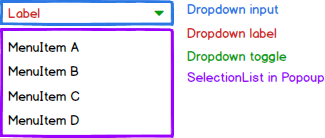
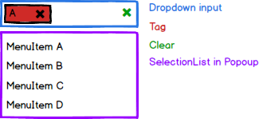

# Dropdown Components Specification

* [Definition](#definition)
* [Elements](#elements)
* [Properties](#properties)
* [Styles](#styles)
* [Accessibility](#accessibility)
* [Behavior](#behavior)
* [Examples](#examples)
* [Design](#design)

## Definition

The dropdown type components include the dropdown, autocomplete and multi-select. The Popup and SelectionList components are used internally, their prop interfaces enriching the dropdown with their functionality.

## Elements

### Dropdown & AutoComplete

### MultiSelect

## Properties

All dropdowns use the following interfaces:

* PopupProps

    See Popup specifications()

* Optionlist

    See SelectionList specifications.

Common Props (all dropdowns)

| Name | Type | Default | Required | Description |
| -- | -- | -- | -- | -- |
| disabled | boolean | false | no | see HTML specs |
| autoFocus | boolean | false | no | see HTML specs |
| open | boolean | false | no | Whether the Popup is shown |
| openOnFocus | boolean | false | no | Whether the Popup opens automatically when focus is gained |
| onChange | (id: string) => void | NOP | no | Triggered when an item is selected in the list |
| hideSelected | boolean | false | no | Hides selected values so that they do not appear in the selection list |
| children | any | null | no | Children to be rendered in the list, see SelectionList for further details |
| toggleIcon | React.SFC | default toggle | no | User can replace the default SVG with another one |

* Dropdown Props

| Name | Type | Default | Required | Description |
| -- | -- | -- | -- | -- |
| value | string | null | no | id of the selected item |

* AutoComplete Props

The AutoComplete is an extension of an input field of type text, thereby expanding its props.

| Name | Type | Default | Required | Description |
| -- | -- | -- | -- | -- |
| allowFreeText | boolean | true | no | Allows user to enter text which does not appear in the suggestion list |
| showNoSuggestions | boolean | false | no | Shows a message when there are no suggestions to show a user |
| noSuggestionsNotice | string \| func | "No Results" | no | Message to show in popup when there are no suggestions for the user. If function used then it renders an element in the popup |
| selected | string | null | no | id of the selected item |
| filter | func | prefix search function | no | Function used to filter results according to input |
| minCharacters | number | 0 | no | Number of characters required in input before suggestions appear |
| maxSearchResults | number | 0 (unlimited) | Maximum number of results to show for a filter match |

* MultiSelect Props

Supports AutoComplete props as well as the native text input props.

| Name | Type | Default | Required | Description |
| -- | -- | -- | -- | -- |
| value | Array<String> | empty | no | list of selected ids |
| maxSelected | number | 0 (unlimited) | no | number of selections allowed |

## Styles

See SelectionList for further styles. The following are relevant for all DropDown and AutoComplete:

| Name | Description |
| -- | -- |
| input | The dropdown input container |
| toggle | The toggle used in the input container |

Styles for MultiSelect:

| Name | Description |
| -- | -- |
| input | The dropdown input container |
| clear | The 'x' that clears tha input container |
| tag | The tag box inside the input container |
| tagDelete | The 'x' that deletes a specific tag |

### States

| Name | Description |
| -- | -- |
| active | self explanatory |
| focus | self explanatory |
| disabled | self explanatory |
| readonly | Relevant for AutoComplete and MultiSelect |
| hover | self explanatory |

## Accessibility

### DropDown

Based on the old w3 [spec](https://rawgit.com/w3c/aria-practices/master/aria-practices-DeletedSectionsArchive.html#autocomplete).

#### Roles
* Root role - *combobox*
* Caret role - *button*
* SelectionList role - *listbox*, each item in the list having the role *option*

#### Aria Attributes
* aria-expanded=true if the popup is open, otherwise aria-expanded=false. Placed on the root element.
* aria-haspopup=true on the root element
* User provided props: aria-label, aria-labelledby, aria-describedby copied to root
* aria-selected=true on the option selected in the SelectionList

#### Focus
* Current focus implementation gives focus to the input container (which has tabindex=0) and controls focus between the input container and the list using js code. This means that it is not accessible. To be changed in the next version.
* Focus (for the purpose of handling keyboard navigation) can be either in the input container or in the selectionlist.
* The caret should **not** be in the tab order

### AutoComplete

Based on the old w3 [spec](https://rawgit.com/w3c/aria-practices/master/aria-practices-DeletedSectionsArchive.html#combobox).

#### Roles

* Root role - *combobox*
* Input role - *textbox*

#### Aria Attributes

* aria-expanded=true if the popup is open, otherwise aria-expanded=false. Placed on the root element.
* aria-haspopup=true on the root element
* User provided props: aria-label, aria-labelledby, aria-describedby copied to root
* aria-autocomplete=list on the input element (the one with the *textbox* role)
* aria-selected=true on the option selected in the SelectionList

#### Focus

The autocomplete manages 2 focus states, one for the input element, the *real* focus, and one in the list (seen through CSS highlighting).

* Focus resides on the input element (user sees a caret in the input element). When a character is entered, focus stays on the input element, however a focus state appears on the SelectionList in the following manner:
  * showNoSuggestions=false - The first item that is matched is highlighted. If no item is matched then the first item in the list is highlighted.
  * showNoSuggestion=true - The first item that is matched is highlighted. If no item is matched then the noSuggestion element is rendered and no highlighting occurs.

### MultiSelect

#### Roles

* Root role - *combobox*
* Input role - *textbox*
* Clear all icon role - *button*, tag delete icons should not be accessible, so verify no active role is used or HTML element which suggests action.

#### Aria Attributes

* aria-expanded=true if the popup is open, otherwise aria-expanded=false. Placed on the root element.
* aria-haspopup=true on the root element
* User provided props: aria-label, aria-labelledby, aria-describedby copied to root
* aria-autocomplete=list on the input element (the one with the *textbox* role)
* aria-multiselectable=true on the SelectionList
* aria-selected=true on the option selected in the SelectionList, **all** other options should have aria-selected=false.

#### Focus

Same as AutoComplete. The tag elements are **not** focusable through keyboard navigation, the reason being it makes accessibility ridiculously difficult for the users.

## Behavior

### Keyboard Navigation

Studied examples from [React Widgets](http://jquense.github.io/react-widgets/docs/#/dropdownlist?_k=p7z1pg) and [Kendo](http://demos.telerik.com/kendo-ui/dropdownlist/keyboard-navigation) which exhibit excellent accessibility features and are comparable to the w3 specs. If the details below are not clear, look at these examples to verify you understand the required behavior.

#### DropDown

* alt + <kbd style="display: inline-block; padding: .1em .3em; color: #555; vertical-align: middle; background-color: #fcfcfc; border: solid 1px #ccc;border-bottom-color: #bbb;border-radius: .2em;box-shadow: inset 0 -1px 0 #bbb;">down</kbd> -> Opens the popup
* alt + <kbd style="display: inline-block; padding: .1em .3em; color: #555; vertical-align: middle; background-color: #fcfcfc; border: solid 1px #ccc;border-bottom-color: #bbb;border-radius: .2em;box-shadow: inset 0 -1px 0 #bbb;">up</kbd> -> Closes the popup (when opened of course)
* <kbd style="display: inline-block; padding: .1em .3em; color: #555; vertical-align: middle; background-color: #fcfcfc; border: solid 1px #ccc;border-bottom-color: #bbb;border-radius: .2em;box-shadow: inset 0 -1px 0 #bbb;">down</kbd> -> When the popup is closed changes selection to the next item in the list
* <kbd style="display: inline-block; padding: .1em .3em; color: #555; vertical-align: middle; background-color: #fcfcfc; border: solid 1px #ccc;border-bottom-color: #bbb;border-radius: .2em;box-shadow: inset 0 -1px 0 #bbb;">right</kbd> -> When the popup is closed changes selection to the next item in the list
* <kbd style="display: inline-block; padding: .1em .3em; color: #555; vertical-align: middle; background-color: #fcfcfc; border: solid 1px #ccc;border-bottom-color: #bbb;border-radius: .2em;box-shadow: inset 0 -1px 0 #bbb;">up</kbd> -> When the popup is closed changes selection to the previous item in the list
* <kbd style="display: inline-block; padding: .1em .3em; color: #555; vertical-align: middle; background-color: #fcfcfc; border: solid 1px #ccc;border-bottom-color: #bbb;border-radius: .2em;box-shadow: inset 0 -1px 0 #bbb;">left</kbd> -> When the popup is closed changes selection to the previous item in the list
* <kbd style="display: inline-block; padding: .1em .3em; color: #555; vertical-align: middle; background-color: #fcfcfc; border: solid 1px #ccc;border-bottom-color: #bbb;border-radius: .2em;box-shadow: inset 0 -1px 0 #bbb;">Esc</kbd> -> Closes dropdown if opened. Focus returns to the input container.
* <kbd style="display: inline-block; padding: .1em .3em; color: #555; vertical-align: middle; background-color: #fcfcfc; border: solid 1px #ccc;border-bottom-color: #bbb;border-radius: .2em;box-shadow: inset 0 -1px 0 #bbb;">Home</kbd> -> When the popup is closed, selects the first item in the SelectionList
* <kbd style="display: inline-block; padding: .1em .3em; color: #555; vertical-align: middle; background-color: #fcfcfc; border: solid 1px #ccc;border-bottom-color: #bbb;border-radius: .2em;box-shadow: inset 0 -1px 0 #bbb;">End</kbd> -> When the popup is closed selects the last item in the SelectionList
* Type-Ahead -> Changes the selection of the list. See SelectionList [spec](./selectionlist.md).

The following behaviors are implemented in the SelectionList (relevant when a popup is opened and focus is in the SelectionList:

* <kbd style="display: inline-block; padding: .1em .3em; color: #555; vertical-align: middle; background-color: #fcfcfc; border: solid 1px #ccc;border-bottom-color: #bbb;border-radius: .2em;box-shadow: inset 0 -1px 0 #bbb;">Home</kbd> -> highlights ths first item in the SelectionList
* <kbd style="display: inline-block; padding: .1em .3em; color: #555; vertical-align: middle; background-color: #fcfcfc; border: solid 1px #ccc;border-bottom-color: #bbb;border-radius: .2em;box-shadow: inset 0 -1px 0 #bbb;">End</kbd> -> highlights the last item in the SelectionList
* <kbd style="display: inline-block; padding: .1em .3em; color: #555; vertical-align: middle; background-color: #fcfcfc; border: solid 1px #ccc;border-bottom-color: #bbb;border-radius: .2em;box-shadow: inset 0 -1px 0 #bbb;">Up</kbd> -> highlights previous item
* <kbd style="display: inline-block; padding: .1em .3em; color: #555; vertical-align: middle; background-color: #fcfcfc; border: solid 1px #ccc;border-bottom-color: #bbb;border-radius: .2em;box-shadow: inset 0 -1px 0 #bbb;">Down</kbd> -> highlights next item
* <kbd style="display: inline-block; padding: .1em .3em; color: #555; vertical-align: middle; background-color: #fcfcfc; border: solid 1px #ccc;border-bottom-color: #bbb;border-radius: .2em;box-shadow: inset 0 -1px 0 #bbb;">Space</kbd> -> Selects the highlighted option, closes the popup
* <kbd style="display: inline-block; padding: .1em .3em; color: #555; vertical-align: middle; background-color: #fcfcfc; border: solid 1px #ccc;border-bottom-color: #bbb;border-radius: .2em;box-shadow: inset 0 -1px 0 #bbb;">Enter</kbd> -> Selects the highlighted option, closes the popup.
* Type-Ahead -> Changes the highlighted item in the list. See SelectionList [spec](./selectionlist.md).
* <kbd style="display: inline-block; padding: .1em .3em; color: #555; vertical-align: middle; background-color: #fcfcfc; border: solid 1px #ccc;border-bottom-color: #bbb;border-radius: .2em;box-shadow: inset 0 -1px 0 #bbb;">Tab</kbd> -> Moves focus to the next focusable component and popup is closed.

#### AutoComplete

* alt + <kbd style="display: inline-block; padding: .1em .3em; color: #555; vertical-align: middle; background-color: #fcfcfc; border: solid 1px #ccc;border-bottom-color: #bbb;border-radius: .2em;box-shadow: inset 0 -1px 0 #bbb;">down</kbd> -> Opens the popup
* alt + <kbd style="display: inline-block; padding: .1em .3em; color: #555; vertical-align: middle; background-color: #fcfcfc; border: solid 1px #ccc;border-bottom-color: #bbb;border-radius: .2em;box-shadow: inset 0 -1px 0 #bbb;">up</kbd> -> Closes the popup (when opened of course)
* <kbd style="display: inline-block; padding: .1em .3em; color: #555; vertical-align: middle; background-color: #fcfcfc; border: solid 1px #ccc;border-bottom-color: #bbb;border-radius: .2em;box-shadow: inset 0 -1px 0 #bbb;">down</kbd> -> When the popup is closed changes selection to the next item in the list. If the current selected item is not valid, the first item in the list is selected.
* <kbd style="display: inline-block; padding: .1em .3em; color: #555; vertical-align: middle; background-color: #fcfcfc; border: solid 1px #ccc;border-bottom-color: #bbb;border-radius: .2em;box-shadow: inset 0 -1px 0 #bbb;">up</kbd> -> When the popup is closed changes selection to the previous item in the list if there is a valid selected item. If there is no valid selection (the input container being empty is such a case) then nothing happens.
* <kbd style="display: inline-block; padding: .1em .3em; color: #555; vertical-align: middle; background-color: #fcfcfc; border: solid 1px #ccc;border-bottom-color: #bbb;border-radius: .2em;box-shadow: inset 0 -1px 0 #bbb;">left</kbd> -> Moves the caret to the left
* <kbd style="display: inline-block; padding: .1em .3em; color: #555; vertical-align: middle; background-color: #fcfcfc; border: solid 1px #ccc;border-bottom-color: #bbb;border-radius: .2em;box-shadow: inset 0 -1px 0 #bbb;">right</kbd> -> Moves the caret to the right
* <kbd style="display: inline-block; padding: .1em .3em; color: #555; vertical-align: middle; background-color: #fcfcfc; border: solid 1px #ccc;border-bottom-color: #bbb;border-radius: .2em;box-shadow: inset 0 -1px 0 #bbb;">Esc</kbd> -> Closes dropdown if opened. Focus returns to the input container.
* <kbd style="display: inline-block; padding: .1em .3em; color: #555; vertical-align: middle; background-color: #fcfcfc; border: solid 1px #ccc;border-bottom-color: #bbb;border-radius: .2em;box-shadow: inset 0 -1px 0 #bbb;">Home</kbd> -> When the popup is closed, selects the first item in the SelectionList
* <kbd style="display: inline-block; padding: .1em .3em; color: #555; vertical-align: middle; background-color: #fcfcfc; border: solid 1px #ccc;border-bottom-color: #bbb;border-radius: .2em;box-shadow: inset 0 -1px 0 #bbb;">End</kbd> -> When the popup is closed selects the last item in the SelectionList
* Any other characters are entered in the input element, filtering the list of available options or showing the no suggestions element when relevant (see autocomplete focus section for details).

The following behaviors are implemented in the SelectionList (relevant when a popup is opened and focus is in the SelectionList:

* <kbd style="display: inline-block; padding: .1em .3em; color: #555; vertical-align: middle; background-color: #fcfcfc; border: solid 1px #ccc;border-bottom-color: #bbb;border-radius: .2em;box-shadow: inset 0 -1px 0 #bbb;">Home</kbd> -> highlights the first item in the SelectionList
* <kbd style="display: inline-block; padding: .1em .3em; color: #555; vertical-align: middle; background-color: #fcfcfc; border: solid 1px #ccc;border-bottom-color: #bbb;border-radius: .2em;box-shadow: inset 0 -1px 0 #bbb;">End</kbd> -> highlights the last item in the SelectionList
* <kbd style="display: inline-block; padding: .1em .3em; color: #555; vertical-align: middle; background-color: #fcfcfc; border: solid 1px #ccc;border-bottom-color: #bbb;border-radius: .2em;box-shadow: inset 0 -1px 0 #bbb;">down</kbd> -> Highlights the next item in the list.
* <kbd style="display: inline-block; padding: .1em .3em; color: #555; vertical-align: middle; background-color: #fcfcfc; border: solid 1px #ccc;border-bottom-color: #bbb;border-radius: .2em;box-shadow: inset 0 -1px 0 #bbb;">up</kbd> -> Highlights the previous item in the list.
* <kbd style="display: inline-block; padding: .1em .3em; color: #555; vertical-align: middle; background-color: #fcfcfc; border: solid 1px #ccc;border-bottom-color: #bbb;border-radius: .2em;box-shadow: inset 0 -1px 0 #bbb;">Enter</kbd> -> Selects the highlighted item, closes the popup.

#### MultiSelect

Same as AutoComplete and includes the following:

* <kbd style="display: inline-block; padding: .1em .3em; color: #555; vertical-align: middle; background-color: #fcfcfc; border: solid 1px #ccc;border-bottom-color: #bbb;border-radius: .2em;box-shadow: inset 0 -1px 0 #bbb;">Backspace</kbd> -> Deletes tag when cursor is after it.

The following behaviors are implemented in the SelectionList (relevant when a popup is opened and focus is in the SelectionList:

* <kbd style="display: inline-block; padding: .1em .3em; color: #555; vertical-align: middle; background-color: #fcfcfc; border: solid 1px #ccc;border-bottom-color: #bbb;border-radius: .2em;box-shadow: inset 0 -1px 0 #bbb;">Enter</kbd> -> Changes the selection state of the highlighted item

### Mouse Handling

#### Dropdown

* Click outside:
  * When popup is closed, focus is lost
  * When popup is opened, focus is lost and popup is closed
* Click on the input container:
  * When popup is closed, opens the popup and:
    * If an element is selected, focus moves to that element
    * If no element is selected, focus moves to the first element
* Click on an option (SelectionList) - option is selected and popup is closed

#### AutoComplete
* Click outside:
  * When popup is closed, focus is lost
  * When popup is opened, focus is lost and popup is closed
* Click on toggle opens the popup
* Click on an option (SelectionList) - option is selected and popup is closed

#### MultiSelect

Same as AutoComplete and including:

* Click on clear icon on tag -> removes value from selection
* Click on clear icon for component -> removes all selected items

### Touch Handling

#### Dropdown

Same as click behavior, apart from touchdown behavior which will be implemented in the next iteration.

#### AutoComplete

Same as click behavior, apart from touchdown behavior which will be implemented in the next iteration.

#### MultiSelect

Same as AutoComplete, including:

* Tap on clear icon on tag -> removes value from selection
* Tap on clear icon for component -> removes all selected items

## Examples

TBD

## Design

See in [zeplin](https://app.zeplin.io/project/590ed391cb8bde641789e1cb/screen/5964cdbfd24b9b50926c8ed0).
