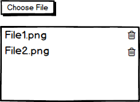
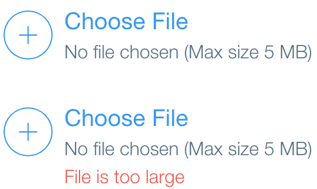

# FilePicker Component Specification

A typed React component which lets the user pick one or more files, allows specifying the files type, size and number limits and exposes the File API. The FilePicker component will be used in the File Upload Dialog.

## Contents

* [Elements](#elements)
* [Internal](#internal)
* [API](#spi)
* [Style API](#style-api)
* [Accessibility](#accessibility)
  * [Roles](#roles)
  * [Aria Attributes](*aria-attibutes)
  * [Focus](#focus)
* [Input Handling](#input-handling)
  * [Keyboard](#keyboard)
  * [Mouse](#mouse)
  * [Touch](#touch)
* [Examples](#examples)

## Elements

There are no elements to the FilePicker, it being a component without visible elements (created via children).

## Internal

The FilePicker renders the following:
```jsx
    <div className="root">
        <input type="file" className="hidden" />
        {children}
    </div>
```

* Note the following:
  * The multiple attribute needs to be used when the multiple property is true.
  * User should be able to remove the one or more of the files in the list (files should be a state object)

## API

| Name | Type | Default | Required | Description |
| -- | -- | -- | -- | -- |
| id | string | null | no | Unique identifier |
| name | string | null | no | Name of the value of the content (passed to hidden input element) |
| className | string | null | no | Space separated list of the classes of the element |
| style | Object | null | no | CSS styling declarations to be applied to the element |
| children | React.ReactNode | null | no | The elements to render in the tooltip |
| tabIndex | number | 0 | no | Indicates if element participates in keyboard navigation |
| accept | string \| array | null | no | Specifies the type of file/s the user is allowed to pick. Extensions and mimetypes are supported ('image/*', ['image/\*', '.pdf', 'video/mp4') |
| files | HTMLInputElement.files | null | no | An object that represents the files property of the native HTML \<input> element |
| onFileSelected | Function(file) | NOOP | no | Called whenever user selects a file. The callback has a file parameter object that contains the filename, mimetype, size in bytes, and source. |
| maxSize | number | null | no | Maximum size of file to upload specified in bytes |
| minSize | number | null | no | Minimum size of file to upload specified in bytes |
| multiple | boolean | false | no | 1 or more files |


## Style API

The root of the component is the only style class.

## Accessibility

### Roles

* None

### Aria Attributes

* aria-label, aria-describedby, aria-labelledby copied to root

### Focus

Not relevant

## Input Handling

### Keyboard

Not relevant

### Mouse

Not relevant

### Touch

Not relevant

## Examples

* Create a demo that allows the user to pick multiple files of type image. It should show the files in a list and the user should be able to remove the files. See image below:

    

* Create a demo which allows the user to choose a single file. If the file chosen is larger than 5mb issue an error. See image below:

    
