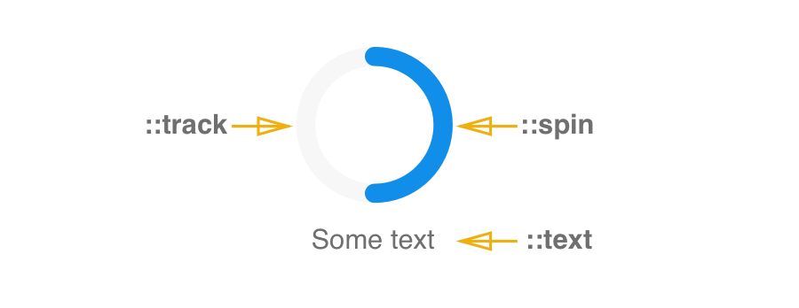

# Loader

**Loader** is a component that rotates to show that there is a wait for a task to complete.

Loader should be used when part of the page is waiting for asynchronous data or during a rendering process. Appropriate loading animation can effectively set users expectations & warn them about wait time.


Add stuff related to using custom loader component.


## Elements



**Loader consists of:** spin and track, spin rotates across the track to show that there is a wait time for a task to complete.


## API

#### Component Props

| name  | type                  | defaultValue | isRequired | description                              |
| ----- | --------------------- | ------------ | ---------- | ---------------------------------------- |
| delay | number (milliseconds) |              |            | Specifies a delay in milliseconds for loader to appear. If content loads faster then the delay period, loader will not be displayed. |
| text  | string                |              |            | Specifies text to be shown with loader. By default text is shown below the loader but its position can be changed with `::text` subcomponent. |


### React Code Example

**Example 1:**

```jsx
//code example goes here
import * as React from 'react';
import {Loader} from './components';

ReactDOM.render(
  <Loader
    delay={2000}
    type="spin"
    text="loading..."
  />
, mountNode);

```

Create spinner `Loader` which wait for `2000ms` before bacame visible

**Example 2:**


```jsx
//code example goes here
import * as React from 'react';
import {Loader} from './components';

ReactDOM.render(
  <Loader text="loading...">
    
  </Loader>
, mountNode);

```

Create custom `Loader` with image instead of content


## Style API

#### Subcomponents (pseudo-elements)

| selector | description                              |
| -------- | ---------------------------------------- |
| ::spin   | Allows to style the progress of the loader |
| ::track  | Allows to style the bar of the loader    |
| ::text   | Allows to style the text shown with loader |


### Style Code Example

```css
//code example goes here
@import * from './components/loader'

Loader::track {
  background-color: #F7F7F7; 
}

Loader::spin {
  background-color: #108EE9;
}

Loader::text {
  font: normal normal bold 18px/1 Arial, Helvetica, sans-serif;
  color: black;
}
```
