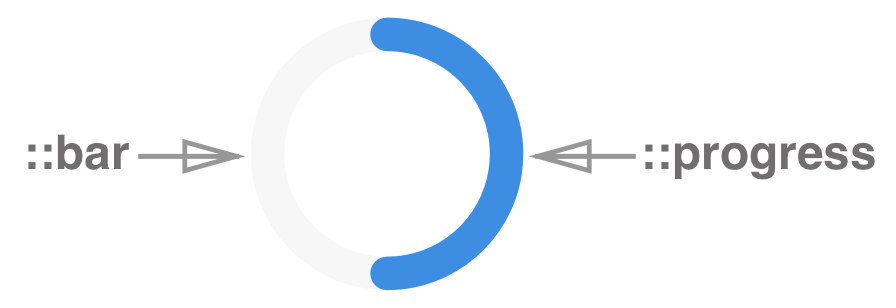

# Circular Loader

Circular Loader is a component that rotates to show the progress of a task or that there is a wait for a task to complete.

When part of the page is waiting for asynchronous data or during a rendering process, an appropriate loading animation can effectively alleviate users' inquietude.

Circular Loader can be:

1. **Indeterminate** - loading indicator animates continuously
2. **Determinate** - loading indicator adjusts to show the percentage complete, as a ratio of `value`: `max-min`


## Elements



**Circular Loader consists of:** 

1. ::progress -  
2. ::bar - 


## API

#### Component Props

| name     | type                                | defaultValue    | isRequired | description                              |
| -------- | ----------------------------------- | --------------- | ---------- | ---------------------------------------- |
| mode     | enum: `determinate` `indeterminate` | `indeterminate` |            | Determines the type of the component. Indeterminate mode shows loader without no connection to the loading progress. |
| value    | number                              | 0               |            | The value of progress. NOTE: works only for determinate mode. |
| showInfo |                                     |                 |            | Displays the progress value of the loading process AND/OR text |
| delay    | number                              |                 |            | Specifies a delay in milliseconds for loading state |
| status   | string                              |                 |            | Sets the status of the loading progress. Options: `success` `exception` `active` |


### React Code Example

**Example 1:**

```
//code example goes here
```

*Comments to example 1*


**Example 2:**

```
//code example goes here	

```

*Comments to example 2*


## Style API

#### Subcomponents (pseudo-elements)

| selector   | description                              |
| ---------- | ---------------------------------------- |
| ::progress | Allows styling the progress of the loader |
| ::bar      | Allows to style the bar of the loader    |

#### Custom CSS States (pseudo-classes)

| state                          | description                              |
| ------------------------------ | ---------------------------------------- |
| :error                         | Style the component on error, i.e. when the `error` prop is true |
| :hover, :focus, :disabled, etc | Standard CSS states                      |

### Style Code Example

```
//code example goes here
```