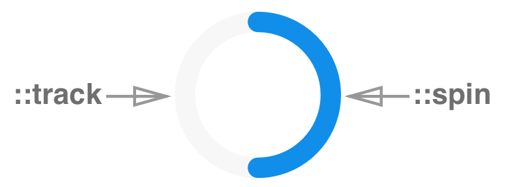

# Loader

**Loader** is a component that rotates to show that there is a wait for a task to complete.

Loader should be used when part of the page is waiting for asynchronous data or during a rendering process. Appropriate loading animation can effectively set users expectations & warn them about wait time.

## Elements

**Loader consists of:** spin and track, spin rotates across the track to show that there is a wait time for a task to complete.

## API

**Props**

See [README.md](https://github.com/wix/stylable-components/blob/maksymc/loader/docs/loader/circular-loader) for more info.

**Style**

Brief description of pseudo-classes and custom CSS states that can be applied to the component. See [README.md](https://github.com/wix/stylable-components/blob/maksymc/loader/docs/loader/circular-loader)for more info.

## Accessibility

There is not specific handling for a loader component. 

### Behavior

User should be able to use **default** circular loader that is provided by component OR create **custom** element and animate it with CSS.

Component should be styled with ::spin, ::track & ::text pseudo-elements. Bt default 
See [README.md](https://github.com/wix/stylable-components/blob/maksymc/loader/docs/loader/circular-loader) for more info.

User should be able to set a delay for loader to show up with `delay` prop.  If content loads faster than the delay period, loader should not be displayed.

By default spinner should be displayed 

## RTL

There is no specific handling related to RTL

## DOM structure

TBD

## Design

Link to [assets](https://zpl.io/2kRTvO)