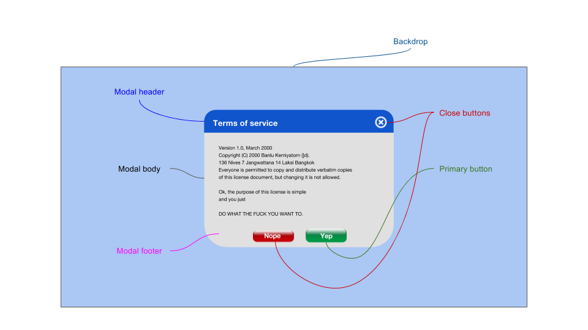

# Modal

The **Modal** component is a window that opens on top of the application's main window. It blocks the main application's interactivity and the application flow. It typically leaves the main app visible and faded out in the background. Users must interact with the modal in order to return to the application flow.

## Elements



**Modal** consists of a the following elements with their sub-elements:

* **Modal header**
    * **title**
    * **Close button** (optional) 
* **Modal body**: main modal content
* **Modal footer**
    * **Primary button**
    * **Close button** (optional)
* **Backdrop**: blocks interactivity with the rest of the screen

Interacting with **Modal** can be via:
  
- clicking its primary button
- clicking its backdrop
- clicking its close/cancel button(s)

## Use Cases

**Modal** can be used for the following:

* Require a sign-in before using a certain feature of an app.
* Display an image, video, or other content, in focus on top of the main screen.
* Edit a complex formula inside of a spreadsheet.

## API

### Component Props

| Prop | Type | Default | Required | Description |
| --- | --- | --- | --- | --- |
| isOpen | boolean | false | yes | Managed by state; this is how to control the visibility of the modal. |
| onAfterOpen | function | noop | no | Invoked after the component is rendered. |
| onRequestClose(source) | function | noop |  | The function used to handle cancel events on the modal. Typically sets the open state to false. It is passed a source as one of a number of possible closing options. |
| children | any |  |  | Children nodes. |
| aria-* | - | - | - | ARIA attributes. Used for accessibility purposes, to describe the screen to a screen-reader. |
| aria-role | - | `dialog` |  | Default ARIA attribute of the modal window, defines its role as a `dialog`. |

### Modal Roles

Children (subcomponents) of a **Modal** can have a `role` attribute that allows them to declare which part of the **Modal** is described by the child subcomponent (node).

| role | class | description |
| --- | --- | --- |
| header | .header | The header of the modal. Usually contains a title for the modal as well as a close button. |
| header-close-button | .header-close-button | The header's close button which is normally located at the top-right corner of the modal. |
| header-title | .header-title | The title of the modal found in the header. |
| body | .header-body | The body of the modal. |
| footer | .footer | The footer of the modal. Usually contains two buttons: <br> **Close**: close or cancel the action <br> **Primary**: perform the action required by the modal (e.g., submit the form, login to the app) |
| footer-close-button | .footer-close-button | The close or cancel button found in the footer. |
| footer-primary-button | .footer-primary-button | The primary (action) button of the modal. |

### `onRequestClose` Sources

| Source | Description |
| --- | --- |
| escKeyPress | Request to close the modal because the `ESC` button was pressed. |
| backdropClick | Request to close the modal because the backdrop of the modal was clicked. |
| headerCloseClick | Request to close the modal came from a click on the child in the role `header-close-button`. |
| footerCloseClick | Request to close the modal came from a click on the child in the role `footer-close-button`. |
| footerPrimaryClick | Request to close the modal came from a click on the child in the role `footer-primary-button`.  |
| backdropTap | Request to close the modal because the backdrop of the modal was tapped. |
| headerCloseTap | Request to close the modal came from a tap on the child in the role `header-close-button`. |
| footerCloseTap | Request to close the modal came from a tap on the child in the role `footer-close-button`. |
| footerPrimaryTap | Request to close the modal came from a tap on the child in the role `footer-primary-button`.  |

### Code Example

```jsx
<Modal
    isOpen="this.state.open"
    onRequestClose="this.whenModalCloses">
    <div role="header">
        <span role="title">Terms of service</span>
        <button role="header-close-button" />
    </div>
    <div role="body">
        <span>content</span>
    </div>
    <div role="footer">
        <button role="footer-primary-button">Yep</button>
        <button role="footer-close-button">Nope</button>
    </div>
</Modal>
```

## Style API

Normally, **modal** opens in relation to the screen and not its parent component. It needs to be prominent on the entire view-port because it breaks the flow of the entire page. 

### Subcomponents (pseudo-elements)

| selector | description | type |
| --- | --- | --- |
| ::header | The header of the modal. | HTML Element |
| ::header-close-button | The close button in the header. | button |
| ::header-title | The title of the modal. | HTML Element |
| ::content | The main content of the modal. | HTML Element |
| ::footer | The footer of the modal. | HTML Element |
| ::footer-close-button | The close button in the footer. | button |
| ::footer-primary-button | The primary button of the modal. | button |
| ::backdrop | The background or overlay of the modal. | HTML Element |

### Custom CSS States (pseudo-classes)

| state | description |
|---|---|
| :open | The open state of the modal. |
| :loading | The loading state of the modal if it takes time to open. |
| :error | Modal displaying an error related to its loading. |
