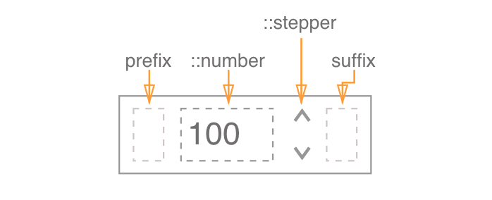

# Number Input

**NumberInput** allows the user to enter a number within a certain range.

The **NumberInput** component improves upon the native `<input type="number">` by providing the ability to customize the stepper arrows design, a common React+Typescript API, and working out the kinks of native implementations.



## Component API

### Props

| name         | type                             | defaultValue | isRequired | description                              |
| ------------ | -------------------------------- | ------------ | ---------- | ---------------------------------------- |
| value        | number                           |              |            | Used to set and change the value of the input. If you bind this to a state in your parent component, you should also set the `onChange` handler in order for the component to work.<br>If value is empty, the component instance behaves as uncontrolled. |
| defaultValue | number                           |              |            | Sets the default value if the input is uncontrolled. |
| placeholder  | string                           |              |            | Text to display if the value is null.    |
| min          | number                           | 1            |            |                                          |
| max          | number                           | 100          |            |                                          |
| step         | number                           | 1            |            |                                          |
| required     | boolean                             | false        |            | Whether or not filling the value is required in a form. |
| disabled     | boolean                             | false        |            | If true, the component will not be interactable. |
| label        | string                           |              |            | Text to display in accessibility mode.   |
| name         | string                           |              |            | The name of the component. Behaves like the name attribute of an input element. |
| prefix       | node                             |              |            | Inserts a component at the start of the input. |
| suffix       | node                             |              |            | Inserts a component at the end of the input. |
| onChange     | function |   |   | Callback function that is fired on component blur.<br>`(event: {value: number}): void`<br>`event` KeyDown event for current component instance.<br>`newValue` The new value of the component instance. |
| onInput      |function |   |  | Callback function that is fired on every keydown event.<br> `(event: {value: number}): void`<br>`event` KeyDown event targeting current component instance.<br>`newValue` The new value of the component instance. |
| error        | boolean                        | false        |            | Sets the `:error` CSS state on the current component instance. |

### Code Examples

##### Example 1

```jsx
//TODO: code guys - fix code example!
import * as React from 'react';
import { NumberInput } from './components/NumberInput';
import style from './style.st.css'; // link to Style file - see examples of style files below

export class ComponentsDemo extends React.Component<{}, {}>{
    constructor() {
        super();
    }

    public render() {
    const {basicValue, sharedValue} = this.state;
    return (
      <NumberInput
        value={basicValue}
        step={1}
        max={100}
        onChange={this.handleBasicValueChange}
        placeholder="How Many?"
      />
    }
```

##### Example 2 (with children)

```jsx
//TODO: code guys - fix code example!
import * as React from 'react';
import { NumberInput } from './components/NumberInput';
import style from './style.st.css'; // link to Style file - see examples of style files below

export class ComponentsDemo extends React.Component<{}, {}>{
    constructor() {
        super();
    }

    public render() {
    const {basicValue, sharedValue} = this.state;
    return (
      <NumberInput
        value={basicValue}
        step={1}
        max={100}
        onChange={this.handleBasicValueChange}
        placeholder="How Many?"
        prefix={</img>}
        suffix={<span>USD</span>}
      />
    }
```

## Style API

### Subcomponents (pseudo elements)

| selector  | description                            | type                                     |
| --------- | -------------------------------------- | ---------------------------------------- |
| ::stepper | Style the stepper arrows. | Style the internal `<stepper/>` component. This component exposes some internal styles. |
| ::stepper::up   | Style the stepper UP arrow.   | Style the internal `<up/>` arrow component.|
| ::stepper::down | Style the stepper DOWN arrow. | Style the internal `<down/>` arrow component. |

### Custom CSS States (pseudo classes)

| selector                       | description                              |
| ------------------------------ | ---------------------------------------- |
| :error                         | Style the component on error, i.e. when the `error` prop is true. |
| :hover, :focus, :disabled, etc | Standard CSS pseudo classes.              |

### Style Code Examples

```css
@import * from './components/slider'; /* TODO: fix the correct syntax */
/* style.st.css
Adding rules here (which may be shared between different components) allows us to 	    override specific parts; or even change the whole theme
*/
NumberInput {
  background: #bada55;
}

NumberInput::stepper {
  background-color: transparent;
}

NumberInput::stepper::down, NumberInput::stepper::up {
  color:blue;
}

NumberInput::stepper::down:hover, NumberInput::stepper::up:hover {
  background-color:lightblue;
}
```
