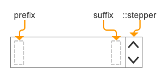

# Number Input

The **NumberInput** component improves upon the native `<input type="number">` by providing the ability to customize the stepper arrows design, a common React+Typescript API, and working out the kinks of native implementations.



### Component API

#### Props

| name         | type   | defaultValue | isRequired | description                              |
| ------------ | ------ | ------------ | ---------- | ---------------------------------------- |
| value        | number |              | yes        | Used to set & change the value of the input. If you bind this to a state in your parent component, you should also set the `onChange` handler, in order for the component to work. |
| defaultValue | number |              |            | Sets the default value if the input is uncontrolled. |
| placeholder  | string |              |            | Text to display if the value is null.     |
| min          | number | 1            |            |                                          |
| max          | number | 100          |            |                                          |
| step         | number | 1            |            |                                          |
| required     | boolean   | false        |            | Whether or not filling the value is required in a form. |
| disabled     | boolean   | false        |            | If true, the component will not be interactable. |
| label        | string |              |            | Text to display in accessibility mode.   |
| name         | string |              |            | The name of the component. Behaves like the name attribute of an input element. |
| onChange     | function   |              | yes        | Callback function that is fired when the component's value is changed and committed. Signature: `function(event: object, newValue: number):void`. event: KeyDown event targeting the slider. newValue: The new value of the slider. |
| onInput      | function   |              |            | Callback function that is fired every time the user types a character into the input. |
| error        | boolean   | false        |            | Sets the `:error` CSS state on the `<NumberInput/>`. |
| rtl          | boolean   | false        |            | Makes the component RTL.                  |

#### Accepted Children

This component accepts children with the following `data-slot` attribute values, in order to be displayed in specific places in its layout.

| data-slot | description                              | example                                  |
| --------- | ---------------------------------------- | ---------------------------------------- |
| prefix    | Allows you to insert a child component (or components) at the start of the input. | `<div data-slot="prefix">hello world</div>` |
| suffix    | Allows you to insert a child component (or components) at the end of the input.<br> This is the **default data slot**. Not specifying a slot will insert the component(s) here. | `<div data-slot="suffix">hello world</div>` |

### Code Examples

##### Example 1

```jsx
//TODO: code guys - fix code example!
import * as React from 'react';
import { NumberInput } from './components/NumberInput';
import style from './style.st.css'; // link to Style file - see examples of style files below

export class ComponentsDemo extends React.Component<{}, {}>{
    constructor() {
        super();
    }

    render() {
        return <NumberInput
        		 value="{this.state.numberInputValue}"
                 onChange={/* something */}

               />;
    }
}
```

##### Example 2 (with children)

```jsx
//TODO: code guys - fix code example!
import * as React from 'react';
import { NumberInput } from './components/NumberInput';
import style from './style.st.css'; // link to Style file - see examples of style files below

export class ComponentsDemo extends React.Component<{}, {}>{
    constructor() {
        super();
    }

    render() {
        return <NumberInput
        		 value="{this.state.numberInputValue}"
                 onChange={/* something */}>
    				<span data-slot="prefix">$</span>
        			<button data-slot="suffix">x</button>
               </NumberInput>;
    }
}
```

## Style API

### Subcomponents (pseudo elements)

| selector  | description                            | type                                     |
| --------- | -------------------------------------- | ---------------------------------------- |
| ::stepper | Style the stepper arrows. | Style the internal `<Stepper/>` component. This component exposes some internal styles. |

> If a subcomponent is a **component**, it might have subcomponents -> then we will link here to its documentation

### Custom CSS States (pseudo classes)

| selector                       | description                              |
| ------------------------------ | ---------------------------------------- |
| :error                         | Style the component on error, i.e. when the `error` prop is true. |
| :hover, :focus, :disabled, etc | Standard CSS pseudo classes.              |

### Style Code Examples

##### Example 1

```css
@import * from './components/slider'; /* TODO: fix the correct syntax */
/* style.st.css
Adding rules here (which may be shared between different components) allows us to 	    override specific parts; or even change the whole theme
*/
NumberInput {
  background: #bada55;
}

NumberInput::stepper {
  background-color: transparent;
}

NumberInput::stepper::down, NumberInput::stepper::up {
  color:blue;
}

NumberInput::stepper::down:hover, NumberInput::stepper::up:hover {
  background-color:lightblue;
}
```
