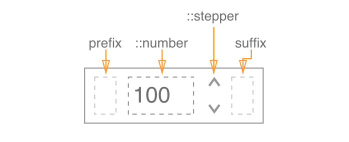

**Table of Contents**

- [Definition](#definition)
- [Elements](#elements)
- [Slider States](#slider-states)
- [Slider Props](#slider-props)
- [UI Customizations](#ui-customizations)
- [Behavior](#behavior)
  - [Keyboard](#keyboard)
  - [Mouse](#mouse)
  - [Touch](#touch)
- [Error handling](#error-handling)
- [Accessibility](#accessibility)
- [Examples](#examples)
- [Design](#design)

## Definition

**Number Input** allows  the user to enter a number within a certain range.

Number Input improves upon the native `<input type="number">` by providing the ability to customise stepper arrows design, a common React+Typescript API, and working out the kinks of native implementations.

## Elements

The **Number Input** functions as native `<input type="time">` component with additional ability to customise stepper and stepper arrows (using `::stepper`, `::stepper::up` ,`::stepper::down` subcomponents). Also number input can be customised by passing node elements into `prefix` and `suffix` properties.

## API

**Props**

See [README.md](./README.md) for more info.

**Style**

The **Number Input** can be customised using:

1. Tag selector or class for the main element
2. Subcomponents:
   - `::stepper` - to style entire stepper subcomponent
   - `::stepper::up` - style the stepper UP arrow
   - `::stepper::down` - style the stepper DOWN arrow  

See [README.md](./README.md) for more info.

## Visual States

| State    | Description                              |
| :------- | ---------------------------------------- |
| Default  | Default component appearance             |
| Hover    | User hovered over any part of the component |
| Focus    | Browser is focused on the component      |
| Error    | The `error` property is true             |
| Disabled | Component can not be changed             |

Link to [assets](https://zpl.io/agGkPRa)

## Accessibility

**Roles & Attributes**

| Role       | Attribute       | Element | Usage                                    |
| ---------- | --------------- | ------- | ---------------------------------------- |
| spinbutton |                 | `div`   | Idetifies component as a spin button.    |
|            | `aria-valuemin` | `div`   | Specifies the minimum value of the input (e.g. 00) |
|            | `aria-valuemax` | `div`   | Specifies the maximum value of the input (e.g. 25) |
|            | `aria-valuenow` | `div`   | Specifies current value of the input (e.g. 30) |

NOTE: there is not Accessibility spec in W3 for number input to put here as a reference.

**Screen Reader Behaviour**

Here is what a screenreader should say:

1. **Focus on hours:** current value (if present) -> "stepper";
2. **Change value:** new value -> "stepper";
3. **Set value to Max / Min**:  value -> "max" OR "min" -> "stepper".

## Behavior

Changing value in the input via keyboard precisely mirrors the behavior of the stepper arrows.

Stepping the value (arrows or keyboard) is performed **from current value**. E.g., if current value is 5.2, and step is 2, then UP will give us 7.2 (unless max is less than 7.2), and DOWN will give us 3.2.

When the value to be given by the stepper arrows/keyboard exceeds the min/max limits, the value is set to the corresponding min/max

When the user types a value, it isn't committed until enter, tab, click outside (or other committing events according to the description below) happen.

If the user types a value out of range, the value is set to the corresponding min/max **on commit**.

**RTL** 

RTL direction moves numbers to the right while `stepper` moves to the left. 

**Delete the value**
When user deletes values from the input it shows either placeholder (if prop is set) or empty state (if prop is empty).

The component follows the external control pattern (value displayed is defined by the `value` property, and in order for the component to function, it should be bound to a state in the parent component, and the `onChange` handler should be set).

**Error handling**

| Error                                    | Handling                                 |
| ---------------------------------------- | ---------------------------------------- |
| value (given as prop) out of min/max range | Show error in console                    |
| value (given as prop) out of step (e.g. min=0 / max=10, step=5, value=7) | value is shown as given (is NOT moved to the closest step) |
| user sets value out of range             | set value within range (to max or min)   |
| the `error` property is true             | This is used to give the user ability to manually indicate that there's an error in the input. Will set the `:error` CSS state on the input itself |

## Input Methods

#### Keyboard 

| Keys               | Action                                   |
| ------------------ | ---------------------------------------- |
| type a number      | insert a value without committing it.    |
| up arrow key       | increase value (& commit)                |
| down arrow key     | decrease value (& commit)                |
| shift + up / down  | increase / decrease value by step * 10 (& commit) |
| tab                | commits the value if needed, moves to next element (skips the stepper) |
| shift + tab        | commits the value if needed, moves to previous element |
| enter              | commits the value (if value wasn't committed) |
| esc                | removes focus (if in focus), discards non-committed new value (if value typed) |
| delete / backspace | deletes number                           |

#### Mouse

| Event                   | Action                                   | NOTE |
| ----------------------- | ---------------------------------------- | ---- |
| hover                   | triggers the css `:hover` state          |      |
| click inside            | focuses the element, selects all text inside |      |
| click outside           | blurs, commits value if the value is not committed |      |
| click & drag on stepper | increases/decreases the value (on drag up/down or left/right) (& commits) |      |

#### Touch

| Event                   | Action                                   | NOTE                                     |
| ----------------------- | ---------------------------------------- | ---------------------------------------- |
| tap inside              | same as mouse click                      |                                          |
| tap outside             | same as mouse click                      |                                          |
| drag                    | up/down/left/right - increase/decrease value by step | need to check if it messes with page scroll |
| tap on a stepper button | same as mouse click                      |                                          |

## Design

Link to [assets](https://zpl.io/agGkPRa)
