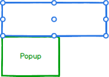

# Popup Component Specification

The Popup enables positioning content next to an anchor element or a point on the viewport.

* [Elements](#elements)
* [Internal](#internal)
  * [Position and Collision](#position-and-collision)
    * [Positioning](#positioning)
    * [Collision](#collision)
  * [Scroll](#scroll)
* [API](#properties)
* [Behavior](#behavior)
  * [Keyboard](#keyboard)
  * [Mouse](#mouse)
  * [Touch](#touch)

## Elements

Or

## Internal

### Position and Collision

* Position - The point and pivot for popup to anchor alignment
  * Anchor Position - Horizontal:
    * left - the left point of the anchor element
    * center - the center point of the anchor element
    * right - the right point of the anchor element
  * Anchor Position - Vertical:
    * top - the top point of the anchor element
    * center - the center point of the anchor element
    * bottom - the bottom point of the anchor element
  * Popup Position - Horizontal:
    * left - the left point of the popup element
    * center - the center point of the popup element
    * right - the right point of the popup element
  * Popup Position - Vertical:
    * top - the top point of the popup element
    * center - the center point of the popup element
    * bottom - the bottom point of the popup element

#### Positioning

* Points of reference

    There are 9 points on the anchor and popup element to be used as reference to where the popup will open. The chosen anchor point will be the location on which the popup will pivot. The popup point will be the location on the popup element which will be anchored to the point on the anchor element.

    

* Anchor default

    

  * Anchor { vertical: 'bottom', horizontal: 'left'}
  * Popup { vertical: 'top', horizontal: 'left'}

* Anchor sample position

    

  * Anchor { vertical: 'bottom', horizontal: 'right'}
  * Popup { vertical: 'top', horizontal: 'left'}

* Anchor sample position

    

  * Anchor { vertical: 'center', horizontal: 'center'}
  * Popup { vertical: 'top', horizontal: 'left'}

* Popup sample position

    

  * Anchor { vertical: 'bottom', horizontal: 'left'}
  * Popup { vertical: 'bottom', horizontal: 'left'}

* Popup sample position

    

  * Anchor { vertical: 'bottom', horizontal: 'left'}
  * Popup { vertical: 'top, horizontal: 'right}

#### Collision

Anytime a popup opens in a page, a check is made to verify that it fully fits into the viewport. Collision detection is the code that compares the viewport limitations with the size of the element and if there is not enough space, decides according to a set of rules how to react to the limitation. The rules are:

  * Horizontal collision was detected:
    * flip - Checks if the opposite side of the anchor has more space and if so flips it.
    * fit - Shifts the popup away from the edge of the viewport until it has enough space or reaches other side of viewport
    * flipfit - Applies flip logic and then fit logic
    * none - no collision detection
  * Vertical Collision - same as horizontal

### Scroll

The position of popup should remain in the location in which it was opened when the page is scrolled.

## API

| Name | Type | Default | Required | Description |
| -- | -- | -- | -- | -- |
| anchor | Element \| Point | none | Yes | The element to be used as an anchor for the popup (will open next to it). |
| open | boolean | false | no | Whether to show or hide the Popup |

* The following props should be placed in a PopupProps interface since they will need to be passed from higher order components.

| Name | Type | Default | Required | Description |
| -- | -- | -- | -- | -- |
| anchorPosition | PositionPoint | { vertical: 'bottom', horizontal: 'left'} | no | The point on the anchor element to which the popupPosition will attach to |
| popupPosition | PositionPoint | { vertical: 'top', horizontal: 'left'} | no | The point from which the popupPosition will pivot |
| collision | ICollision| {'vertical: 'none', horizontal: 'none'} | No | Specify the collision behavior of the component |
| syncWidth	| boolean |	true | no | If true, the width of the popup will be set to the width of the anchor. If false, it will be set to the width of the children.* Not relevant for a point anchor type.|

\* This property should be more robust in the future in order to handle options such as *contentMin* (set to size of largest content item), etc.

## Behavior

### Keyboard

* <kbd style="display: inline-block; padding: .1em .3em; color: #555; vertical-align: middle; background-color: #fcfcfc; border: solid 1px #ccc;border-bottom-color: #bbb;border-radius: .2em;box-shadow: inset 0 -1px 0 #bbb;">Esc</kbd> - closes the popup

### Mouse

* None - determined by

### Touch

* None - determined by user
