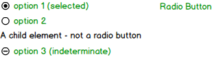

# Radio Group and Radio Button

The **RadioGroup** component is used to group together children and provide them with similar properties. The most common use case is to render **RadioButton** components under the group.

## Elements



## API

### RadioGroup Props

| Name     | Type     | Default | Required | Description                              |
| -------- | -------- | ------- | -------- | ---------------------------------------- |
| name     | string   | null    | no       | The name of the group. Sets the name property on each child. |
| id       | string   | null    | no       | Unique component instance identifier.                        |
| tabIndex | number   | 0       | no       | Tab order of the element, copied to the element in focus (not on the root). |
| disabled | boolean  | false   | no       | If `true`, all of the radio buttons and children are disabled. |
| readonly | boolean  | false   | no       | If `true`, the group value cannot be changed. |
| value    | string   | null    | no       | The value of the selected element.        |
| dataSource | DataInterface | null | no.  | Collection of data items. |
| onChange |function  | noop    | no       | Triggered by changing a radio button state to selected. <br> `(event: ChangeEvent) => void`  |
| children | React.ReactNode | null  | no  | Children components and elements.                                |

The following props are part of the **DataInterface** (name to be decided):

| Name | Type | Default | Required | Description |
| --- | --- | --- | --- | --- |
| dataSource | Array[DataSourceItem] | [] | no | The **DataSourceItem** is of type `string \| object \| symbol`. <br> Receives an array and the component uses the **renderItem** function to render the items in the array in order.
| dataSchema | {[index: string]: string} | {} | no | Maps fields from the **DataSourceItem** to the field used by the **renderItem** function |
| renderItem | function | default function | no | This function receives a **DataSourceItem** and determines how to render it. <br> `(item : DataSourceItem) -> JSX.Element`

### RadioButton Props

| Name     | Type        | Default   | Required   | Description                                    |
| -------- | ----------- | --------- | ---------- | ---------------------------------------------- |
| checked  | boolean     | false     | no         | If `true`, the button is checked.              |
| id       | string      | null      | no         | Unique identifier for the component instance.  |
| tabIndex | number      | -1 \| set by the containing **RadioGroup** | no | Tab order of the element. |
| name     | string      | null      | no         | The name of the group that this button is part of. |
| disabled | boolean     | false     | no         | If `true`, the button is disabled.  |
| readonly | boolean     | false     | no         | If `true`, the button's value is readonly and cannot be changed. |
| value    | string      | no        | Yes        | The value of the radio button.            |
| onChange | function    | noop      | no         | Triggered by changing the button's state. <br> `(event: ChangeEvent) => void` |
| children | React.ReactNode | null  | no         | children       |

### React Code Examples

##### Example 1

```jsx
import * as React from 'react';
import { RadioGroup, RadioButton } from 'stylable-components';
import style from './style.st.css'; // link to Style file - see examples of style files below

export class Example1 extends React.Component<{}, {}>{
    public state = {
      myValue: '',
    };

    private onChange = (e: {value: string}) => {
        this.setState({myValue: e.value});
    }

    render() {
        return (
            <RadioGroup onChange={this.onChange} name="example1" className="rg1">
               <RadioButton value="Option 1"/>
               <RadioButton value="Option 2" checked/>
               <RadioButton value="Option 3"/>
           </RadioGroup>
       );
    }
}
```

##### Example 2

```jsx
import * as React from 'react';
import { RadioGroup, RadioButton, RadioChangeEvent } from 'stylable-components';
import style from './style.st.css'; // link to Style file - see examples of style files below

export class Example2 extends React.Component<{}, {}>{
    public state = {
      myValue: '',
    };

    private onChange = (e: {value: string}) => {
        this.setState({myValue: e.value});
    }

    render() {
        return (
            <RadioGroup
                 onChange={this.onChange}
                 name="example2"
                 className="rg2"
                 dataSource={[
                     {value: 'Option 1'},
                     {value: 'Option 2', checked: true},
                     {value: 'Option 3'}
                 ]}
            />
       );
    }
}
```

## Style API

### RadioGroup Subcomponents (pseudo-elements)

| selector | description                              |
| -------- | ---------------------------------------- |
| ::option | Allows styling the children contained in the **RadioGroup**. This subcomponent is a **RadioButton**. See its style API below. |

### RadioButton Subcomponents (pseudo-elements)

| selector           | description                              |
| ------------------ | ---------------------------------------- |
| ::contentContainer | Style the `<div>` containing the button and the children passed to the component. |
| ::button           | Style the actual button graphics for the **RadioButton**. <br> Use the `:checked` state to style the icon. |

### RadioButton Custom CSS States (pseudo-classes)

| state     | description                              |
| --------- | ---------------------------------------- |
| :disabled | Style the button when it is disabled.     |
| :focused  | Style the component when it gets document focus. |
| :checked  | Style the button when it is checked.      |

### Style Code Example

```css
@namespace "MyAwesomeComp";

:import {
    -st-from: "stylable-components/dist/src/components/radio-group/radio-group.st.css";
    -st-default: RG;
}

/* myRadioGroup class now extends stylable radio group */
.myRadioGroup {
    -st-extends: RG;
}

/* style every child of the group*/
.myRadioGroup::option {
    display: block;
}

/* style every child of the group when in hover state*/
.myRadioGroup::option:hover {
    border: 1px solid rebeccapurple;
}

/* style every child's inner class */
.myRadioGroup::option::radioSVG {
    width: 20px;
    height: 20px;
}
```
