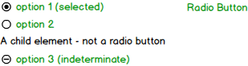

# RadioGroup/RadioButton Component Specifications

* [Description](#description)
* [Elements](#elements)
* [API](#api)
* [Internal](#internal)
* [Styling](#styling)
* [Accessibility](#accessibility)
  * [Roles](#roles)
  * [Aria Attributes](#aria-attributes)
  * [Focus](#focus)
* [Behavior](#behavior)
  * [Keyboard](#keyboard)
  * [Mouse](#mouse)
  * [Touch](#touch)
* [Design](#design)

## Description

A fully-typed React radiogroup/radiogroup implementation.

## Elements

## API

**RadioGroup**

| Name | Type | Default | Required | Description |
| -- | -- | -- | -- | -- |
| name | string | null | no | The name of the group. sets the _name_ property on each child |
| id | string | null | no | Unique identifier |
| tabIndex | number | 0 | no | Tab order of the element, copied to the element in focus (not on the root) |
| disabled | boolean | false | no | Whether all the radio buttons are disabled |
| readonly | boolean | false | no | Whether the group value cannot be changed |
| value | string | null | no | The value of the selected element |
| onChange | (event: ChangeEvent) => void | NOOP | no | Triggered by changing a radio button state to selected |
| children | React.ReactNode | null | no | children |

The following props are part of the DataInterface (name to be decided):

| Name | Type | Default | Required | Description |
| -- | -- | -- | -- | -- |
| dataSource | Array[DataSourceItem] | [] | no | The DataSourceItem is of type '*string \| object \| symbol*'. The dataSource receives an array and the component uses the renderItem function to render the items in the array in order.
| dataSchema | {[index: string]: string} | {} | no | Maps fields from the DataSourceItem to the field used by the renderItem function |
| renderItem | (item : DataSourceItem) -> JSX.Element \| default function | no | The renderItem function receives a DataSourceItem and then decides how to render it.

**RadioButton**

| Name | Type | Default | Required | Description |
| -- | -- | -- | -- | -- |
| checked | boolean | false | no | Whether the button appears checked |
| id | string | null | no | Unique identifier |
| tabIndex | number | -1 \| tabIndex set by RadioGroup | Tab of order of the element |
| name | string | null | no | The name of the group that this button is part of |
| disabled | boolean | false | no | Whether this button appears as disabled |
| readonly | boolean | false | no | Whether this button's value can be changed |
| value | string | no | Yes | The value of the radio button |
| onChange | (event: ChangeEvent) => void | NOOP | no | Triggered by changing the button's state |
| children | React.ReactNode | null | no | children | Any further nodes will be rendered. |

## Internal

There are several methods to use the RadioGroup. In the simple case, the RadioGroup accepts children and renders them in order, RadioButtons being the components that "participate" in flow. When both a datasource and children are present, the datasource items are rendered and then the children. When only a datasource is given then they are rendered in order according to the logic of the renderItem function.

The default renderItem function works only for strings and renders RadioButtons for each string. Any other element type can be ignored.

## Styling

**RadioButton States**

| Name | Description |
| -- | -- |
| :checked | RadioButton is in checked state |
| :disabled | RadioButton is in disabled state |
| :focused | RadioButton is highlighted |

## Accessibility

### Roles

* Root role - radiogroup
* Child role - radio

### Aria Attributes

* Text content attributes relevant for the radiogroup - aria-label, aria-labelledby, aria-describedby.
* aria-checked is set to true on the checked radio button and set to false on the unchecked radio buttons.

### Focus

* Upon receiving focus:
  * If a radio button is checked, focus is set to the checked button
  * If no button is checked, focus is set to the first radio button
* Set tabindex="-1" on all radio buttons which are unchecked (apart from the first one if all are unchecked), otherwise set tabindex="0"

Use roving tabindex method in a minimal way, no need to set focus explicitly in code since the hidden input element takes care of it in the browser and assistive technologies.

## Behavior

### Keyboard

* <kbd style="display: inline-block; padding: .1em .3em; color: #555; vertical-align: middle; background-color: #fcfcfc; border: solid 1px #ccc;border-bottom-color: #bbb;border-radius: .2em;box-shadow: inset 0 -1px 0 #bbb;">Space</kbd> Checks the focused button if not already checked
* <kbd style="display: inline-block; padding: .1em .3em; color: #555; vertical-align: middle; background-color: #fcfcfc; border: solid 1px #ccc;border-bottom-color: #bbb;border-radius: .2em;box-shadow: inset 0 -1px 0 #bbb;">Up</kbd> or <kbd style="display: inline-block; padding: .1em .3em; color: #555; vertical-align: middle; background-color: #fcfcfc; border: solid 1px #ccc;border-bottom-color: #bbb;border-radius: .2em;box-shadow: inset 0 -1px 0 #bbb;">Left</kbd> move focus to the previous radio button in the group, uncheck the previously focused button, and check the newly focused button. If focus is on the first button, focus moves to the last button.
* <kbd style="display: inline-block; padding: .1em .3em; color: #555; vertical-align: middle; background-color: #fcfcfc; border: solid 1px #ccc;border-bottom-color: #bbb;border-radius: .2em;box-shadow: inset 0 -1px 0 #bbb;">Down</kbd> or <kbd style="display: inline-block; padding: .1em .3em; color: #555; vertical-align: middle; background-color: #fcfcfc; border: solid 1px #ccc;border-bottom-color: #bbb;border-radius: .2em;box-shadow: inset 0 -1px 0 #bbb;">Right</kbd> move focus to the next radio button in the group, uncheck the previously focused button, and check the newly focused button. If focus is on the last button, focus moves to the first button.

### Mouse

* Clicking on an element selects it

### Touch

* Tapping on an element selects it

### Design

See [zeplin](https://app.zeplin.io/project/590ed391cb8bde641789e1cb/screen/5964cdbf48b8359b948c6778).
