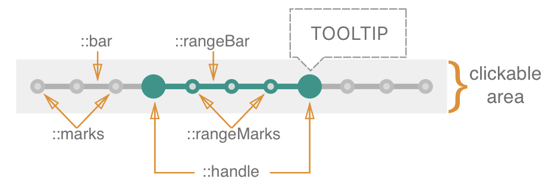

# Range Slider

A **range slider** is an input where the user selects a range of values from within a given/predefined range.	


### Elements



A **Range Slider** is composed of the following elements: "bar", "handle", "rangeBar", "marks", "rangeMarks", "tooltip". The "handle" is dragged across the "bar" in order to give the range slider a desired value, while "rangeBar" shows the range between values. "Tooltip" is used to show the current value.

The value steps are indicated by marks and rangeMarks.

You can display a tooltip (e.g. to display current value) by adding a child element with the relevant data-slot (data-slot="tooltip").


### API

#### Props

| name            | type                                     | defaultValue | isRequired | description                              |
| --------------- | ---------------------------------------- | ------------ | ---------- | ---------------------------------------- |
| value           | array of numbers                         | [2, 5]       |            | Difference between values represent slider's selected range. |
| disableCross    | bool                                     | false        |            | Prevents handles to cross                |
| axis            | 'x'<br>'x-reverse'<br>'y'<br>'y-reverse' | 'x'          |            | The axis on which the slider will slide  |
| min             | number                                   | 0            |            | The absolute minimum of the slider's range |
| max             | number                                   | 1            |            | The absolute maximum of the slider's range |
| step            | number OR string "any"                   | 1            |            | Set the slider's step. If step = "number" it causes slider to move in discrete increments. If step = "any" sliders moves along a subjective range |
| disabled        | bool                                     | false        |            | If true, the slider will not be interactive |
| label           | string                                   |              |            | Text to display in accessibility mode    |
| name            | string                                   |              |            | The name of the slider. Behaves like the name attribute of an input element |
| displayMarks    | bool                                     | false        |            | Controls the visibility of the marks     |
| displayTooltip  | bool                                     | false        |            | Controls the visibility of the tooltip   |
| tooltipPosition | string                                   | top          |            | Controls the position of the tooltip. <br> Supports the following options: `top`, `bottom`, `left`, `right` |
| onChange        | `(event: {value: number}): void`         |              | yes        | Callback function that is fired when the slider's value changed. |
| onDragStart     | `(event: PointerEvent): void`            |              |            | Callback function that is fired when the handle has begun to move. |
| onDragStop      | ` event: PointerEvent): void`            |              |            | Callback function that is fired when the handle has stopped moving. |
| onDrag          | ` event: PointerEvent): void`            |              |            | Callback function that is fired when the handle is moving. |


### Code Examples

#### **Example 1:**

```jsx
//TODO: code example should be updated when component is done
import * as React from 'react';
import { RangeSlider } from './components/rangeslider';
import style from './style.st.css'; // link to Style file - see examples of style files below

type State = {
  rangesliderValue: number
}

export class ComponentsDemo extends React.Component<{}, State>{
  	state: State,

    constructor() {
        super();
    },

    public render() {
        return <RangeSlider
                 value="{this.state.rangesliderValue}"
                 onChange={/* something */}
          		/>;
    }
}
```

Comments to example 1

**Example 2:**

```jsx
//TODO: code example should be updated when component is done
import * as React from 'react';
import { RangeSlider } from './components/rangeslider';
import style from './style.st.css'; // link to Style file - see examples of style files below

type State = {
  rangesliderValue: number
}

export class ComponentsDemo extends React.Component<{}, State>{
  	state: State,

    constructor() {
        super();
    },

    public render() {
        return <RangeSlider
                 value="{this.state.rangesliderValue}"
                 onChange={/* something */}>
                 	<span data-slot="tooltip"></span>
          	   </RangeSlider>;
    }
}
```

Comments to example 2


## Style API

### Subcomponents (pseudo elements)

| selector     | description                              | note                                     |
| ------------ | ---------------------------------------- | ---------------------------------------- |
| ::handles    | Allows to style the handles of the slider | For now there is no way to style each handle separately |
| ::bar        | Allows to style the bar of the slider    |                                          |
| ::rangeBar   | Allows to style the section of the bar that represents selected range |                                          |
| ::marks      | Allows to style marks that are shown on the ::bar section of the slider | by default ::marks use the same background color as ::bar |
| ::rangeMarks | Allows to style marks that are shown on the :rangeBar section of the slider | by default ::rangeMarks use the same background color as ::rangeBar |
| ::tooltip    | Allows to style the tooltip              |                                          |

### Custom CSS States (pseudo-classes)

| state                          | description                            |
| ------------------------------ | -------------------------------------- |
| :error                         | Style the error state of the component |
| :hover, :focus, :disabled, etc | Standard CSS pseudo state              |


### Style Code Examples

**Example 1:**

```css
@import * from './components/rangeslider'; 
/* TODO: fix the correct syntax */
/* style.st.css
Adding rules here (which may be shared between different components) allows us to override specific parts or even change the whole theme
*/
RangeSlider {
  background: transparent;
}

RangeSlider::bar {
  background-color: #bada55; 
/* although the whole look comes from the theme, we override the background color of the range slider bar */
}

RangeSlider::handles {
  background-color: #0099ff;
}

RangeSlider::handles:hover {
  background-color: #33ccff;
}

RangeSlider:disabled::handles {
  background-color: gray;
}
```

**Example 2:**

```
/* code example of the basic theme here? */
```