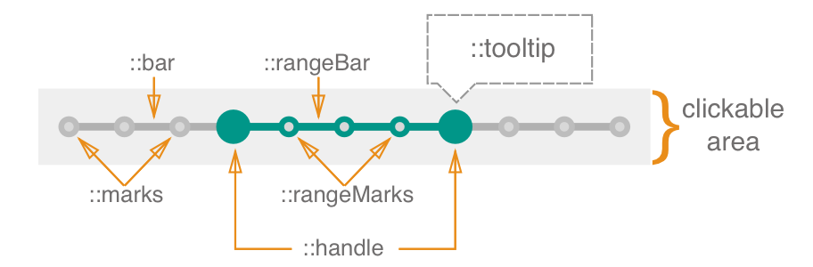

# Range Slider

The **RangeSlider** is an input component that allows the user selects a range of values from within a given or predefined range.

## Elements



**RangeSlider** consists of the following elements:

* **::bar** represents the component's range. 
* **::rangeBar** represents the selected range from within the full range.
* **::handle** is dragged across the ::bar in order to set or change the selected range.
* **::marks** represent steps.
* **::rangeMarks** represent steps that are displayed within ::rangeBar.
* **::tooltip** is an optional display of the current value of the ::handle being dragged.
* **clickable area** represents the area where you can interact with the component (e.g. drag handles and change the range).

## API

### Props

| name             | type                                     | defaultValue | isRequired | description                              |
| ---------------- | ---------------------------------------- | ------------ | ---------- | ---------------------------------------- |
| value            | array of numbers                         | [2, 5]       |            | Difference between values represent slider's selected range. |
| disableCross     | boolean                                     | false        |            | Prevents handles from crossing.                |
| axis             | enum:<br>'x'<br>'x-reverse'<br>'y'<br>'y-reverse' | 'x'          |            | The axis on which the handles will slide.  |
| min              | number                                   | 0            |            | The absolute minimum of the range of the ::bar. |
| max              | number                                   | 1            |            | The absolute maximum of the range of the ::bar. |
| step             | number OR string "any"                   | 1            |            | Set the slider's step behavior. If step is set to a number, it causes each ::handle to move in discrete increments. If step is set to the string "any", each ::handle moves along a subjective range. |
| disabled         | boolean                                     | false        |            | If true, the component will not be interactive. |
| label            | string                                   |              |            | Text to display in accessibility mode.    |
| name             | string                                   |              |            | The name of the component's instance. Behaves like the name attribute of an input element. |
| displayStopMarks | boolean                                     | false        |            | Controls the visibility of the ::marks.   |
| displayTooltip   | boolean                                     | false        |            | Controls the visibility of the ::tooltip.   |
| tooltipPosition  | string                                   | top          |            | Controls the position of the tooltip. <br> Supports the following options: `top`, `bottom`, `left`, `right` |
| onChange         | function         |              | yes        | Callback function that is fired when the value of the bar has changed.<br>`(event: {value: number}): void` |
| onDragStart      | function            |              |            | Callback function that is fired when the ::handle has begun to move.<br>`(event: PointerEvent): void` |
| onDragStop       | function            |              |            | Callback function that is fired when the handle has stopped moving.<br>`(event: PointerEvent): void` |
| onDrag           | function            |              |            | Callback function that is fired when the handle is moving.<br>`(event: PointerEvent): void` |

### Code Examples

##### Example 1

```jsx
//TODO: code example should be updated when component is done
import * as React from 'react';
import { RangeSlider } from './components/rangeslider';
import style from './style.st.css'; // link to Style file - see examples of style files below

type State = {
  rangesliderValue: number
}

export class ComponentsDemo extends React.Component<{}, State>{
  	state: State,

    constructor() {
        super();
    },

    public render() {
        return <RangeSlider
                 value="{this.state.rangesliderValue}"
                 onChange={/* something */}
          		/>;
    }
}
```

##### Example 2

```jsx
//TODO: code example should be updated when component is done
import * as React from 'react';
import { RangeSlider } from './components/rangeslider';
import style from './style.st.css'; // link to Style file - see examples of style files below

type State = {
  rangesliderValue: number
}

export class ComponentsDemo extends React.Component<{}, State>{
  	state: State,

    constructor() {
        super();
    },

    public render() {
        return <RangeSlider
                 value="{this.state.rangesliderValue}"
                 onChange={/* something */}>
                 	<span data-slot="tooltip"></span>
          	   </RangeSlider>;
    }
}
```

## Style API

### Subcomponents (pseudo elements)

| selector     | description                              | note                                     |
| ------------ | ---------------------------------------- | ---------------------------------------- |
| ::handle     | Allows you to style the handles of the slider. | Styling each ::handle separately is not currently supported. |
| ::bar        | Allows you to style the bar of the slider.  |                     |
| ::rangeBar   | Allows you to style the section of the ::bar that represents selected range. |   |
| ::marks      | Allows you to style ::marks that are shown on the ::bar section of the slider. | By default, ::marks use the same background color as ::bar. |
| ::rangeMarks | Allows you to style ::rangeMarks that are shown on the ::rangeBar section of the slider. | By default, ::rangeMarks use the same background color as ::rangeBar. |
| ::tooltip    | Allows you to style the tooltip.              |                      |

### Custom CSS States (pseudo-classes)

| state                       | description                            |
| --------------------------- | -------------------------------------- |
| :error                      | Style the component on error, i.e. when the `error` prop is true. |
| :hover, :focus, :disabled, etc | Standard CSS pseudo state.              |

### Style Code Examples

##### Example 1

```css
@import * from './components/rangeslider'; 
/* TODO: fix the correct syntax */
/* style.st.css
Adding rules here (which may be shared between different components) allows us to override specific parts or even change the whole theme
*/
RangeSlider {
  background: transparent;
}

RangeSlider::bar {
  background-color: #bada55; 
/* although the whole look comes from the theme, we override the background color of the range slider bar */
}

RangeSlider::handles {
  background-color: #0099ff;
}

RangeSlider::handles:hover {
  background-color: #33ccff;
}

RangeSlider:disabled::handles {
  background-color: gray;
}
```
