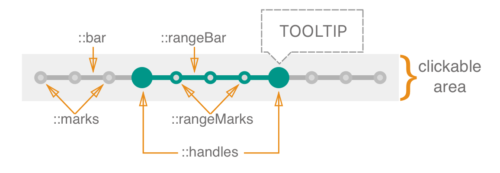
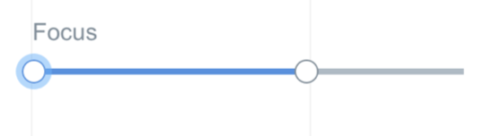

   **Table of Contents**

- [Definition](#definition)

- [Elements](#elements)

- [API](#api)

- [States](#states)

- [Accessibility](#accessibility)

- [Behavior](#behavior)

  - [Input Methods](#input-methods)
    - [Keyboard](#keyboard)
    - [Mouse](#mouse)
    - [Touch](#touch)

- [RTL](#rtl)

- [DOM structure](#dom-structure)

- [Design](#design)

  ​

## Definition

A **range slider** is an input where the user selects a range of values from within a given/predefined range.	

## Elements

The handles are dragged across the bar in order to give the slider a desired range. Marks and range marks are representing the step. Clickable area represents the area where user can interact with slider (e.g. drag handles & change range) 

**Range Slider consists of:** 
::bar - represents sliders given range 
::rangeBar - represents selected range from within a given range
::handles - are dragged across the bar in order to set/change range
::marks - represent step
::rangeMarks - represent step that it displayed within ::rangeBar	

> TBD (need to decide on how to implement tooltip)
> Also, you can display tooltip (e.g. to display current value) by adding child DOM element with relevant data-slot (data-slot="tooltip")

## API

**Props**

See [README.md](./README.md) for more info.

**Style**

Slider can be customized using ::bar, ::rangeBar, ::handles, ::marks and ::rangeMarks. 

For more info, see [README.md](./README.md).

## States

| State    | Description                              |
| :------- | ---------------------------------------- |
| Default  | Default component appearance             |
| Hover    | User hovered over bar / handle / clickable area |
| Focus    | User focuses on the components. Focus appears on click, tap or when user focuses on element with TAB button (focus is displayed around the 'handle'). |
| Active   | User clicks on bar, handle or mark       |
| Disabled | Component can not be changed             |
| Error    | Error state for the component (can be set with :error pseudo-class) |

Design [assets](https://zpl.io/2kRTvO)

## Accessibility

##### Keyboard

Range Slider has all basic accessibility features related to keyboard behavior (tab, space, shift, arrows, etc). See [keyboard](https://github.com/wix/stylable-components/blob/master/specs/timeInput/timePickerSpec.md#keyboard) section for more info.

##### Focus

Focus is placed around the handle. If user focuses on the slider with TAB button, focus is placed over the handle with smaller value first and then moves to the next handle. If user interacts with slider via mouse/tap, focus is placed over the active handle. Only one handle can have focus.  

> NOTE:
> Focus is placed on handle according to ARIA doc
> https://www.w3.org/TR/wai-aria-practices/#slidertwothumb

**Roles & Attributes**

| Role   | Attribute               | Element | Usage                                    |                                          |
| ------ | ----------------------- | ------- | ---------------------------------------- | ---------------------------------------- |
| slider |                         | div     | 1) Identifies the element as a slider. 2) Set on the `div` that represents as the movable thumb because it is the operable element that represents the slider value. | Each element serving as a focusable slider thumb has role [slider](https://www.w3.org/TR/wai-aria-1.1/#slider) |
|        | `tabindex=0`            | `div`   | Includes the slider thumb in the page tab sequence |                                          |
|        | `aria-valuemax=100`     | `div`   | Specifies the maximum value of the slider |                                          |
|        | `aria-valuemin=0`       | `div`   | Specifies the minimum value of the slide |                                          |
|        | `aria-valuenow=NUMBER`  | `div`   | Indicates the current value of the slider |                                          |
|        | `aria-label`            | `div`   | Defines a string value that labels the current element |                                          |
|        | `aria-labelledby=IDREF` | `div`   | Refers to the element containing the name of the slider |                                          |
|        | `aria-describedby`      | `div`   | Identifies the element (or elements) that describes the object |                                          |
|        | `aria-orientation`      | `div`   | Indicates the orientation of the slider element.Set to `vertical` for sliders with vertical orientation. Set to `horizontal` for sliders with horizontal orientation |                                          |
|        | `aria-label=text`       | `div`   | A label identifying the function of the slider (e.g "Minimum Price" or "Maximum Price") | This attribute is necessary to inform the user which handle is currently in focus |

See ARIA example for reference - https://rawgit.com/jongund/aria-practices/slider/examples/slider/multithumb-slider.html

**Reference links:** 
https://www.w3.org/TR/wai-aria-practices/#slidertwothumb
https://www.paciellogroup.com/blog/2008/05/aria-slider-part-1/
https://www.paciellogroup.com/blog/2008/06/aria-slider-part-2/
http://ilyabirman.net/meanwhile/all/slider/

## Behavior

In order to change/set range, user can:

1. drag handles over the slider bar 
2. click on the slider bar, mark OR clickable area to select the value from within the given range
3. click & drag  (click = click on handle, slider, mark OR clickable area)

Changing the value is performed **from current value** to the next expected value. 
E.g. if `min=0`, `max=10`, `step=2`, `value=3.5`, then UP arrow key will give us 4 and Down arrow key will give us 2
Value can not exceed the min/max limits. If value is > or < than min/max it is automatically set to corresponding min/max.

If range slider has a `step` prop set to "number", handles should move across the slider bar only according to the step.

When user clicks/taps on slider bar we move the handle that is closer to selected value OR handle with lower value.  

E.g.

1. If `min=0`, `max=10`, `step=1`, `value=3, 7`, then when user clicks/taps on 8 we move handle that represents value 7 (no matter what handle is in focus right now). 
2. If `min=0`, `max=10`, `step=1`, `value=3, 7`, then when user clicks/taps on 5 we move handle that represents value 3  (no matter what handle is in focus right now). 

NOTE: active handle should immediately obtain focus.

**Number of handles**

Number of handles displayed on sliders equals to the number of values in `value` prop. 

**Crossing handles**
You can allow/forbade handles to cross using `allowCross` prop. Handles can not push each other (they either cross or stop before the next/previous handle).

If use is trying to set min/max value to one handle, allowed min/max value is determine either by sliders range or by next/previous handle. 

**Alignment & Direction**

You can adjust sliders alignment and direction in which the range is going to change with axis prop.

1. `axis="x"` -> horizontal slider, progress is moving from left to right

2. `axis="x-reverse"` -> horizontal slider, progress is moving from right to left

3. `axis="y"` -> vertical slider, progress is moving from bottom to top

4. `axis="y-reverse"` -> vertical slider, progress is moving from top to bottom

   ​

#### Validation

| Case                          | Handling          |
| ----------------------------- | ----------------- |
| `value` is less then `min`    | set to `min`      |
| `value` is greater than `max` | set to `max`      |
| `value` is empty              | set to `min` OR 0 |

#### Edge case handling

| Case                                     | Handling                                 | Example                                  |
| ---------------------------------------- | ---------------------------------------- | ---------------------------------------- |
| value is out of `step`                   | keep current value & display handle at the position that represents this value | `min=0` `max=10` `step=2` `value=3.5`. Handle is displayed at the position that represents 3.5. When user changes value (keyboard / mouse) we move it to the next expected, which is 4 or 2 |
| `step` is not set & `marks` are set to true | show marks at the beginning and at the end of the slider |                                          |

### Input Methods 

#### Keyboard

| Keys                                     | Action                      |
| ---------------------------------------- | --------------------------- |
| up / right arrow key                     | increase value              |
| left / down arrow key                    | decrease value              |
| home ( fn/ctrl) OR shift + left arrow key | set min value               |
| end ( fn/ctrl) OR shift + left arrow key | set max value               |
| page up (fn/ctrl) OR shift + up arrow key | increase value by 10        |
| page down (fn/ctrl) OR shift + down arrow key | decrease value by 10        |
| tab                                      | moves to next element       |
| shift + tab                              | moves to previous element   |
| esc                                      | removes focus (if in focus) |

**RTL** orientation

| Keys                   | Action         |
| ---------------------- | -------------- |
| up  / left arrow key   | increase value |
| down / right arrow key | decrease value |

#### Mouse

| Event                                    | Action                                   |
| ---------------------------------------- | ---------------------------------------- |
| hover (over bar / handle / clickable area) | highlight slider (bar, handle, marks)    |
| click & drag (right / left OR up / down) | change value according to direction of movement |
| click (on handle)                        | highlights handle                        |
| click (on bar / mark / clickable area)   | moves handle to position where user clicked |

#### Touch

| Event                                  | Action                                   | NOTE                                     |
| -------------------------------------- | ---------------------------------------- | ---------------------------------------- |
| tap (on handle)                        | highlights handle                        | we need the ability to expand clickable area for mobile devices |
| tap (on bar / mark / clickable area)   | moves handle to position where user clicked | -                                        |
| tap & drag (right / left OR up / down) | change value according to direction of movement | -                                        |

###### Links to sliders (for reference): 

http://files.paciellogroup.com/blogmisc/ARIA/slider/
https://www.w3.org/TR/wai-aria-practices/examples/slider/slider-2.html
http://ilyabirman.net/meanwhile/all/slider/

## RTL

> RTL behavior is under discussion.

## DOM structure

TBD

## Design

Link to [assets](https://zpl.io/2kRTvO)
