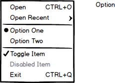

# SelectionList Component

**SelectionList** is a component which allows the user to take action by choosing an item from a list. **SelectionList** will usually be displayed inside of a **Popup** component.

## Elements



## API

### Props

| Name | Type | Default | Required | Description |
| --- | --- | --- | --- | --- |
| value | string \| Array\<string> | null | no | ID string, or array of ID strings, of the selected item(s). |
| onChange | function | noop | no | Triggered when an item is selected in the list.<br>`(event: ChangeEvent) => void` |
| multiple | boolean | false | no | Whether the selection list supports single or multiple selections. When `true`, adds `aria-multiselectable='true'` to the root element.
| orientation | enum:<br>'Vertical'<br>'Horizontal' | 'Vertical' | no | The orientation is used mostly for assistive technologies. Changing to 'Horizontal' will change the behavior of keyboard navigation and add an aria-orientation attribute to the root with the 'Horizontal' value. |
| typeAhead | boolean | true | no | Enables keyboard type-ahead. |
| children | any | null | no | Children to be rendered in the list. |
| dataSource | Array[DataSourceItem] | [] | no | The DataSourceItem is of type `string \| object \| symbol`. The dataSource receives an array and the component uses the renderItem function to render the items in the array in order.
| dataSchema | {[index: string]: string} | {} | no | Maps fields from the DataSourceItem to the field used by the renderItem function |
| renderItem | function | default function | no | The renderItem function receives a DataSourceItem and then decides how to render it.<br>`(item : DataSourceItem) -> JSX.Element` |

### React Code Examples

```jsx
@stylable(demoStyle)
class TextStyleList extends React.Component {
    public state = {value: 'heading'};

    public render() {
        return (
            <div data-automation-id="TEXT_STYLE">
                <h3>Child components as options</h3>
                <SelectionList
                    className="text-style-list"
                    value={this.state.value}
                    onChange={this.handleChange}
                >
                    <Option value="title">
                        <span className="text-style-title">Title</span>
                    </Option>
                    <Option value="heading">
                        <span className="text-style-heading">Heading</span>
                    </Option>
                    <Option value="heading-red">
                        <span className="text-style-heading-red">Heading Red</span>
                    </Option>
                    <Option value="body">
                        <span className="text-style-body">Body</span>
                    </Option>
                    <Option value="caption" disabled>
                        <span className="text-style-caption">Caption</span>
                    </Option>
                    <Option value="label">
                        <span className="text-style-label">Label</span>
                    </Option>
                </SelectionList>
                <p>
                    <span data-automation-id="RESULT" className={`text-style-${this.state.value}`}>
                        Styled text
                    </span>
                </p>
            </div>
        );
    }

    private handleChange = ({value}: {value: SelectionListItemValue}) => this.setState({value});
}
```

## Style API

### Subcomponents (pseudo elements)

| selector | description |
| --- | --- |
| ::item | Selector applying to items in the list. |

### Custom CSS States (pseudo classes)

The following states are applied to the items in the list. 

state | type | default | description
--- | --- | --- | ---
:selected | boolean | false | Whether the item is selected.
:focused | boolean | false | Whether the item is focused by keyboard navigation.
:hidden | boolean | false | Whether the item appears in the list.
:disabled | boolean | false | Whether the item is enabled for selection or not.
:hover | boolean | false | Whether the cursor is positioned over the item.<br>(Standard CSS pseudo state)

### Style Code Example

```css
@namespace "SelectionListDemo";

:import {
    -st-from: '../../src/components/selection-list/selection-list.st.css';
    -st-default: List;
}

.text-style-list {
    -st-extends: List;
}

.text-style-list::item {
    padding: 10px 20px;
    color: #000000;
    border-top: 1px solid #DDDDDD;
    cursor: pointer;
}

.text-style-list::item:first-child {
    border-top: none;
}

.text-style-list::item:disabled {
    cursor: default;
}

.text-style-list::item:disabled > * {
    filter: grayscale(100%);
    opacity: 0.2;
}

.text-style-title {
    font-family: Helvetica, sans-serif;
    font-size: 30pt;
    font-weight: bold;
}

.text-style-heading {
    font-family: Helvetica, sans-serif;
    font-size: 18pt;
    font-weight: bold;
}

.text-style-heading-red {
    font-family: Helvetica, sans-serif;
    font-size: 16pt;
    font-weight: bold;
    color: #C82506;
}

.text-style-body {
    font-family: Helvetica, sans-serif;
    font-size: 11pt;
}

.text-style-caption {
    font-family: Helvetica, sans-serif;
    font-size: 10pt;
    text-transform: uppercase;
    font-weight: bold;
}

.text-style-label {
    font-family: Helvetica, sans-serif;
    background: #C0C0C0;
    color: #FFFFFF;
    padding: 2px 3px;
}
```
