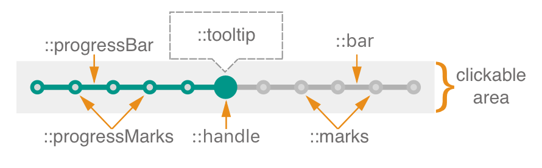

# Slider Component

**Slider** is a component in Wix's [Stylable Components](https://github.com/wix/stylable-components/) library that allows users to easily input or select value from a range.

Sliders are great for adjusting settings that reflect intensity levels (volume, brightness, color saturation).

## Elements



A **Slider** is composed of: a "bar", a "handle", and a "progress" segment. The "handle" is dragged across the "bar" in order to give the slider a desired value, while "progress" marks the range from the minimum value to the current value. 

You can also add elements to it by using the tooltip (e.g. to display value) and error slots, and passing the appropriate props (see component props).

## Component API

> tbd :: add method definition

### Component Props

| name        | type                                  | defaultValue | isRequired | description                              |
| ----------- | ------------------------------------- | ------------ | ---------- | ---------------------------------------- |
| axis        | enum:&nbsp;&nbsp;&nbsp;&nbsp;&nbsp;&nbsp;&nbsp;&nbsp; 'x',<br> 'x-reverse',<br> 'y',<br> 'y-reverse' | 'x'          |            | The axis on which the slider will slide. |
| value       | number                                | max          |            | Displays default OR actual value of the slider. |
| min         | number                                | 0            |            | The absolute minimum of the slider's range. |
| max         | number                                | 1            |            | The absolute maximum of the slider's range. |
| step        | number                                | 1            |            | The slider's step value.                        |
| required    | bool                                  | FALSE        |            | Whether or not the slider is required in a form. |
| disabled    | bool                                  | FALSE        |            | If true, the slider will not be interactive. |
| label       | string                                |              |            | Text to display in accessibility mode.    |
| name        | string                                |              |            | The name of the slider. Behaves like the name attribute of an input element. |
| onChange    | func                                  |              | yes        | Callback function that is fired when the slider's value changed.<br>`function(event: object, newValue: number): void`<br> ● event: KeyDown event targeting the slider.<br> ● newValue: The new value of the slider. |
| onDragStart | func                                  |              |            | Callback function that is fired when the slider has begun to move.<br>`function(event: object) : void`<br> ● event: MouseDown or TouchStart event targeting the slider. |
| onDragStop  | func                                  |              |            | Callback function that is fired when the slide has stopped moving.<br>`function(event: object) : void`<br> ● event: MouseEnd or TouchEnd event targeting the slider. |
| tooltip     | node                                  | null         |            | You can pass a tooltip component into this prop, and it will be displayed on hover near the handle of the Slider. |

### Code Example

```jsx
//TODO: code guys - fix code example!
import * as React from 'react';
import { Slider } from './components/slider';
import style from './style.st.css'; // link to Style file - see examples of style files below

type State = {
  sliderValue: number
}

export class ComponentsDemo extends React.Component<{}, State>{
  	state: State,
    
    constructor() {
        super();
    },

    render() {
        return <div>
            <Slider 
                 onChange={newValue => this.setState({sliderValue: newValue})} // this should conform to the onChange API, please change 
              	 value="{this.state.sliderValue}"
                 tooltip="<div className='tooltip'>{this.state.sliderValue}</div>"
                 />
          </div>;
    }
}
```

## Style API

### Subcomponents (pseudo elements)

| selector   | description                              | type                                     |
| ---------- | ---------------------------------------- | ---------------------------------------- |
| ::handle   | Allows you to style the handle of the slider | HTML Element. This subcomponent has no subcomponents of its own* |
| ::bar      | Allows you to style the bar of the slider | HTML Element. This subcomponent has no subcomponents of its own* |
| ::progress | Allows you to style the progress part of the bar | HTML Element. This subcomponent has no subcomponents of its own* |
| ::error    | Style the error message node             | If text is passed, this will allow you to set its font & positioning. If a node / component is passed, this will be used to set its position & display. |

> if a subcomponent is a COMPONENT, it might have subcomponents -> then we will link here to its documentation

### Custom CSS States (pseudo-classes)

| state                          | description                              |
| ------------------------------ | ---------------------------------------- |
| :error                         | Style the component on error, i.e. when the `error` prop is not empty |
| :hover, :focus, :disabled, etc | standard CSS pseudo state                |

### Style Code Example

```css
@import * from './components/slider'; /* TODO: fix the correct syntax */
/* style.st.css 
Adding rules here (which may be shared between different components) allows us to 	    override specific parts; or even change the whole theme
*/
Slider {
  background: transparent;
}

Slider::bar {
  background-color: #bada55; /* although the whole look comes from the theme, we override the background color of the slider bar */
}

Slider::handle {
  background-color: #0099ff;
}

Slider::handle:hover {
  background-color: #33ccff;
}

Slider:disabled::handle {
  background-color: gray;
}
```
