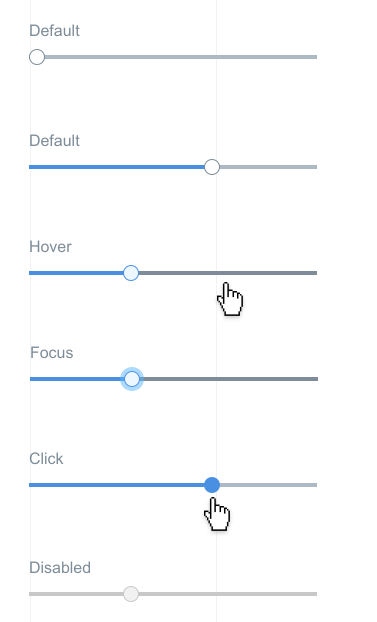

# Slider Component

**Slider** is a component that allows users to input or select value from a range.

Sliders are great for adjusting settings that reflect intensity levels (volume, brightness, color saturation).

## Elements


A **Slider** is composed of the following elements: "bar", "handle", "progress". The "handle" is dragged across the "bar" in order to give the slider a desired value, while "progress" marks the range from the minimum value to the current value. 

You can also add elements to it by using the **roles** assigned to the **data slots**, and passing the appropriate props (see component props).

## Component API

> tbd :: add method definition

### Component Props

&nbsp;&nbsp;&nbsp;&nbsp;&nbsp;&nbsp;&nbsp;&nbsp;

| name        | type                                  | defaultValue | isRequired | description                              |
| ----------- | ------------------------------------- | ------------ | ---------- | ---------------------------------------- |
| axis        | enum:&nbsp;&nbsp;&nbsp;&nbsp;&nbsp;&nbsp;&nbsp;&nbsp;<br>x<br>x-reverse<br>y<br>y-reverse | x          |            | The axis on which the slider will slide. |
| value       | number                                | max          |            | Displays default OR actual value of the slider |
| min         | number                                | 0            |            | The absolute minimum of the slider's range |
| max         | number                                | 1            |            | The absolute maximum of the slider's range |
| step        | number OR string "any"                | 1            |            | Set the slider's step. If step = number it causes slider to move in discrete increments. If step = "any"  sliders moves along a subjective range. |
| required    | boolean                               | false        |            | Whether or not the slider is required in a form. |
| disabled    | boolean                               | false        |            | If true, the slider will not be interactive. |
| label       | string                                |              |            | Text to display in accessibility mode    |
| name        | string                                |              |            | The name of the slider. Behaves like the name attribute of an input element. |
| onChange    | function                                  |              | yes        | Callback function that is fired when the slider's value changed.<br> `function(event: object, newValue: number): void`<br> event: KeyDown event targeting the slider<br> newValue: The new value of the slider |
| onDragStart | function                                  |              |            | Callback function that is fired when the slider has begun to move.<br> `function(event: object) : void`<br> event: MouseDown or TouchStart event targeting the slider. |
| onDragStop  | function                                  |              |            | Callback function that is fired when the slide has stopped moving.<br> `function(event: object) : void`<br> event: MouseEnd or TouchEnd event targeting the slider. |
| error       | boolean                                  | false        |            | Sets the `:error` CSS state on the `<slider>` |
| rtl         | boolean                                  | false        |            | Makes the component RTL                  |

#### Accepted children

The children in **Slider** use the `data-slot` attribute to assign roles to themselves. If **Slider** recognizes the roles, it connects the child components to the corresponding elements according to the table below.

| role | element | description | child component example                                  |
| --------- | -------- | --------------| ------------------------- |
| tooltip   | ::handle | Connect a tooltip child component to the ::handle element. | `<span data-slot="tooltip">hello world</span>` |

## Input Handling

### Keyboard 

| key                      | action                         |
| ------------------------ | ------------------------------ |
| up / right arrow key     | increase value                 |
| left / down arrow key    | decrease value                 |
| fn / ctrl + right / left | set max / min value            |
| fn / ctrl + up / down    | increase / decrease value by X |
| tab                      | moves to next element          |
| shift + tab              | moves to previous element      |
| enter                    | -                              |
| esc                      | removes focus (if in focus)    |

**RTL** orientation

| key                    | action         |
| ---------------------- | -------------- |
| up  / left arrow key   | increase value |
| down / right arrow key | decrease value |

### Mouse

| event             | action                                   | note                                     |
| ----------------- | ---------------------------------------- | ---------------------------------------- |
| hover             | highlight slider (both bar & handle)     | Event triggers on both bar & handle hover |
| click & drag      | moves handle one step forward / backwards | drag right/up -> increase value  \| drag down/left -> decrease value |
| click (on handle) | highlights handle                        |                                         |
| click (on bar)    | moves handle to position where user clicked |                                         |

### Touch

| event           | action                                   | note                                     |
| --------------- | ---------------------------------------- | ---------------------------------------- |
| tap (on handle) | highlights handle                        | we need the ability to expand clickable area for mobile devices |
| tap (on bar)    | moves handle to position where user clicked |                                         |
| drag            | moves handle according to drag           |                                        |

## Accessibility

### Keyboard

Accessibility for slider is mostly covered with keyboard behavior (according to ARIA docs).

### Focus

Slider should have a focus state. Focus state looks like a square border around handle. We place focus around handle because in range slider there are no other options and we need to keep consistency in all components.
 


> reference links:
> 
* [ARIA slider part 1](https://www.paciellogroup.com/blog/2008/05/aria-slider-part-1/)
* [ARIA slider part 2](https://www.paciellogroup.com/blog/2008/06/aria-slider-part-2/)

### Code Examples

#### **Example 1**

```jsx
//TODO: code guys - fix code example!
import * as React from 'react';
import { Slider } from './components/slider';
import style from './style.st.css'; // link to Style file - see examples of style files below

type State = {
  sliderValue: number
}

export class ComponentsDemo extends React.Component<{}, State>{
  	state: State,
    
    constructor() {
        super();
    },

    render() {
        return <Slider 
                 value="{this.state.sliderValue}"
                 onChange={/* something */}
          		/>;
    }
}
```

**Example 2**

**Slider** with tooltip child component.

```jsx
//TODO: code guys - fix code example!
import * as React from 'react';
import { Slider } from './components/slider';
import style from './style.st.css'; // link to Style file - see examples of style files below

type State = {
  sliderValue: number
}

export class ComponentsDemo extends React.Component<{}, State>{
  	state: State,
    
    constructor() {
        super();
    },

    render() {
        return <Slider 
                 value="{this.state.sliderValue}"
                 onChange={/* something */}>
                 	<span data-slot="tooltip"></span>
          	   </Slider>;
    }
}
```

## Style API

### Subcomponents (pseudo elements)

| selector   | description                              | type                                     |
| ---------- | ---------------------------------------- | ---------------------------------------- |
| ::handle   | Allows you to style the handle of the slider. | HTML Element. This subcomponent has no subcomponents of its own. |
| ::bar      | Allows you to style the bar of the slider. | HTML Element. This subcomponent has no subcomponents of its own. |
| ::progress | Allows you to style the progress part of the bar. | HTML Element. This subcomponent has no subcomponents of its own. |

> If a subcomponent is a **component**, it might have subcomponents -> then we will link here to its documentation.

### Custom CSS States (pseudo-classes)

| state                          | description                              |
| ------------------------------ | ---------------------------------------- |
| :error                         | Style the component on error, i.e. when the `error` prop is not empty |
| :hover, :focus, :disabled, etc | standard CSS pseudo state                |

## Visual States

| State    | Description                              |
| :------- | ---------------------------------------- |
| Default  | Default component appearance             |
| Hover    | User hovered over bar OR handle          |
| Focus    | Browser is focused on the component      |
| Active   | User clicks on bar OR handle             |
| Disabled | Component can not be changed             |
| Error    | Error state for the component (can be set with :error pseudo-class) |



### Style Code Example

```css
@import * from './components/slider'; /* TODO: fix the correct syntax */
/* style.st.css 
Adding rules here (which may be shared between different components) allows us to
override specific parts; or even change the whole theme
*/

Slider {
  background: transparent;
}

Slider::bar {
  background-color: #bada55; /* although the whole look comes from the theme,
                                we override the background color of the slider bar */
}

Slider::handle {
  background-color: #0099ff;
}

Slider::handle:hover {
  background-color: #33ccff;
}

Slider:disabled::handle {
  background-color: gray;
}
```
