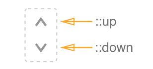

# Stepper Component

Stepper is a component that allows users increase / decrease numeric values. Stepper is oftentimes going to be used as an auxiliary component for number input & time picker.


## Elements



**Stepper** consists of an `::up` and `::down` arrow buttons that are used to increase / decrease value respectively. 


## API

##### Component Props

| name        | type                            | defaultValue | isRequired | description                              |
| ----------- | ------------------------------- | ------------ | ---------- | ---------------------------------------- |
| disableUp   | bool                            | false        |            | Disables UP button.                      |
| disableDown | bool                            | false        |            | Disables DOWN button.                    |
| dragStep    | number                          | 10           |            | Defines how many pixels should a user drag the cursor on mousedown to fire `onUp` / `onDown` function. |
| onUp        | `(modifiers: Modifiers): void;` |              |            | Callback function that is fired on "mouse click", "Up Arrow Key" or "dragStep". <br>  **interface Modifiers** { <br>  altKey?: boolean; <br>   ctrlKey?: boolean; <br>  shiftKey?: boolean; <br>  } |
| onDown      | `(modifiers: Modifiers): void;` |              |            | Callback function that is fired on "mouse click", "Down Arrow Key" or "dragStep". <br>  **interface Modifiers** { <br>  altKey?: boolean; <br>   ctrlKey?: boolean; <br>  shiftKey?: boolean; <br>  } |


### Code Examples

#### **Example 1:**

```jsx
import {codes as KeyCodes} from 'keycode';
import * as React from 'react';
import {properties, stylable} from 'wix-react-tools';
import {Modifiers, Stepper} from '../stepper';
	
return (
	<Stepper
		className="stepper"
      	data-automation-id="NUMBER_INPUT_STEPPER"
      	onUp={this.handleIncrement}
      	onDown={this.handleDecrement}
      	disableUp={disableIncrement}
      	disableDown={disableDecrement}
    />
```

Comments to example 1

**Example 2:**

```jsx
//TODO: code guys - fix code example!
```

Comments to example 2


## Style API

#### Subcomponents (pseudo-elements)

| selector | description          |
| -------- | -------------------- |
| ::up     | Style the UP arrow   |
| ::down   | Style the DOWN arrow |

#### Custom CSS States (pseudo-classes)

| selector                       | description                 |
| ------------------------------ | --------------------------- |
| :hover, :focus, :disabled, etc | Standard CSS pseudo classes |

### Style Code Examples

**Example 1:**

```css
/* Layout for default components style */

:import {
    -st-from: "../../style/project.st.css";
    -st-named: color_MainText,
               color_MainText_Background,
               color_Disabled,
               borderWidth,
               inputHeight,
               iconChevronDownBK3,
               iconChevronDownDS1,
               iconChevronDownPR3,
               iconChevronUpBK3,
               iconChevronUpDS1,
               iconChevronUpPR3,
               DS1,
               BK3,
               PR3;
}

.root {
    display: inline-flex;
    flex-direction: column;
    justify-content: space-between;

    position: relative;

    width: 30px;
    height: value(inputHeight);
}

.control {
    position: absolute;

    width: 100%;
    height: 50%;

    margin: 0;
    padding: 0;
    border: 0;

    outline: none;

    background: center/16px 16px no-repeat transparent;
}
```

**Example 2:**

```css
/* Style the UP & DOWN arrow keys */
.up {
    top: 0;
    background-image: value(iconChevronUpBK3);
}
.up:focus,
.up:hover {
    background-image: value(iconChevronUpPR3);
}
.up:disabled {
    background-image: value(iconChevronUpDS1);
}

.down {
    bottom: 0;
    background-image: value(iconChevronDownBK3);
}
.down:focus,
.down:hover {
    background-image: value(iconChevronDownPR3);
}
.down:disabled {
    background-image: value(iconChevronDownDS1);
}
```