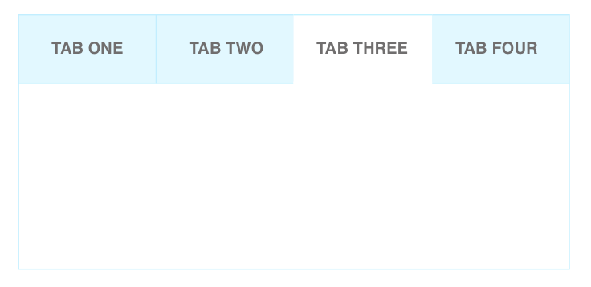

# Tabs

Tabs components makes it easy to explore and switch between different views.

Tabs are a set of layered sections of content, known as tab panels, that display one panel of content at a time. Each tab panel has an associated tab element, that when activated, displays the panel. The list of tab elements is arranged along one edge of the currently displayed panel, most commonly the top edge.

## Elements



**Tab consist of:**

1. Tabs - set of tab elements and their associated tab panels (acts as root)
2. Tab List - set of all tab elements contained in component.
3. Tab - element in the tab list that serves as a label for one of the tab panels and can be activated to display associated panel.
4. Tab Panel - element that contains the content associated with a particular tab.

When a tab interface is initialized, one tab panel is displayed and its associated tab is styled to indicate that it is active. When the user activates one of the other tab elements, the previously displayed tab panel is hidden, the tab panel associated with the activated tab becomes visible, and the tab is considered "active".

## API

#### Tabs Props

| name                | type   | defaultValue | isRequired | description                              |
| ------------------- | ------ | ------------ | ---------- | ---------------------------------------- |
| onChange            | func   |              | yes        | Callback function that is fired when the tab value changes |
| children            | node   |              |            | Should be used to pass `Tab` components. |
| value               | string |              |            | Controls which tab is active             |
| defaultValue        | string |              |            | Controls tab that is active by default (e.g. when component is mounted) |
| unmountInactiveTabs | bool   | false        |            | When `false` component mounts all tabs and tab panels content. When `true` component mounts content related to active tab only. Switching between tabs unmounts all previous content. |
| disabled            | bool   | false        |            | Allows to disable all tabs from the tab list |


#### Tab Props

| name     | type               | defaultValue | isRequired | description             |
| -------- | ------------------ | ------------ | ---------- | ----------------------- |
| value    | string             |              |            | Specifies the value by which this tab can be activated |
| label    | node               |              |            | Specifies the tab label |
| disabled | array (of tab IDs) |              |            | Specifies disabled tabs |
| children | node               |              |            | Specifies the content of current tab |


### React Code Example

**Example 1:**

```jsx
<Tabs
    value="2"
    onChange={({value}) => handleChange(value)}
>
    <Tab value="1" label="Tab One">
        <p>This is hidden</p>
    </Tab>
    <Tab value="2" label="Tab Two">
        <p>This is selected</p>
    </Tab>
    <Tab value="3" label={component} disabled={true}>
        <p>This is disabled and cannot be selected</p>
    </Tab>
</Tabs>
```

*Comments to example 1*

The 3rd tab is disabled. Clicks on it will not call `Tabs#onChange`

**Example 2:**

```jsx
<Tabs
    disabled={true}
    value="2"
>
    <Tab value="1" label="Tab One">
        <p>This is disabled and cannot be selected</p>
    </Tab>
    <Tab value="2" label="Tab Two">
        <p>This is selected</p>
    </Tab>
    <Tab value="3" label={component}>
        <p>This is disabled and cannot be selected</p>
    </Tab>
</Tabs>
```

*Comments to example 2*

All tabs arev disabled no clicks will call `Tabs#onChange`

## Style API

#### Subcomponents (pseudo-elements)

| selector      | description                              |
| ------------- | ---------------------------------------- |
| ::tabList     | Allows to style container that stores all tabs |
| ::selectedTab | Allows to style selected tab             |
| ::tabPanel    | Allows to style tab panel                |

#### Custom CSS States (pseudo-classes)

| state                          | description         |
| ------------------------------ | ------------------- |
| :hover, :focus, :disabled, etc | Standard CSS states |


### Style Code Example

```css
Tabs::tabList {
    border: 1px solid limegreen;
    /* border around all tabs */
}
Tabs::tabs {
    background: green;
    /* every tab is green */
}
Tabs::selectedTab {
    background: yellow;
    /* selected tab is yellow */
}
```
