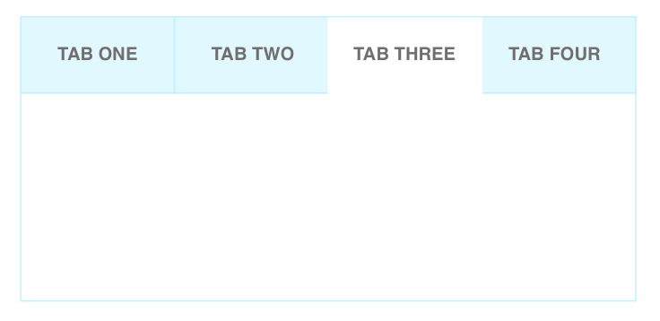

**Table of Contents**

- [Description](#description)

- [Elements](#elements)

- [API](#api)

- [States](#states-(if-applicable))

- [Accessibility](#accessibility)

- [Behavior](#behavior)
  - [Validation](validation)
  - [Edge case handling](edge-case-handling)

- [Input Methods](#input-methods)
  - [Keyboard](#keyboard)
  - [Mouse](#mouse)
  - [Touch](#touch)

- [RTL](#rtl)

- [DOM Structure](#dom-structure)

- [Design](#design)

  ​

## Description

Tabs components makes it easy to explore and switch between different views.

Tabs are a set of layered sections of content, known as tab panels, that display one panel of content at a time. Each tab panel has an associated tab element, that when activated, displays the panel. The list of tab elements is arranged along one edge of the currently displayed panel, most commonly the top edge.

When a tab interface is initialized, one tab panel is displayed and its associated tab is styled to indicate that it is active. When the user activates one of the other tab elements, the previously displayed tab panel is hidden, the tab panel associated with the activated tab becomes visible, and the tab is considered "active".

> NOTE: we decided to include tap panel into the scope for several reasons:
>
> 1. This is required for Accessibility 
> 2. Makes it simple to position tabs relatively to the content that they are connected to
> 3. Makes component complete (in terms of functionality)

### Elements

**Tab consist of:** 

1. Tabs - set of tab elements and their associated tab panels (acts as root)

2. Tab List - set of all tab elements contained in component.

3. Tab - element in the tab list that serves as a label for one of the tab panels and can be activated to display associated panel.

4. Tab Panel - element that contains the content associated with a particular tab.

   ​

## API

**Props**

See [README.md](./README.md) for more info. 

**Style**

See [README.md](./README.md) for more info. 

## States (if applicable)

| State    | Description                              | Link to design |
| :------- | :--------------------------------------- | -------------- |
| Default  | Default component appearance             |                |
| Hover    | User hovered over bar OR handle          |                |
| Focus    | User focused on the tab                  |                |
| Active   | Tab is active                            |                |
| Disabled | Component is in disabled state & not actionable |                |
| Error    | Error state for the component (can be set with :error pseudo-class) |                |

Design [assets](https://zpl.io/2kRTvO)

## Accessibility

##### Keyboard

Tabs component behaves according to ARIA best practices. 
See [keyboard](https://github.com/wix/stylable-components/blob/master/docs/time-input/timePickerSpec.md#keyboard) section for more info.

##### Focus

When focus moves into the tab components it goes to the tab list and places focus on the active `tab` element . When the tab list is in focus and "tab" button is pressed again, focus moves to the next element in the page tab sequence outside the tablist (typically it is either the first focusable element inside the tab panel or the tab panel itself).

When focus is on a tab element in a **horizontal** tab list:

- "Left Arrow Key" moves focus to the previous tab. If focus is on the first tab, moves focus to the last tab. 
- "Right Arrow Key" moves focus to the next tab. If focus is on the last tab element, moves focus to the first tab.

When focus is on a tab element in a **vertical** tab list:

- "Down Arrow Key" performs as "Right Arrow Key" (described above)
- "Up Arrow Key" performs as "Left Arrow Key" (described above)

When focus is on a tab in a tab list with either **horizontal** or **vertical** orientation:

- "Space" or "Enter" activates the tab if it was not activated automatically on focus **(TBD)**
- "Home" moves focus to the first tab
- "End" moves focus to the last tab

NOTE:

Horizontal tab list does not listen for "Down/Up Arrow Key" so those keys can provide their normal browser scrolling functions even when focus is inside the tab list.

See [ARIA docs](https://www.w3.org/TR/wai-aria-practices/#tabpanel) for reference.

**Roles & Attributes**

| Role       | Attribute                  | Element  | Usage                                    |
| ---------- | -------------------------- | -------- | ---------------------------------------- |
| `tablist`  |                            | `div`    | Indicates that the element serves as a container for a set of tabs. |
|            | `aria-label=Entertainment` | `div`    | Provides a label that describes the purpose of the set of tabs. |
| `tab`      |                            | `button` | Indicates the element serves as a tab control. When focused, is automatically activated, causing its associated `tabpanel` to be displayed. Provides a title for its associated `tabpanel`. |
|            | `aria-selected=true`       | `button` | Indicates the tab control that is activated and its associated panel is displayed. Set when a tab receives focus. |
|            | `aria-selected=false`      | `button` | Indicates the tab control that is not active and its associated panel is **NOT** displayed. Set for all tab elements in the tab except for the focused tab. |
|            | `tabindex=-1`              | `button` | Removes the element from the page Tabsequence. Set when a tab is not selected so that only the selected tab is in the page Tabsequence. |
|            | `aria-controls=IDREF`      | `button` | Refers to the `tabpanel` element associated with the tab. |
|            | `id=1,2,3...`              | `button` | Refers to the particular tab. Tab ID serves as additional selector. |
| `tabpanel` |                            | `div`    | Indicates the element serves as a container for tab panel content. Is hidden unless its associated `tab` control is activated. |
|            | `aria-labelledby=IDREF`    | `div`    | Refers to the `tab` element that controls the panel. Provides an accessible name for the tab panel. |
|            | `tabindex=0`               | `div`    | Puts the tab panel in the page Tabsequence. Facilitates movement to panel content for assistive technology users. Especially helpful if there are panels that do not contain a focusable element. |

##### Reference links to ARIA documentation

https://www.w3.org/TR/wai-aria-practices/examples/tabs/tabs-1/tabs.html
https://www.w3.org/TR/wai-aria-practices/#tabpanel

### Behavior

When user places focus over TAB component, focus is set to active tab OR if there are no active tabs to the first tab from the tab list. 

User can switch between tabs with mouse or arrow buttons. 

When a tab interface is initialized, tab panel displays content that is associated with active tab. When the user activates another tab elements, the previously displayed tab panel is hidden, the tab panel associated with the activated tab becomes visible, and the tab is considered "active". 

User can prevent loading of inactive tabs with `killInactiveTab` prop. When `killInactiveTab` is set to `true` component loads only the content that is related "active" tab & tab panel. When swathing to another tab, content from previously "active" tab unloads and all background activities are terminated.

By default Tab List is displayed on top of the Tab Panel. But it can be changed with `position`  prop that accepts the following values: `left / right / up / down`. When `position` prop is set `left / right` tabs are displayed in vertical position (NOTE: even though tabs are displayed vertically, we keep the text orientation to horizontal. Increasing tab content will push the tab panel to the left / right). 

By default tab takes the size of its content + 18 px margins on sides (so different tabs may have different sizes). 

If tab component can not fit all tabs we display arrows on both sides. User can click on the arrow which will scroll tabs to the corresponding direction revealing 1 new tab. When user scrolls to the end of the tab list (e.g on the right) corresponding arrow disappears (note that in this case arrow on the left should be displayed, so that the user is able to return to the beginning of the tab list).

Disabled state for tabs can be controlled with `disabled` prop. It is possible to disable one tab OR all tabs except for the active one

Active tab should always keep its state (e.g. if user entered some information into active tab panel and then left tab component we should preserve the information). Same behavior should be applied inactive tabs if `killInactiveTab` prop is set to `false`.

#### Validation 

We do not have anything here for now. 

#### Edge case handling

| Case                             | Handling                                 |
| -------------------------------- | ---------------------------------------- |
| no active tab                    | Tab Panel remains empty or can display a placeholder (if provided) |
| active tab is set to be disabled | Nothing happens. Active tab should not be disabled. |

## Input Methods

#### Keyboard

| Keys                          | Action                                   |
| ----------------------------- | ---------------------------------------- |
| tab                           | If pressed outside of the component sets focus on active OR first tab (if there are no active taps). If pressed inside the component moves focus to the tab panel associated with current tab |
| shift+tab                     | Moves to previous element which is the previous DOM element OR active tab |
| left arrow key                | Moves focus to the previous tab OR if focus is on the first tab, moves focus to the last tab (NOTE: works only for horizontal layout, for vertical see Up Arrow Key) |
| right arrow key               | Moves focus to the next tab OR if focus is on the last tab element, moves focus to the first tab (NOTE: works only for horizontal layout, for vertical see Down Arrow Key) |
| down arrow key                | Moves focus to the next tab. If focus is on the last tab element, moves focus to the first tab (NOTE: works only for vertical layout, for horizontal layout provides normal browser scrolling functions) |
| up arrow key                  | Moves focus to the previous tab. If focus is on the first tab element, moves focus to the last tab (NOTE: works only for vertical layout, for horizontal layout provides normal browser scrolling functions) |
| home (shift + left arrow key) | Moves focus to the first tab             |
| end (shift + left arrow key)  | Moves focus to the last tab              |
| esc                           | Removes focus (if on focus)              |

#### Mouse

| Event            | Action                   |
| ---------------- | ------------------------ |
| hover (over tab) | highlight tab            |
| click (on tab)   | sets tab to active state |

#### **Touch**

| Event        | Action                   |
| ------------ | ------------------------ |
| tap (on tab) | sets tab to active state |

## RTL

TBD

## DOM structure

Each component should have a visual style guide for all of its visual states and elements structure. This style guide will be based on the **Style API**, and a visual theme agreed upon as our reset style (Wix style).

If more themes exist, they should be shown as well, and available as options through change of theme.

In addition, a link to Zeplin or a similar system is optional.

## Design

Link to [assets](link goes here) (assets will be provided later)
