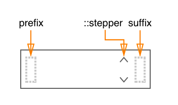

# Time Picker Component

The **TimePicker** component allows users to select the time and improves upon the native `<input type="time">` by providing:

* the ability to customize the stepper arrows style
* a common React+Typescript API
* works out the kinks of native implementations

## Elements



## API

### Component Props

| name        | type                   | defaultValue | isRequired | description                              |
| ----------- | ---------------------- | ------------ | ---------- | ---------------------------------------- |
| value       |                        |              |            |                                          |
| placeholder | string                 |              |            | Text to display if the value is null.  |
| format      | enum  (ampm, 24hr) | system default |            | Tells the component to display the picker in am/pm (12hr) format or 24hr format. |
| required    | boolean                   | false        |            | Whether or not filling in the value is required in a form. |
| disabled    | boolean                | false        |            | If `true`, the componentName will not be interactive. |
| label       | string                 |              |            | Text to display in accessibility mode.   |
| name        | string                 |              |            | The name of the slider. Behaves like the name attribute of an input element. |
| error       | boolean                   | false        |            | Sets the `:error` CSS state on the `<timePicker>`. |
| rtl         | boolean                | false        |            | Makes the component RTL. |

#### Accepted Children

This component accepts children with the following `data-slot` attribute, in order to be displayed in specific places in its layout

| data-slot | description                              | example                                  |
| --------- | ---------------------------------------- | ---------------------------------------- |
| prefix    | Allows you to insert a component (or components) at the start of the input. | `<div data-slot="prefix">hello world</div>` |
| suffix    | Allows you to insert a component (or components) at the end of the input. | `<div data-slot="suffix">hello world</div>` |

### Code Example

##### Example 1

```jsx
//TODO: code guys - fix code example!
import * as React from 'react';
import { TimePicker } from './components/TimePicker';
import style from './style.st.css'; // link to Style file - see examples of style files below

export class ComponentsDemo extends React.Component<{}, {}>{
    constructor() {
        super();
    }

    render() {
        return <TimePicker
        		 value="{this.state.timePickerValue}"
                 onChange={/* something */}

                 />;
    }
}
```

##### Example 2

```jsx
//TODO: code guys - fix code example!
import * as React from 'react';
import { TimePicker } from './components/TimePicker';
import style from './style.st.css'; // link to Style file - see examples of style files below

export class ComponentsDemo extends React.Component<{}, {}>{
    constructor() {
        super();
    }

    render() {
        return <TimePicker
        		 value="{this.state.timePickerValue}"
                 onChange={/* something */}>
    				<span data-slot="prefix">icon</span>
        			<button data-slot="suffix">smth</button>
               </TimePicker>;
    }
}
```

## Style API

### Subcomponents (pseudo-elements)

| selector      | description                            | type                                     |
| :-------------| -------------------------------------- | ---------------------------------------- |
| ::stepper     | Allows you to style the stepper arrows. | Style the internal `<Stepper/>` component. This component exposes some internal styles. Consult the (Link to Documentation) to see which subcomponents and states are available |
| ::placeholder | Allows you to style the placeholder.    | HTML Element. This subcomponent has no subcomponents of its own. * |

*&nbsp; *If a subcomponent is a COMPONENT, it might have subcomponents -> then we will link here to its documentation*

You can change the color of the `::placeholder` subcomponent by changing the `color` property.

```css
TimePicker::placeholder {
	color: red;
}
```

### Custom CSS States (pseudo-classes)

| state                          | description                              |
| ------------------------------ | ---------------------------------------- |
| :error                         | Style the component on error, i.e. when the `error` prop is true. |
| :hover, :focus, :disabled, etc | Standard CSS states.    |

### Style Code Example

```css
@import * from './components/timePicker'; /* TODO: fix the correct syntax */
/* style.st.css
Adding rules here (which may be shared between different components) allows us to override specific parts; or even change the whole theme
*/
timePicker {
  background: #bada55;
}

timePicker::stepper {
  background-color: transparent;
}

timePicker::stepper::down, timeInput::stepper::up {
  color:blue;
}

timePicker::stepper::down:hover, timePicker::stepper::up:hover {
  background-color:lightblue;
}
```
