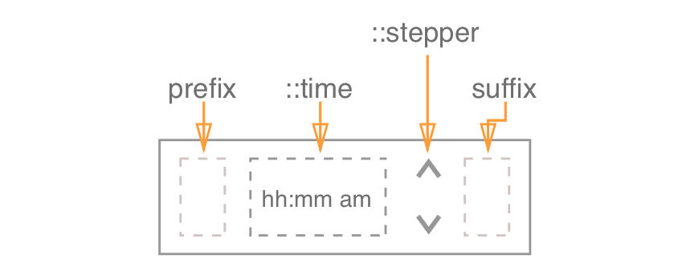

**Table of Contents**

- [Definition](#definition)

- [Elements](#elements)

- [Props](#props)

- [Style](#style)

- [Accessibility](#accessibility)

- [Behavior](#behavior)

  - [Edge case handling](edge_case_handling)
  - [Keyboard](#keyboard)
  - [Mouse](#mouse)
  - [Touch](#touch)

- [Examples](#examples)

- [Design](#design)

  ​

## Definition

Time Picker allows users to input & select time in 12 & 24 hours format. 

## Elements

The **Time Picker** functions as native  `<input type="time">` component with additional ability to customize stepper arrows design (using `::stepper` subcomponent) and add prefix / suffix elements 

> NOTE: suffix is displayed after the stepper for for several reasons:
>
> 1. the very notion of word suffix means that this element is going to be displayed at the end of the component
> 2. according to our design, stepper is not separated from the input. It means that every component within the input field should interact with stepper (visual hierarchy). 
> 3. use cases for suffix are: clock, globe icon, etc. These elements have nothing to do with input and time and should not be intractable via stepper. 

## Props

See [README.md](./README.md) for more info. 

## Style

Time Picker allows additional style customization with  `::stepper` subcomponent. 
For more info & code samples, see [README.md](./README.md). 

## Accessibility

##### Keyboard

Time Picker has all basic accessibility features related to keyboard behavior (tab, space, shift, arrows, etc).
See [keyboard](#keyboard) section for more info. 

##### Focus

Focus behavior for Time Picker differs from other components. Unlike other components, focus is not applied to entire component but to its internal elements (e.g. 'hh', 'mm', 'am/pm'). 

For more info see [keyboard](#keyboard),  [mouse](#mouse) & [touch](#touch) sections. 

**Roles & Attributes**

There is not Accessibility spec in W3 for time picker.

| Role       | Attribute        | Element | Usage                                    |
| ---------- | ---------------- | ------- | ---------------------------------------- |
| spinbutton |                  | `div`   | Idetifies component as a spin button. NOTE: Every component within time picker (`hh`, `mm`, `am/pm`) has a separate span with `role="spinbutton"` |
|            | `aria-valuetext` | `div`   | A string value that provides a user-friendly name for the current value of the time picker. |
|            | `aria-valuemin`  | `div`   | Specifies the minimum value of the input (e.g. 00) |
|            | `aria-valuemax`  | `div`   | Specifies the maximum value of the input (e.g. for 'hh' section  it would be smith like: 12 for 12h format & 23 for 24h format) |
|            | `aria-help`      | `div`   | A string value that is clearly describes focused part of the control. "Hours", "Minutes", "am/pm" |

**Screen Reader Behavior:**

Here is what a screenreader should say on focus:

1. **Focus on hours:** current value (if present) -> "stepper" -> "hours"
2. **Focus on minutes:** current value (if present) -> "stepper" -> "minutes"
3. **Focus on am/pm:** current value -> "stepper" -> "am/pm"

## Behavior

Changing value in the input via keyboard mirrors the behavior of the stepper arrows.

Stepping the value (arrows or keyboard) is performed **from current value** if there is any value OR from 0 if there is no value. Step is set to. 

> NOTE: there is no way to change step via API for now. There are several reasons for that:
>
> 1. All competitor libs allow to set step only for minutes. In our case we support shift+up/down which covers part of the cases. 
> 2. Step for hours makes no sense since we operate in 0-24 range. Step adds extra functionality here.  

When user types a value, it isn't committed until enter, tab, click outside OR internal validation happen.  Enter, tab, click outside are described below in [keyboard](#keyboard), [mouse](#mouse) & [touch](#touch) sections. As for internal validation, we check if value entered in active sections is maximum. If so, we move focus to the next input (e.g user enters 4 into 'hh' -> move focus to 'mm').

**Tab / Shift+Tab** & **Right / Left** arrow key moves focus to the next number within input ('hh' -> 'mm' -> 'am/pm'). We mirror the behavior of [native HTML number input](https://www.w3schools.com/html/tryit.asp?filename=tryhtml_input_time) + add few additional tweaks which are described in [keyboard](#keyboard), [mouse](#mouse) & [touch](#touch) sections.

If the user types a value that is out of current format range (e.g. 14h in 12hours format), we automatically convert time to relevant value (e.g. 14h = 2, 15 = 3, etc).
We mirror the behavior of [native HTML number input.](https://www.w3schools.com/html/tryit.asp?filename=tryhtml_input_time)

The component follows the external control pattern (value displayed is defined by the `value` property, and in order for the component to function, it should be bound to a state in the parent component, and the `onChange` handler should be set).

**RTL** direction moves 'hh' & 'mm' to the right while 'am/pm' is displayed on the left. So the format looks like this: (`am/pm`, `hh`, `mm`). When user focuses on time picker with RTL direction focus is set to hh, pressing TAB button moves focus to 'mm' and then 'am/pm' (here we preserve the same logic as with LTR).

### Edge case handling

| Edge case                                | Handling                                 |
| ---------------------------------------- | ---------------------------------------- |
| user clears input and starts typing time | once user types 'hh' we automatically add ':' and then user can type 'mm' |
| user clears input and removes focus      | display previously entered time          |
| user enters unsupported characters       | nothing is added. We do not allow to enter anythings except for numbers ( 0 - 9 ) |
| user enters 13 for 'hh' when `format` is `ampm` | change 13 to corresponding time in 12h format (13 = 1, 14 = 2, etc) |

### Keyboard

| Keys                       | Action                                   |
| -------------------------- | ---------------------------------------- |
| type a number              | insert a value without committing it     |
| up arrow key               | increase & commit value (for focused element) |
| down arrow key             | decrease & commit value (for focused element) |
| shift + up arrow key       | increase & commit value by 10  NOTE: works only for 'mm' |
| shift + down arrow key     | decrease & commit value by 10  NOTE: works only for 'mm' |
| tab / right arrow key      | moves focus to previous element within component ('hh' -> 'mm' -> 'am/pm') AND once it reaches the end of time picker moves focus to the next component |
| shift+tab / left arrow key | moves focus to previous element within component ('am/pm' -> 'mm' -> 'hh') AND once it reaches the beginning of time picker moves focus to the next component |
| esc                        | removes focus (if on focus)              |
| enter                      | removes focus (if in focus), discards non-committed new value (if value typed) |
| space                      | switches between AM / PM  NOTE: space works only for AM / PM and only when it is in focus |
| delete / backspace         | for 'hh' sets value to '12' OR '00 based on `format` 'for 'mm' sets value to '00' for 'am/pm' does nothing NOTE: double tap on delete / backspace moves focus to previous value |

### Mouse

| Event                        | Action                                   | NOTE |
| ---------------------------- | ---------------------------------------- | ---- |
| hover                        | changes BG color of the input            |      |
| click inside                 | focuses on the first number (by default it is HH) |      |
| click inside (on 'hh', 'mm') | focuses on the corresponding number (HH, MM) |      |
| click inside (on AM/MP)      | focuses on AM/PM and changes value       |      |
| click outside                | blurs, commits value if the value is not committed |      |

### Touch 

| Event                              | Action                  | NOTE |
| ---------------------------------- | ----------------------- | ---- |
| tap inside (anywhere on the input) | opens native time input |      |
| tap outside                        | same as mouse click     |      |

## Design

Link to [assets](link goes here)
