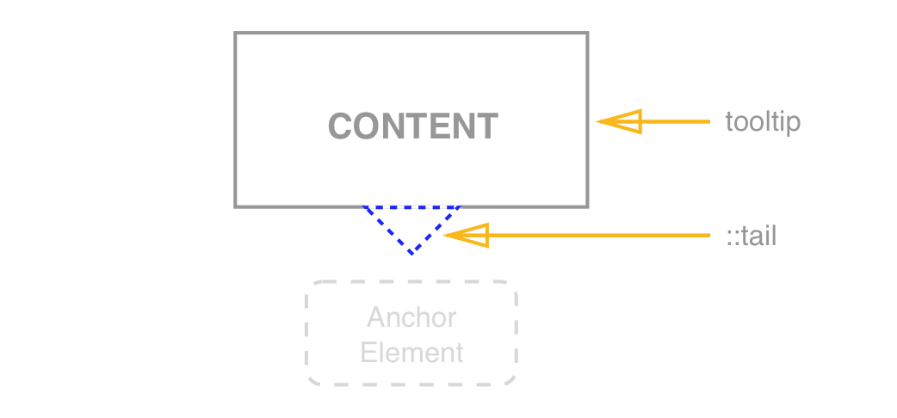

# Tooltip

Tooltip is a label (usually a text one) that appear on particular event (e.g. hover, focus, touch).

Tooltip identifies element when it is activated. Often used to display brief text description about the anchor element functionality. 


## Elements



**Position**


## API

#### Component Props

| name        | type                                     | defaultValue | isRequired | description                              |
| ----------- | ---------------------------------------- | ------------ | ---------- | ---------------------------------------- |
| children    | node                                     | -            | -          | Specifies the element to render inside the tooltip |
| position    | enum: <br>`topLeft`, `top`, `topRight`<br> `bottomLeft`, `bottom`, `bottomRight`<br>`leftTop`, `left`, `leftBottom`<br>`rightTop`, `right`, `rightBottom` | `top`        | -          | Controls the position of the tooltip.    |
| anchor      | string **(TBD w Yuri)**                  | -            | yes        | The element to be used as an anchor for the tooltip (element will open next to it). |
| distance    | number (pixels) **(check if it can be replaced w margins)** | -            | -          | Specifies the distance between an anchor & tooltip. |
| showDelay   | number<br>(milliseconds)                 | -            | -          | Specifies a delay in milliseconds for tooltip to appear. |
| hideDelay   | number<br>(milliseconds)                 | -            | -          | Specifies a delay in milliseconds for tooltip to disappear. |
| showTrigger | string                                   | `mouseEnter` | -          | Specifies the trigger that shows tooltip.<br>NOTE: supports multiple triggers.<br>[List of triggers](#list_or_triggers). |
| hideTrigger | string                                   | `mouseleave` | -          | Specifies the trigger that hides tooltip.<br>NOTE: supports multiple triggers.<br>[List of triggers](#list_of_triggers). |


**List of triggers**

| Name                                   | Event                           |
| -------------------------------------- | ------------------------------- |
| focus                                  | onFocus                         |
| blur                                   | onBlur                          |
| mouseEnter                             | onMouseEnter                    |
| mouseLeave                             | onMouseLeave                    |
| click                                  | onClick                         |
| touchstart                             | touchStart                      |
| touchleave                             | touchLeave                      |
| custom **(check if we can do custom)** | Allows to create custom trigger |


### React Code Example

**Example 1:**

```jsx
Fil will add samples 
```

*Comments to example 1*

**Example 2:**

```jsx
Fil will add samples 
```

*Comments to example 2*

## Style API

#### Subcomponents (pseudo-elements)

| selector | description                              |
| -------- | ---------------------------------------- |
| ::tail   | Style the tail part of the tooltip. <br> E.g. we often hide it with `display: none;` rule. |

#### Custom CSS States (pseudo-classes)

| state                          | description         |
| ------------------------------ | ------------------- |
| :hover, :focus, :disabled, etc | Standard CSS states |

### Style Code Example

```css
/* Fil will add samples */
 
Tooltip{
    border: 1px solid limegreen;
    /* border around tooltip */
}
```