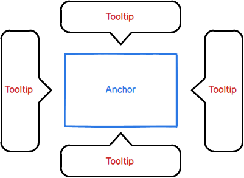
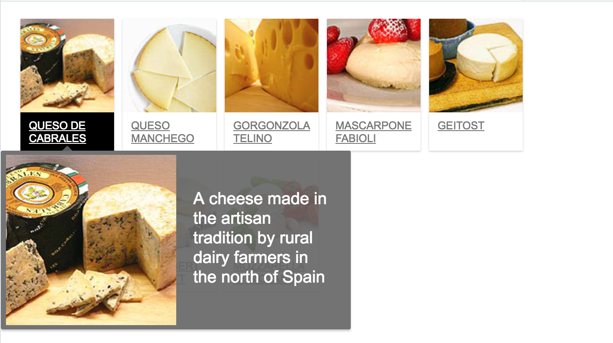
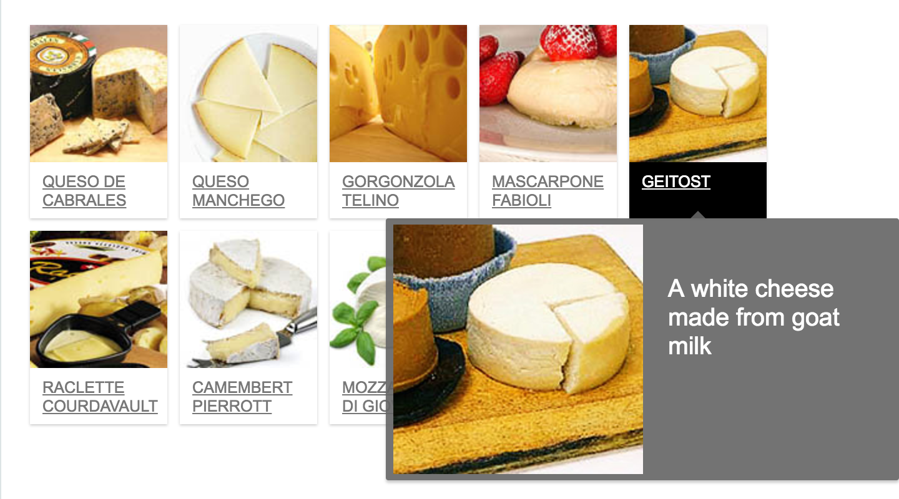
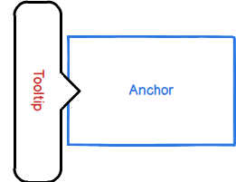

# Tooltip Component Specification

A typed React Tooltip component extending the [Popup](../popup/popup.md) component. The tooltip is anchored to another DOM element.

**TBD:**
* Animation - awaiting API finalization (showAfter - Delay in milliseconds before tooltip is shown, hideAfter - Delay in milliseconds before tooltip is hidden)

## Contents

* [Elements](#elements)
* [Internal](#internal)
* [API](#spi)
* [Style API](#style-api)
* [Accessibility](#accessibility)
  * [Roles](#roles)
  * [Aria Attributes](*aria-attibutes)
  * [Focus](#focus)
* [Input Handling](#input-handling)
  * [Keyboard](#keyboard)
  * [Mouse](#mouse)
  * [Touch](#touch)
* [Examples](#examples)
* [Design](#design)

## Elements



## Internal

* The tooltip itself is composed of a box and an callout (i.e. arrow). The callout and box are CSS constructs which can be replaced by the user of the component through styling.
* The arrow always point to the middle of the anchor (in the relevant position), with the box being layed out according to *flipfit* collision rule.

    

    

## API

| Name | Type | Default | Required | Description |
| -- | -- | -- | -- | -- |
| id | string | null | no | Unique identifier |
| className | string | null | no | Space separated list of the classes of the element |
| style | Object | null | no | CSS styling declarations to be applied to the element |
| children | React.ReactNode | null | no | The elements to render in the tooltip |
| open | boolean | false | no | Whether the tooltip is shown or hidden |
| onOpenStateChange | function | NOOP | no | Triggered when the popup is opened/closed |
| anchor | Element | none | Yes | The element to be used as an anchor for the tooltip (will open next to it). |
| maxHeight*** | number | 0 | no | The max height in pixels of the popup. If set to 0, the property will be ignored and receive height from its content |
| distance*** | number | 5(px) | no | Sets the distance in pixels between the location of the tooltip and the anchor element (in the direction of the specified position property). Both negative and positive numbers accepted.* |
| position | string literal type | "bottom" | no | Options are "bottom", "left", "right", "top" |
| showTrigger | Array\<string> | ["mouseEnter"] | no | Shows the tooltip according to an event or events triggered on the anchor element (see [triggers](#triggers)) |
| hideTrigger | Array\<string> | ["mouseLeave"]** | no | Hides the tooltip according to an event or events triggered on the anchor element |

\* No matter the position specified by the user, a positive number will always push the tooltip away from the component, while a negative while number will push the tooltip onto the component.

\** The hideTrigger will default to the opposite event/s of the triggers in the showTrigger property unless explicitly specified (focus <-> blur, mouseEnter <-> mouseLeave, click <-> click, manual <-> manual).

\*** TalmiJS requirement

### Triggers

| Name | Event |
| -- | -- |
| focus | onFocus |
| blur | onBlur |
| mouseEnter | onMouseEnter |
| mouseLeave | onMouseLeave |
| click | onClick |
| manual | When set, no other trigger applies. To be used when a trigger is either not in the list or not supported by the anchor component |

## Style API

It is required to supply an API which allows the user to change the arrow and the content div of the tooltip.

### Internal Style

You can create the arrow using several different CSS methods which produce different results. We'll start with 2 methods for styling the tooltip, the first solution will be placed in the reset style and the second in a Design System theme.

The reason for creating both is to understand what we need to do in order to create a generic tooltip. In the following examples, having 4 *callout* classes (top, bottom, left, right) with their own CSS could be a viable solution.

* Border (bottom) Example

```html
    <div class="tooltip">
        <div class="content">Hello World</div>
        <div class="callout"></div>
    </div>
```

```css
body {
    background-color: white;
}

.content {
    background-color: white;
    color: rgba(100,100,100,.9);
    width: 200px;
    height: 100px;
}

.tooltip {
    position: absolute;
    top: 12px;
    border: 1px solid #adbac5;
    opacity: 1;
    background-color: transparent;
    color: #fff;
}

.callout {
    position: absolute;
    left: 88px;
    top: -24px;
    border-color: transparent;
    border-bottom-color: #adbac5;
    width: 0;
    height: 0;
    border-style: solid;
    border-width: 12px;
}
```

* Design System (bottom) [example](https://github.com/wix/wix-style-react/blob/master/src/Tooltip/TooltipContent.scss)

```html
    <div class="tooltip">
        <div class="content">Hello World</div>
        <div class="callout"></div>
    </div>
```

```css
body {
    background-color: white;
}

.content {
    background-color: white;
    color: rgba(100,100,100,.9);
    width: 200px;
    height: 100px;
}

.tooltip {
  position: absolute;
  top: 12px;
  border-radius: 8px;
  opacity: 1;
  box-shadow: 0 6px 6px 0 rgba(22, 45, 60, 0.06), 0 0 18px 0 rgba(22, 45, 60, 0.12);
}

.callout{
    position: absolute;
    background-color: white;
    left: 88px;
    top: -6px;
    width: 12px;
    height: 12px;
    box-shadow: -3px -3px 6px rgba(0, 0, 0, 0.1);
    transform: rotateZ(45deg);
}
```

## Accessibility

### Roles

* Element that serves as the tooltip anchor has a role *tooltip*

### Aria Attributes

* Element that serves as the tooltip anchor requires an aria-describedby property set to the id of the tooltip.

### Focus

Focus stays on the triggering element while the tooltip is displayed.

## Input Handling

### Keyboard

Esc key closes the tooltip. Not sure how it should be implemented here.

### Mouse

See triggers.

### Touch

None

## Examples

* Negative distance



```jsx
<div id="tooltipOnMe">Anchor</div>
<Tooltip
    open={true}
    position='left'
    distance={-10}
    anchor="tooltipOnMe"
    showTrigger="manual">
    <span>Tooltip</span>
</Tooltip>

```

## Design

See [zeplin](https://zpl.io/2vMlOW5).
