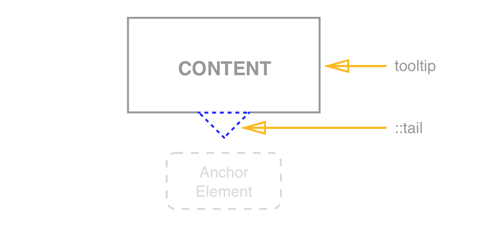
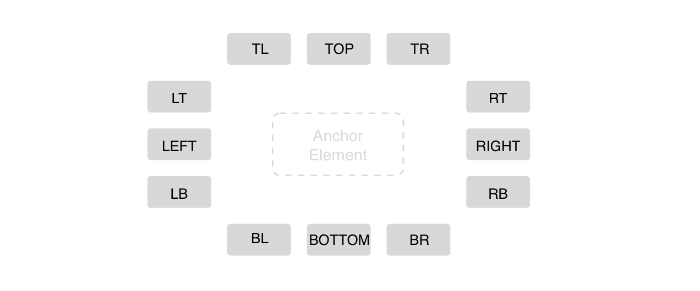

# Tooltip

Tooltip is a label (usually a text one) that appear on particular event (e.g. hover, focus, touch).

Tooltip identifies element when it is activated. Often used to display brief text description about the anchor element functionality. 

## Elements

**Position**

## API

**Props**

See [README.md](add link) for more info.

**Style**

Brief description of pseudo-classes and custom CSS states that can be applied to the component. See [README.md](add link)for more info.

## Accessibility

##### Keyboard

Tooltip can be shown when user focuses over the anchor element with TAB key.
Tooltip can be hidden when user removes focus from the anchor element with ESC key.

##### Focus

Tooltip never receives focus. Focus is placed over the anchor element which triggers the tooltip to be displayed. 

**Roles & Attributes**

| Role    | Attribute          | Element | Usage                                    |
| ------- | ------------------ | ------- | :--------------------------------------- |
| tooltip |                    | `div`   | Identifies anchor element that triggers the tooltip. |
|         | `aria-describedby` | `div`   | Element that serves as the tooltip anchor requires an aria-describedby property set to the id of the tooltip. |

See ARIA example for reference: 
http://oaa-accessibility.org/example/39/
http://oaa-accessibility.org/example/40/

See ARIA documentation on the topic:
http://accessibility.athena-ict.com/aria/examples/tooltip.shtml

### Behavior

By default tooltip is shown on hover and/or focus. Nevertheless tooltip can be shown on other triggers:

**Triggers**

| Name                                   | Event                           |
| -------------------------------------- | ------------------------------- |
| focus                                  | onFocus                         |
| blur                                   | onBlur                          |
| mouseEnter                             | onMouseEnter                    |
| mouseLeave                             | onMouseLeave                    |
| click                                  | onClick                         |
| touchstart                             | touchStart                      |
| touchleave                             | touchLeave                      |
| custom **(check if we can do custom)** | Allows to create custom trigger |

**Position**

As it was described above, tooltip has 12 positions. But, tooltip should also be able to automatically change its position on the screen to keep element visible for the user (e.g if the tooltip position is set to `top` but there is no space above the anchor element, tooltip should be displayed on the `bottom`). 
We apply simple logic here, `topRight` position changes to `bottomRight`, `rightBottom` changes to `leftBottom` and so on.

## Input Methods

#### Keyboard

Depends on show/hideTrigger prop.

Default behaviour is:

| Keys | Action                                   |
| ---- | ---------------------------------------- |
| tab  | Sets focus over the anchor element & displays the tooltip. |
| esc  | Removes focus from the element & hides the tooltip. |

#### Mouse

Depends on show/hideTrigger prop.

Default behaviour is:

| Event             | Action            |
| ----------------- | ----------------- |
| hover, mouseEnter | Show the tooltip. |
| mouseLeave        | Hide the tooltip. |

#### **Touch**

Depends on show/hideTrigger prop.

Default behaviour is:

| Event      | Action            |
| ---------- | ----------------- |
| touchstart | Show the tooltip. |
| touchleave | Hide the tooltip. |

## RTL

RTL does not influence the tooltip position. Please make sure that position prop set to `right` is displayed on the right side with `dir="rtl"`. The layout of the page may be different but the tooltip position should remain unchanged. 

## Design

Link to [assets](https://zpl.io/2vMlOW5)
