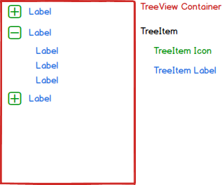

# TreeView Component

**TreeView** is a component that creates a hierarchical display of data. Example uses of TreeViews include a corporate hierarchy, a directory structure, a documentation center, and so on.

## Elements



**TreeView** is composed of **TreeItems** (nodes).<br>
**TreeItem** is composed of a **TreeItem Label**, and an optional **TreeItem Icon** if the node has children.<br>
**TreeItem Icon** is used to expand and collapse its particular node.

## API

### Component Props

| name   | type                | default  | required | description                                     |
| ---- | ------- | -------- | -------- | ---------------------------- |
| dataSource   | TreeItemData[]      |          | yes      | Collection of item data.       |
| itemRenderer | React.ComponentType | TreeItem | no       | Returns an JSX.Element to render as a tree node. |
| onSelectItem | React.EventHandler  | () => {} | no       | Callback to be invoked when an item is selected. |
| onFocusItem  | React.EventHandler  | () => {} | no       | Callback to be invoked when an item is focused.  |
| selectedItem | TreeItemData        |          | no       | Refers to the currently selected data item.      | 
| focusedItem  | TreeItemData        |          | no       | Refers to the currently focused data item.       |

### The Tree Item Props Interface

In order to render custom tree nodes, you need to provide an `itemRenderer` as described in the props table above.
The component (or function) should accept props that conform to (or extend) the `TreeItemProps` interface:

| name   | type    | default  | required | description                       |
| ------- | ----------- | -------- | -------- | ------------------------------- |
| item         | TreeItemData         |          | yes      | Item data to render.        |
| itemRenderer | React.ComponentType  | TreeItem | no       | Returns an JSX.Element to render as a tree node. |
| onItemClick  | TreeItemEventHandler | () => {} | no       | Callback to be invoked when the item label is clicked. |
| onIconClick  | TreeItemEventHandler | () => {} | no       | Callback to be invoked when the item icon is clicked.  |
| stateMap     | TreeViewStateMap     |          | yes      | A map that keeps the state of each item.    |

> Note the `itemRenderer` is required in order to enable the tree nodes to render nested nodes.

### The State Map

In order to manage the state of the tree items, each item is mapped to a `TreeItemState`.
This object encloses information about the item's state (is it selected? expanded? focused?).
It is required to propagate the state map through the tree items so they can access their own state and render accordingly.


## Code Examples

##### Sample data for the examples

```
const treeData: TreeItemData[] = [
    { label: 'Food Menu', children: [
        { label: 'Salads', children: [
            { label: 'Greek Salad' },
            { label: 'Israeli Salad' },
            { label: 'Caesar Salad' }
        ]},
        { label: 'Steaks', children: [
            { label: 'Filet Steak' },
            { label: 'Sirloin Steak' }
        ]},
        { label: 'Desserts', children: [
            { label: 'Pancakes' },
            { label: 'Muffin' },
            { label: 'Waffle' },
            { label: 'Cupcake' }
        ]}
    ]}
];
```

##### Example views

* Renders a TreeView

```
<TreeView dataSource={treeData} />
```

* Renders a TreeView with the ability to select an item.

```
const parentState = {
  selectedItem: Object;
};

function onSelectItem(selectedItem) {
  this.state.selectedItem = selectedItem;
}

<TreeView dataSource={treeData} selectedItem={this.state.selectedItem} onSelectItem={this.onSelectItem.bind(this)} />
```

## Style API

### Subcomponents (pseudo-elements)

| selector        | description | note            |
| --------- | ----------------- | --------------- |
| ::root | The root class for the **TreeItem**. |
| ::icon | The style for the **TreeItem Icon** which appears only if child nodes are available. |
| ::title | The style for the **TreeItem Label**. |

### Custom CSS States (pseudo-classes)

| State     | Description                                                         |
| --------- | ------------------------------------------------------------------- |
| :selected | Style to apply when the **TreeItem** is selected.                         |
| :focused  | Style to apply when the **TreeItem** is focused (by keyboard navigation). |

### Style Code Examples

```
.item {
    background-color: white;
}

.item:focused {
    border: 1px solid lightblue;
}

.item:selected {
    background-color: navy;
    color: white;
}
```
