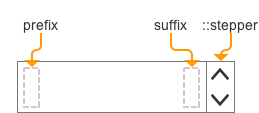

**Table of Contents**

- [Definition](#definition)
- [Elements](#elements)
- [Slider States](#slider-states)
- [Slider Props](#slider-props)
- [UI Customizations](#ui-customizations)
- [Behavior](#behavior)
  - [Keyboard](#keyboard)
  - [Mouse](#mouse)
  - [Touch](#touch)
- [Error handling](#error-handling)
- [Accessibility](#accessibility)
- [Examples](#examples)
- [Design](#design)

## Definition

The **NumberInput** component improves upon the native `<input type="number">` by providing ability to customize the stepper arrows design, a common React+Typescript API, and working out the kinks of native implementations.

## Elements

The NumberInput consists of a native input and a Stepper subcomponent, which provides customisable Up and Down buttons. Also, you can add more elements into it in the prefix, suffix and error slots, by passing the approprtiate props (see component props).

## Visual States

| State    | Description                            |
| :------- | -------------------------------------- |
| Default  | Default component appearance           |
| Hover    | User hovered any part of the component |
| Focus    | Browser is focused on the component    |
| Error    | The `error` property is not null       |
| Disabled | Component can not be changed           |

https://wix.invisionapp.com/share/9YCNHDR68#/screens/244465917

## Props

See [README.md](./README.md) for more info.

## UI Customizations

The NumberInput can be customized using:

`::stepper` subcomponent, which has subcomponents of its own

`::error` subcomponent

See [README.md](./README.md) for more info.

## Behavior

Changing value in the input via keyboard precisely mirrors the behavior of the stepper arrows.

When the value to be given by the stepper arrows/keyboard exceeds the min/max limits, the value is set to the corresponding min/max

When the user types a value, it isn't committed until enter, tab, click outside (or other committing events according to the description below) happen.

If the user types a value outside of slider range, on the value is set to the corresponding min/max on commit.

The component follows the external control pattern (value displayed is defined by the `value` property, and in order for the component to function, it should be bound to a state in the parent component, and the `onChange` handler should be set).

#### Keyboard 

| Keys                | Action                                   |
| ------------------- | ---------------------------------------- |
| type a number       | insert a value without committing it.    |
| key up              | increase value (& commit)                |
| key down            | decrease value (& commit)                |
| fn/ctrl + up / down | increase / decrease value by step * 10 (& commit) |
| tab                 | commits the value if needed, moves to next element (skips the stepper) |
| Shift+tab           | moves to previous element                |
| enter               | Commits the value (if value wasn't committed). If value already committed, tabs to next element |
| esc                 | removes focus (if in focus), discards non-committed new value (if value typed) |

**RTL** orientation

| Keys             | Action         |
| ---------------- | -------------- |
| key up / left    | increase value |
| key down / right | decrease value |

#### Mouse

| Event                   | Action                                   | NOTE |
| ----------------------- | ---------------------------------------- | ---- |
| hover                   | triggers the css :hover state            |      |
| click inside            | focuses the element, selects all text inside |      |
| click outside           | blurs, commits value if the value is not committed |      |
| click & drag on stepper | increases/decreases the value (on drag up/down or left/right) |      |

#### Touch

| Event                   | Action                                   | NOTE |
| ----------------------- | ---------------------------------------- | ---- |
| tap inside              | same as mouse click                      |      |
| tap outside             | same as mouse click                      |      |
| drag                    | up/down/left/right - increase/decrease value by step |      |
| tap on a stepper button | same as mouse click                      |      |

## Error handling

| Error                                    | Handling                                 |
| ---------------------------------------- | ---------------------------------------- |
| value (given as prop) out of min/max range | Show error in console                    |
| value (given as prop) out of step (e.g. min=0 / max=10, step=5, value=7) | value is shown as given                  |
| user sets value out of range             | set value within range (to max or min)   |
| the `error` property is passed           | This is used to give the user ability to manually indicate that there's an error in the input. Will render the content of the `error` property (node), and set the `:error` CSS state on the input itself |

## Accessibility

To be included

## Examples

 To be included

## Design

Link to assets:

https://wix.invisionapp.com/share/9YCNHDR68#/screens/244465917