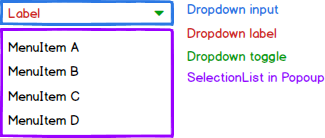

# Dropdown Components Specification

* [Definition]
* [Elements]
* [Properties]
* [Styles]
* [Accessibility]
* [Behavior]
* [Examples]
* [Design]

## Definition

The dropdown type components include the dropdown, autocomplete and multi-select. The Popup and SelectionList components are used internally, their prop interfaces enriching the dropdown with their functionality.

## Elements

### Dropdown & AutoComplete

### MultiSelect

## Properties

All dropdowns use the following interfaces:

* PopupProps

    See Popup specifications.

* Optionlist

    See SelectionList specifications.

Common Props (all dropdowns)

| Name | Type | Default | Required | Description |
| -- | -- | -- | -- | -- |
| disabled | boolean | false | no | see HTML specs |
| autoFocus | boolean | false | no | see HTML specs |
| open | boolean | false | no | Whether the Popup is shown |
| openOnFocus | boolean | false | no | Whether the Popup opens automatically when focus is gained |
| onSelect | (id: string) => void | NOP | no | Triggered when an item is selected in the list |
| children | any | null | no | Children to be rendered in the list, see SelectionList for further details |

* Dropdown Props

| Name | Type | Default | Required | Description |
| -- | -- | -- | -- | -- |
| selected | string | null | no | id of the selected item |

* AutoComplete Props

The AutoComplete is an extension of an input field of type text, thereby expanding its props.

| Name | Type | Default | Required | Description |
| -- | -- | -- | -- | -- |
| allowFreeText | boolean | true | no | Allows user to enter text which does not appear in the suggestion list |
| showNoSuggestions | boolean | false | no | Shows a message when there are no suggestions to show a user |
| noSuggestionsNotice | string \| func | "No Results" | no | Message to show in popup when there are no suggestions for the user. If function used then it renders an element in the popup |
| selected | string | null | no | id of the selected item |
| filter | func | prefix search function | no | Function used to filter results according to input |
| minCharacters | number | 0 | no | Number of characters required in input before suggestions appear |
| maxSearchResults | number | 0 (unlimited) | Maximum number of results to show for a filter match |

* MultiSelect Props

Supports AutoComplete props as well as the native text input props.

| Name | Type | Default | Required | Description |
| -- | -- | -- | -- | -- |
| selected | Array<String> | empty | no | list of selected ids |
| maxSelected | number | 0 (unlimited) | no | number of selections allowed |

div with icon for dropdown (up/down)
onChange
clearbutton

## Properties

## Styles

| Name | Description |
| -- | -- |
|

### States

| active
| focus
| disabled
| readonly
| hover
