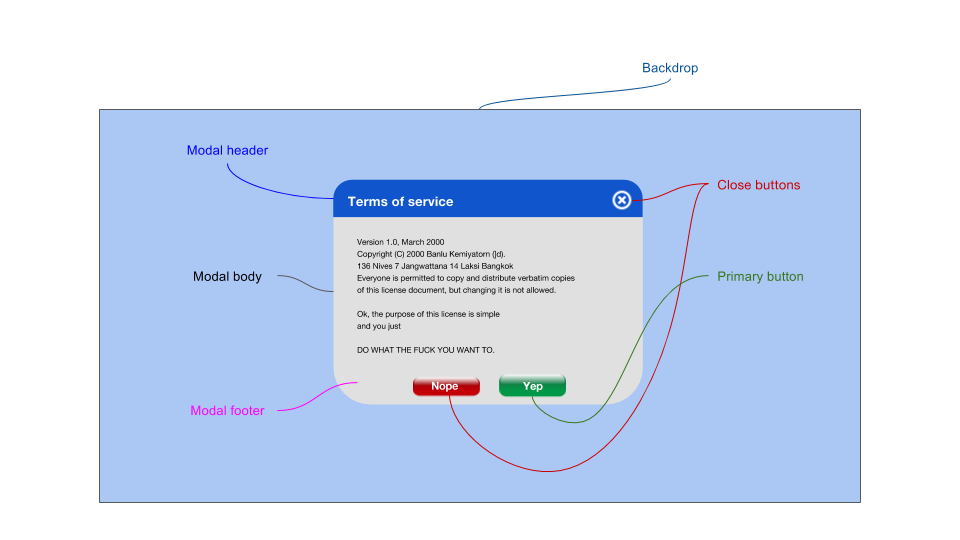

# Modal

The **Modal** component is a window that opens on top of the application's main window. It blocks the main application's interactivity, and the application flow. In practice, it usually leaves the main app visible in the background, faded out. Users must interact with the modal in order to return to the application flow.

Interacting with the modal can consist of:  
- clicking its primary button
- clicking its backdrop
- clicking its close/cancel button(s)



## Use Cases

* A modal can be used to edit a complex formula inside of a spreadsheet
* A modal can be used in order to require sign-in before using a certain feature of an app
* A modal can be used to display a photograph or video in focus on top of the screen

## Basic Implementatoin

### Modal Attributes

The **Modal** component allows the user to control the following configutations:  
* `isOpen` indicates that the modal is open and shown on the screen
<!-- * `backdropClosesModal` indicates whether clicking the backdrop of this modal should close it -->
* `onAfterOpen` an optional function that runs immediately after the modal is switched from closed to open
* `onRequestClose(source)` is an optional function that runs when closing the modal is requested, and usually will pass the source of the click (e.g., backdrop, close button, cancel button)
* [Position](#modal-position) 
* [Sizing](#modal-sizing)

```jsx
<Modal
    isOpen={this.state.open}
    onRequestClose(source)={this.close && this.log(source)}
/>
```

### Modal Roles

Modal children can have a `role` attribute that allows them to declare which part of the modal is described by the node.

| role | class | description |
| --- | --- | --- |
| header | .header | the header of the modal, in many cases containing a title for the modal as well as a close button |
| header-close-button | .header-close-button | the close button located in the header. Normally, at the top-right corner of the modal |
| header-title | .header-title | the title of the modal found in the header |
| body | .header-body | the body of the modal |
| footer | .footer | the footer of the modal, usually containing at least two options: 1) to close or cancel the action, 2) to perform the primary action required by the modal (e.g., submit the form, login to the app) |
| footer-close-button | .footer-close-button | the close or cancel button found in the footer |
| footer-primary-button | .footer-primary-button | the primary button of the modal |

Children with a role may also accept different props, such as a `title` for the child marked as header.

```jsx
<Modal
  ... >
  <div role='header'>
    <button role='header-close-button' />
  </div>
</Modal>
```

### Modal Position

Normally, the modal opens in relation to the screen and not its parent component. Because it breaks the flow of the entire page, it needs to be prominent on the entire view-port. 

Its possible positions are top, **middle**, bottom and left, **center**, right (defaults bolded).

It can have an offset from each of its non-default positions (top, bottom, right, left). The offset direction is opposite to its starting position (leftOffset pushes left to right, rightOffset pushes right to left).

```jsx
<Modal
  position={left}
  topOffset={10}
  leftOffset={10}>
</Modal>
```

#### Contained modals

There are special cases where a modal is relevant only to a certain part of an application, and will only block its flow.

```jsx
<Modal
  ...
  container={this.container}>
  <div>
    content
  </div>
</Modal>
```

### Modal Sizing

The modal size has 3 presets (small, medium and large), and can accept custom width and height using the `width` and `height` attributes. If `height` is declared, overflow can be declared or will default to `overflow:visible`.


```html
<Modal width={width.small}></Modal>
<Modal width={width.large}></Modal>
<Modal width={768}></Modal>
```

## Modal Props

| Prop | Type | Default | Description |
| --- | --- | --- | --- |
| isOpen | bool | false | Managed by state; this is how to control the visibility of the modal|
| onAfterOpen | func | undefined | |
| onRequestClose(source) | func | undefined | The function used to handle cancel events on the modal; typically sets the open state to false. It is passed a source, as one of a number of possible closing options |
| children | any |  | children nodes of the modal |
| width | number/enum | 'medium' | Explicitly set a numeric width or provide one of three sizes; 'small', 'medium', 'large' - 320px, 640px, 960px respectively|
| height | number/enum | 'auto' | Explicitly set a numeric height of the modal|
| container | any | null |  |
| aria-* | - | - |  |
| aria-role | - | 'dialog' |  |

### Close Request Sources

| Source | Description |
| --- | --- |
| backdropClick | request to close the modal because the backdrop of the modal was clicked |
| escKeyPress | request to close the modal because the `ESC` button was pressed |
| headerCloseClick | request to close the modal came from a child in the role `header-close-button` |
| footerCloseClick | request to close the modal came from a child in the role `footer-close-button` |
| footerPrimaryClick | request to close the modal came from a child in the role `footer-primary-button`  |

### Modal Header Props

| Prop | Type | Default | Description |
| --- | --- | --- | --- |
| children | node | undefined | Alternative to using the text attribute, for when you need more control over the content|
| onClose | func | undefined | What to do when the user clicks the close button|
| title | string | '' | Creates a title for the modal |

## Stylable API

### Custom Pseudo-Elements

| Name | Type | pseudo classes | Description |
| -- | -- | -- | -- |
| ::header | div |  | the header of the modal |
| ::header-close-button | button |  | the close button in the header |
| ::header-title | span |  | the title of the modal |
| ::body | div |  | the main content of the modal |
| ::footer | div |  | the footer of the modal |
| ::footer-close-button | button |  | the close button in the footer |
| ::footer-primary-button | button |  | the primary button of the modal |

### Custom Pseudo-Classes (Modal States)

| state | description |
|---|---|
| :open | the open state of the modal |
| :loading | the loading state of the modal if it takes time to open |
| :error | modal displaying an error related to its loading |

## Accessibility

The Modal component is by default given `aria-role="dialog"`. 

You may give the Modal any aria attributes, such as labelledby, describedby, hidden and 

### Keyboard Handling

* `Esc` - closes the modal
* `Tab` - tab order applies only to parts of the modal, excluding the backdrop (and ignoring the app in the background)
