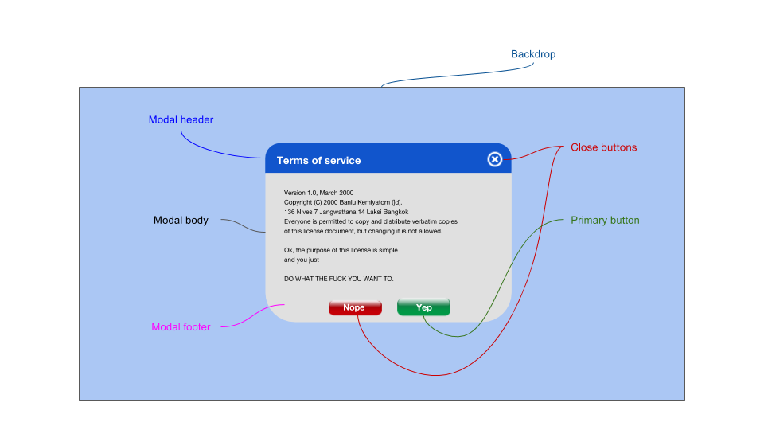

# Modal

Brief component description

The **Modal** component is a window that opens on top of the application's main window. It blocks the main application's interactivity, and the application flow. In practice, it usually leaves the main app visible in the background, faded out. Users must interact with the modal in order to return to the application flow.

## Elements



The modal consists of a header, body and footer. The header usually contains a title and optionally a close button, the body contains the main modal content, and the footer usually contains a primary button and another close button. The modal has a backdrop that blocks interactivity with the rest of the screen.

Interacting with the modal can consist of:  
- clicking its primary button
- clicking its backdrop
- clicking its close/cancel button(s)

## Use Cases

* A modal can be used to edit a complex formula inside of a spreadsheet
* A modal can be used in order to require sign-in before using a certain feature of an app
* A modal can be used to display a photograph or video in focus on top of the screen

## API

### Component Props

| Prop | Type | Default | isRequired | Description |
| --- | --- | --- | --- | --- |
| isOpen | bool | false | yes | Managed by state; this is how to control the visibility of the modal|
| onAfterOpen | func | undefined |  |  |
| onRequestClose(source) | func | undefined |  | The function used to handle cancel events on the modal; typically sets the open state to false. It is passed a source, as one of a number of possible closing options |
| children | any |  |  | children nodes of the modal |
| aria-* | - | - | - | ARIA attributes. Used for accessibility purposes, to describe the screen to a screen-reader |
| aria-role | - | 'dialog' |  | Default ARIA attribute of the modal window, defines its role as a `dialog` |

#### Modal Roles

Modal children can have a `role` attribute that allows them to declare which part of the modal is described by the node.

| role | class | description |
| --- | --- | --- |
| header | .header | the header of the modal, in many cases containing a title for the modal as well as a close button |
| header-close-button | .header-close-button | the close button located in the header. Normally, at the top-right corner of the modal |
| header-title | .header-title | the title of the modal found in the header |
| body | .header-body | the body of the modal |
| footer | .footer | the footer of the modal, usually containing at least two options: 1) to close or cancel the action, 2) to perform the primary action required by the modal (e.g., submit the form, login to the app) |
| footer-close-button | .footer-close-button | the close or cancel button found in the footer |
| footer-primary-button | .footer-primary-button | the primary button of the modal |

### `onRequestClose` Sources

| Source | Description |
| --- | --- |
| escKeyPress | request to close the modal because the `ESC` button was pressed |
| backdropClick | request to close the modal because the backdrop of the modal was clicked |
| headerCloseClick | request to close the modal came from a click on the child in the role `header-close-button` |
| footerCloseClick | request to close the modal came from a click on the child in the role `footer-close-button` |
| footerPrimaryClick | request to close the modal came from a click on the child in the role `footer-primary-button`  |
| backdropTap | request to close the modal because the backdrop of the modal was tapped |
| headerCloseTap | request to close the modal came from a tap on the child in the role `header-close-button` |
| footerCloseTap | request to close the modal came from a tap on the child in the role `footer-close-button` |
| footerPrimaryTap | request to close the modal came from a tap on the child in the role `footer-primary-button`  |

### Code Example

**Example 1:**

```jsx
<Modal
    isOpen="this.state.open"
    onRequestClose="this.whenModalCloses">
    <div role="header">
        <span role="title">Terms of service</span>
        <button role="header-close-button" />
    </div>
    <div role="body">
        <span>content</span>
    </div>
    <div role="footer">
        <button role="footer-primary-button">Yep</button>
        <button role="footer-close-button">Nope</button>
    </div>
</Modal>
```

## Style API

Normally, the modal opens in relation to the screen and not its parent component. Because it breaks the flow of the entire page, it needs to be prominent on the entire view-port. 

### Subcomponents (pseudo-elements)

| selector | description | type |
| -- | -- | -- |
| ::header | the header of the modal | HTML Element |
| ::header-close-button | the close button in the header | button |
| ::header-title | the title of the modal | HTML Element |
| ::body | the main content of the modal | HTML Element |
| ::footer | the footer of the modal | HTML Element |
| ::footer-close-button | the close button in the footer | button |
| ::footer-primary-button | the primary button of the modal | button |

### Custom CSS States (pseudo-classes)

| state | description |
|---|---|
| :open | the open state of the modal |
| :loading | the loading state of the modal if it takes time to open |
| :error | modal displaying an error related to its loading |

## Design

https://app.zeplin.io/project/5864e02695b5754a69f56150/screen/588f14b1bfaae69a22be1620