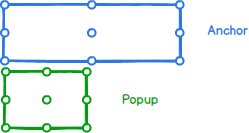
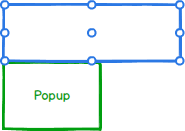
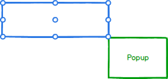
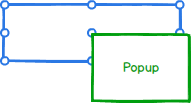
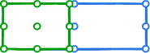

# Popup Component Specification

The Popup enables positioning content next to an anchor element.

* [Position and Collision](#position-and-collision)
* [Properties](#properties)
* [Input Handling](#input-handling)
* [Examples](#examples) - Based on the stages of builds

## Position and Collision

* Position - The point and pivot for popup to anchor alignment
  * Anchor Position - Horizontal:
    * left - the left point of the anchor element
    * center - the center point of the anchor element
    * right - the right point of the anchor element
  * Anchor Position - Vertical:
    * top - the top point of the anchor element
    * center - the center point of the anchor element
    * bottom - the bottom point of the anchor element
  * Popup Position - Horizontal:
    * left - the left point of the popup element
    * center - the center point of the popup element
    * right - the right point of the popup element
  * Popup Position - Vertical:
    * top - the top point of the popup element
    * center - the center point of the popup element
    * bottom - the bottom point of the popup element

### Positioning

* Points of reference

    There are 9 points on the anchor and popup element to be used as reference to where the popup will open. The chosen anchor point will be the location on which the popup will pivot. The popup point will be the location on the popup element which will be anchored to the point on the anchor element.

    

* Anchor default

    

  * Anchor { vertical: 'bottom', horizontal: 'left'}
  * Popup { vertical: 'top', horizontal: 'left'}

* Anchor sample position

    

  * Anchor { vertical: 'bottom', horizontal: 'right'}
  * Popup { vertical: 'top', horizontal: 'left'}

* Anchor sample position

    

  * Anchor { vertical: 'center', horizontal: 'center'}
  * Popup { vertical: 'top', horizontal: 'left'}

* Popup sample position

    

  * Anchor { vertical: 'bottom', horizontal: 'left'}
  * Popup { vertical: 'bottom', horizontal: 'left'}

* Popup sample position

    

  * Anchor { vertical: 'bottom', horizontal: 'left'}
  * Popup { vertical: 'top, horizontal: 'right}


* Collision - The behavior of the popup when viewport limitations collide with the the position property
  * Horizontal Collision:
    * flip - Checks if the opposite side of the anchor has more space and if so flips it.
    * fit - Shifts the popup away from the edge of the viewport until it has enough space or reaches other side of viewport
    * flipfit - Applies flip logic and then fit logic
    * none - no collision detection
  * Vertical Collision - same as horizontal

## Properties

| Name | Type | Default | Required | Description |
| -- | -- | -- | -- | -- |
| anchor | Node \| Point | none | Yes | The element to be used as an anchor for the popup (will open next to it). |
| open | boolean | false | no | Whether to show or hide the Popup |
| onOpen | Triggered when the popup is opened | NOOP | no | Triggered when the popup is shown |
| onClose | Triggered when popup is closed | NOOP | no | Triggered when the popup is closed |

* The following props should be placed in a PopupProps interface since they will need to be passed from higher order components.

| Name | Type | Default | Required | Description |
| -- | -- | -- | -- | -- |
| anchorPosition | PositionPoint | { vertical: 'bottom', horizontal: 'left'} | no | The point on the anchor element to which the popupPosition will attach to |
| popupPosition | PositionPoint | { vertical: 'top', horizontal: 'left'} | no | The point from which the popupPosition will pivot |
| collision | ICollision| {'vertical: 'none', horizontal: 'none'} | No | Specify the collision behavior of the component |
| syncWidth	| boolean |	true | no | If true, the width of the popup will be set to the width of the anchor. If false, it will be set to the width of the children |
| maxHeight | number | 500 | no | The max height in pixels of the popup. If set to 0, the property will be ignored and receive height from its content |

## Input Handling

### Keyboard

* Esc - closes the popup
* Click outside - closes the popup

## Examples

* Primary use case

  Given a popup is attached to an element, when rendered, then it should appear on the screen
    ```
    render() {
     return (
         <div ref={ (MyAnchor) => {this.anchorElement = MyAnchor;} }>Anchor Element</div>
         <Popup anchor={this.anchorElement}>
               <div>Popup Element</div>
         </Popup>
     );
   }
   ```

* Popup inside a React component parent

    Given a component is created with a popup connected to an anchor element, when rendered and the parent component receives focus, then it should appear on the screen

* Popup opens according to anchor positioning

    Given a popup is connected to an anchor element, when the anchor position is changed, then the popup will open on that specific position.

* Popup opens according to popup positioning

    Given a popup is connected to an anchor element, when the popup position is changed, the popup will pivot according to that position in relation to the location on the anchor to which it was set.

* Collision rules are observed

    Given a popup is connected to an anchor element, when the popup does not have enough space in the viewport, then it will realign according to the collision rules.

* Open and close events

    Given a popup, when it opens or closes, then registered open and close events are triggered.

* Right-click menu

    Given a popup, when the user right-clicks on a certain point on the screen, then a popup opens at that specific point (collision rules apply of course).
