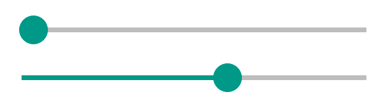
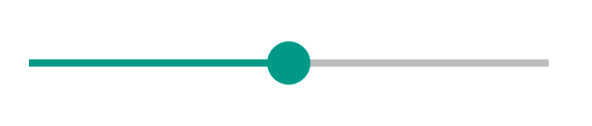
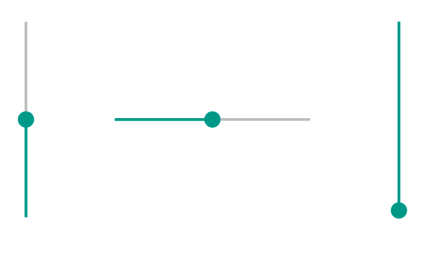
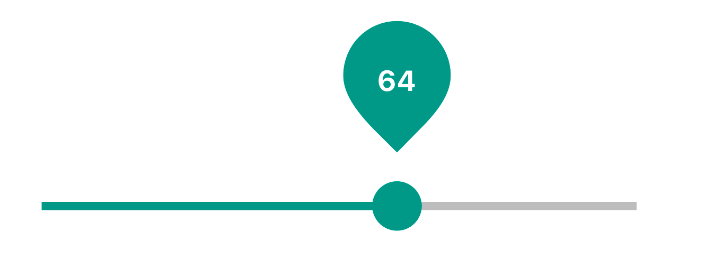

[TOC]

## Definition

**Slider** is a component that allows users to input or select value from a range.

**Flows**
Sliders are great for adjusting settings that reflect intensity levels (volume, brightness, color saturation) or for selecting particular range (years period, price range)

* [Definition](#definition)
* [Elements](#elements)
* [Slider states](#sliderstates)
* [Slider props](#slider props)
* [UI customizations](#ui customizations)

## Elements

Slider consists of a "bar" and a "handle". The "handle" is dragged across the "bar" in order to give the slider a desired value.

## Slider States

| State    | Description                         | Link to design |
| :------- | ----------------------------------- | -------------- |
| Default  | Default component appearance        |                |
| Hover    | User hovered over bar OR handle     |                |
| Focus    | Browser is focused on the component |                |
| Click    | User clicks on bar OR handle        |                |
| Disabled | Component can not be changed        |                |

## Slider Props

See [README.md](./README.md) for more info.

need Leo's help with pref / suf stuff description 

`prefix="<node>"`
`suffix="<node>"`

## UI Customizations

Slider can be customized using ::handle & ::bar subcomponents.

Link to README file.

## Behavior

### Keyboard 

| Keys            | Action                         |
| --------------- | ------------------------------ |
| key up / right  | increase value                 |
| key left / down | decrease value                 |
| fn right / left | set max / min value            |
| fn up / down    | increase / decrease value by X |
| tab             | moves to another component     |
| enter           | -                              |
| esk             | removes focus (if in focus)    |

**RTL** orientation

| Keys             | Action         |
| ---------------- | -------------- |
| key up / left    | increase value |
| key down / right | decrease value |

### Mouse

| Event             | Action                                   | NOTE                                     |
| ----------------- | ---------------------------------------- | ---------------------------------------- |
| hover             | highlight slider (both bar & handle)     | Event triggers on both bar & handle hover |
| drag              | moves handle one step forward / backwards | drag right/up -> increase value  \| drag down/left -> decrease value |
| click (on handle) | highlights handle                        | -                                        |
| click (on bar)    | moves handle to position where user clicked | -                                        |

###### links to ARIA compliant sliders (for reference): 

http://files.paciellogroup.com/blogmisc/ARIA/slider/
https://www.w3.org/TR/wai-aria-practices/examples/slider/slider-2.html

## Error handling

tbd 

## Accessibility

According to ARIA documentation, accessibility for slider is mostly covered with keyboard behavior.
The only accessibility issue that is not covered with slider is the absence of number input that it connected to this slider. But this is not a part of the spec (can be fixed by adding number input to slider).

reference links: 
https://www.paciellogroup.com/blog/2008/05/aria-slider-part-1/
https://www.paciellogroup.com/blog/2008/06/aria-slider-part-2/

## Examples

#### Simple

The `defaultValue` property sets the initial position of the slider. 

#### Stepped

By default, the slider is continuous. The step property causes the slider to move in discrete increments.

<!--see Fan slider for reference - https://www.w3.org/TR/wai-aria-practices/examples/slider/slider-2.html-->

#### Horizontal / Vertical Axis

The orientation of the slider can be reversed and rotated using the axis prop.

#### Tooltip

Tooltip display & customizations can be done via "tooltip" prop.  Link to [README.md](./README.md). 

