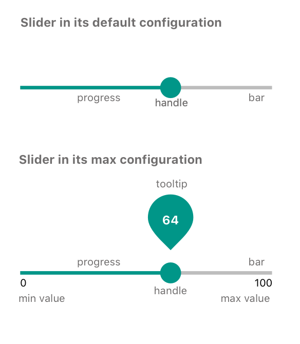

   **Table of Contents**

- [Definition](#definition)

- [Elements](#elements)

- [API](#api)

- [States](#states)

- [Accessibility](#accessibility)

- [Behavior](#behavior)

  - [Input Methods](#input-methods)
    - [Keyboard](#keyboard)
    - [Mouse](#mouse)
    - [Touch](#touch)

- [RTL](#rtl)

- [DOM structure](#dom-structure)

- [Design](#design)

  ​

## Definition

A **slider** an input where the user selects a value from within a given range.

Sliders are great for adjusting settings that reflect intensity levels (volume, brightness, color saturation).

## Elements

**Slider consists of:** ::bar, ::handle, ::progressBar, ::marks and ::progressMarks . The ::handle is dragged across the bar in order to give the slider a desired value. ::progressBar shows range from min value to the current value. ::marks and ::progressMarks are representing the step

> TBD (need to decide on how to implement tooltip)
> Also, you can display tooltip (e.g. to display current value) by adding child DOM element with relevant data-slot (data-slot="tooltip")

## API

**Props**

See [README.md](https://github.com/wix/stylable-components/blob/master/specs/specTemplate/README.md) for more info.

**Style**

Slider can be customized using ::handle, ::bar, and ::progress subcomponents.

See [README.md](./README.md) for more info.

## States

| State    | Description                              |
| :------- | ---------------------------------------- |
| Default  | Default component appearance             |
| Hover    | User hovered over bar / handle / slider area |
| Focus    | Browser is focused on the component (focus is displayed around the 'handle') |
| Active   | User clicks on bar, handle or mark       |
| Disabled | Component can not be changed             |
| Error    | Error state for the component (can be set with :error pseudo-class) |

Design [assets](https://zpl.io/2kRTvO)

## Accessibility

##### Keyboard behavior

Accessibility for slider is mostly covered with keyboard behavior (according to ARIA docs).
See [keyboard](#keyboard) section for reference.

##### Focus

Focus is placed on the slider (the visual object that the mouse user would move, also known as the thumb).

> NOTE:
> Focus is placed on handle according to ARIA doc
> https://www.w3.org/TR/wai-aria-practices/#slider

**Roles & Attributes**

| Role   | Attribute               | Element | Usage                                    |
| ------ | ----------------------- | ------- | ---------------------------------------- |
| slider |                         | div     | 1) Identifies the element as a slider. 2) Set on the `div` that represents as the movable thumb because it is the operable element that represents the slider value. |
|        | `tabindex=0`            | `div`   | Includes the slider thumb in the page tab sequence. |
|        | `aria-valuemax=255`     | `div`   | Specifies the maximum value of the slider. |
|        | `aria-valuemin=0`       | `div`   | Specifies the minimum value of the slide |
|        | `aria-valuenow=NUMBER`  | `div`   | Indicates the current value of the slider. |
|        | `aria-label`            | `div`   | Defines a string value that labels the current element. |
|        | `aria-labelledby=IDREF` | `div`   | Refers to the element containing the name of the slider. |
|        | `aria-describedby`      | `div`   | Identifies the element (or elements) that describes the object. |
|        | `aria-orientation`      | `div`   | Indicates the orientation of the slider element.Set to `vertical` for sliders with vertical orientation. Set to `horizontal` for sliders with horizontal orientation . |

See ARIA doc for reference - https://www.w3.org/TR/wai-aria-practices/examples/slider/slider-2.html

**Reference links:** 
<https://www.w3.org/TR/wai-aria-practices/#slider>
https://www.w3.org/TR/wai-aria-practices/#slidertwothumb>
https://www.paciellogroup.com/blog/2008/05/aria-slider-part-1/
https://www.paciellogroup.com/blog/2008/06/aria-slider-part-2/
http://ilyabirman.net/meanwhile/all/slider/

## Behavior

In order to change the value, user can:

1. drag handle over the slider bar 
2. click on the slider bar, mark OR clickable area to select the value from the range
3. click & drag  (click = click on handle, slider, mark & clickable area)

Changing the value is performed **from current value** to the next expected value. 
E.g. if min=0, max=10, step=2, value=3.5, then UP arrow key will give us 4 and Down arrow key will give us 2
Value can not exceed the min/max limits. If value is > or < than min/max it is automatically set to corresponding min/max.

If slider has a 'step' prop, handle should move across the slider bar only according to the step.

#### Validation

| Case                          | Handling          |
| ----------------------------- | ----------------- |
| `value` is less then `min`    | set to `min`      |
| `value` is greater than `max` | set to `max`      |
| `value` is empty              | set to `min` OR 0 |

#### Edge case handling

| Case                                     | Handling                                 | Example                                  |
| ---------------------------------------- | ---------------------------------------- | ---------------------------------------- |
| value is out of `step`                   | keep current value & display handle at the position that represents this value | `min=0` `max=10` `step=2` `value=3.5`. Handle is displayed at the position that represents 3.5. When user changes value (keyboard / mouse) we move it to the next expected, which is 4 or 2 |
| `step` is not set & `displayMarks` is set to true | show marks at the beginning and at the end of the slider |                                          |

### Input Methods 

#### Keyboard

| Keys                                 | Action                      |
| ------------------------------------ | --------------------------- |
| up / right arrow key                 | increase value              |
| left / down arrow key                | decrease value              |
| home ( fn/ctrl + left arrow key)     | set min value               |
| end ( fn/ctrl + right arrow key)     | set max value               |
| page up (fn/ctrl + up arrow key)     | increase value by X         |
| page down (fn/ctrl + down arrow key) | decrease value by X         |
| tab                                  | moves to next element       |
| shift + tab                          | moves to previous element   |
| esc                                  | removes focus (if in focus) |

**RTL** orientation

| Keys                   | Action         |
| ---------------------- | -------------- |
| up  / left arrow key   | increase value |
| down / right arrow key | decrease value |

#### Mouse

| Event                                    | Action                                   |
| ---------------------------------------- | ---------------------------------------- |
| hover (over bar / handle / clickable area) | highlight slider (bar, handle, marks)    |
| click & drag (right / left OR up / down) | change value according to direction of movement |
| click (on handle)                        | highlights handle                        |
| click (on bar / mark / clickable area)   | moves handle to position where user clicked |

#### Touch

| Event                                  | Action                                   | NOTE                                     |
| -------------------------------------- | ---------------------------------------- | ---------------------------------------- |
| tap (on handle)                        | highlights handle                        | we need the ability to expand clickable area for mobile devices |
| tap (on bar / mark / capable area)     | moves handle to position where user clicked | -                                        |
| tap & drag (right / left OR up / down) | change value according to direction of movement | -                                        |

###### Links to sliders (for reference): 

http://files.paciellogroup.com/blogmisc/ARIA/slider/
https://www.w3.org/TR/wai-aria-practices/examples/slider/slider-2.html
http://ilyabirman.net/meanwhile/all/slider/

## RTL

> RTL behavior is under discussion.

## DOM structure

TBD

## Design

Link to [assets](https://zpl.io/2kRTvO)
