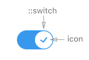

**Table of Contents**

- [Description](#description)

- [Elements](#elements)

- [API](#api)

- [States](#states-(if-applicable))

- [Accessibility](#accessibility)

- [Behavior](#behavior)
  - [Validation](validation)
  - [Edge case handling](edge-case-handling)

- [Input Methods](#input-methods)
  - [Keyboard](#keyboard)
  - [Mouse](#mouse)
  - [Touch](#touch)

- [RTL](#rtl)

- [DOM Structure](#dom-structure)

- [Design](#design)

  ​

## Description

Brief component description

> E.g.
> **Slider** is a component that allows users to input or select value from a range.
> Sliders are great for adjusting settings that reflect intensity levels (volume, brightness, color saturation).

### Elements

All elements of the component and their interactivity will be described, including a visual representation of it (image or animations).

> e.g.
>
> 
> **Toggle** consists of:  **switch**, **icon**, and **background**. The **switch** moves across the **background** in order to set the value to On/Off, and **icon** indicates the state of the value.

## API

**Props**

See [README.md](./README.md) for more info. 

**Style**

Brief description of pseudo-classes and custom CSS states that can be applied to the component.
See [README.md](./README.md) for more info. 

## States (if applicable)

A description of all the internal states of the component, and how they should be shown visually.

| State   | Description                              | Link to design |
| :------ | :--------------------------------------- | -------------- |
| Default | Default component appearance             |                |
| Hover   | User hovered over bar OR handle          |                |
| …       |                                          |                |
| Error   | Error state for the component (can be set with :error pseudo-class) |                |

Design [assets](https://zpl.io/2kRTvO)

## Accessibility

Our components should be accessible according to [WAI-ARIA 1.0](https://www.w3.org/TR/wai-aria/) standards.

We follow these guidelines when [using ARIA](https://www.w3.org/TR/using-aria/#intro)

When using a native `role` for a part of the component, the component will abide to the exact standards of their native counterparts. (For example, if using `role="button"` the element must be able to receive focus and a user must be able to activate the action associated with the element using both the enter (on WIN OS) or return (MAC OS) and the space key.)

> **Note:**
> Where relevant, the component should have default ARIA properties - for example, the Modal component will have a default `aria-role="dialog"`

In addition, if other best practices regarding the accessibility of a specific component apply, they should be detailed in this document.

##### Keyboard

> Specific cases related to keyboard behavior (if any)

##### Focus

> Describe focus behavior (e.g. different components can have different focus states)

##### Reference links

> Links to similar ARIA compatible components for reference

### Behavior

A detailed description of the component and its use-cases. This should cover all the different behaviors that the component exhibits, and how its different features should be implemented.

> User can drag handle over slider bar or click on the slider (in desired location) to select the value from the range.
>
> Changing the value (keyboard) is performed **from current value** to the next expected value. E.g. if min=0, max=10, step=2, value=3.5, then UP arrow key will give us 4 and Down arrow key will give us 2 Value can not exceed the min/max limits. If value is > or < than min/max it is automatically set to corresponding min/max.
>
> The component follows the external control pattern (value & handle position is defined by the `value` property, and in order for the component to function, it should be bound to a state in the parent component, and the `onChange` handler should be set).

#### **Validation **

Form validation defaults need to be addressed, as well as the component behavior when validation is broken.

> E.g. 
> Time Input component will address inputs that fail validation like letters, numbers larger than 24 for hours, numbers larger than 59 for minutes, etc. What should happen, what should be shown to the user, etc.

The component may allow a developer to use his own validation patterns where relevant. **In such a case, there should be an example implementation in the readme doc.**

#### Edge case handling

| Case                                     | Handling                                 |
| ---------------------------------------- | ---------------------------------------- |
| value out of min/max range               | Show error in console and set value to corresponding min/max |
| value out of step (e.g. min=0 / max=20, step=5, value=7) | Show error in console, handle displays on 7. User can increase value (in this case 7 will change to 10) OR decrease value (7 will change to 5) and after that step will work as expected. |

## Input Methods

#### Keyboard

| Keys      | Action                      |
| --------- | --------------------------- |
| tab       | moves to next element       |
| shift+tab | moves to previous element   |
| esc       | removes focus (if on focus) |
| enter     |                             |

**RTL** ( if applicable )

| Keys | Action |
| ---- | ------ |
|      |        |

#### Mouse

| Event | Action                | NOTE                     |
| ----- | --------------------- | ------------------------ |
| hover | what happens on hover | Side notes (if relevant) |
| click |                       |                          |

#### **Touch**

| Event | Action              | NOTE                    |
| ----- | ------------------- | ----------------------- |
| tap   | what happens on tap | Side note (if relevant) |
| drag  |                     |                         |

## RTL

> We are deciding on how are we going to handle the RTL. Detailed description will be added later.

## DOM structure

Each component should have a visual style guide for all of its visual states and elements structure. This style guide will be based on the **Style API**, and a visual theme agreed upon as our reset style (Wix style).

If more themes exist, they should be shown as well, and available as options through change of theme.

In addition, a link to Zeplin or a similar system is optional.

## Design

Link to [assets](link goes here)
