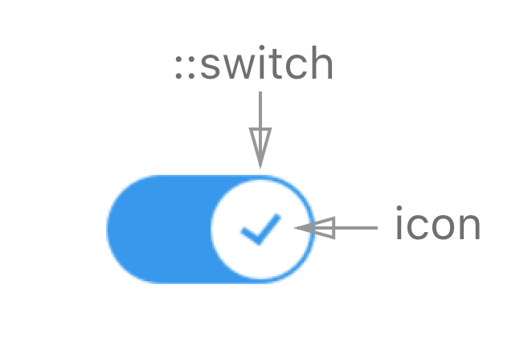

**Table of Contents**

- [Definition](#definition)
- [Elements](#elements)
- [Slider States](#slider-states)
- [Slider Props](#slider-props)
- [UI Customizations](#ui-customizations)
- [Behavior](#behavior)
- [Keyboard](#keyboard)
- [Mouse](#mouse)
- [Error handling](#error-handling)
- [Accessibility](#accessibility)
- [Examples](#examples)

## Definition

A toggle switch is used as an on/off control

## Elements

**Toggle consists of:**  "switch", "icon" and "background". The "switch" moves across the "background" in order to set the value to On / Off and "icon" indicates the state of the value.

## Visual States

| State          | Description                         |
| -------------- | ----------------------------------- |
| On             | Toggle is on / checker              |
| Off            | Toggle is off / unchecked           |
| On + hover     | Toggle is on / checker & hovered    |
| Off + hover    | Toggle is off / unchecked & hovered |
| On + disabled  | Toggle is on & disabled             |
| Off + disabled | Toggle is off & disabled            |

Design [assets](https://zpl.io/1PLfpV)

## Props

See [README.md](./README.md) for more info.

## UI Customizations

Toggle can be customized using ::switch and ::background subcomponents.

See [README.md](./README.md) for more info.

## Behavior

User can hit toggle to switch between on / off value. 

Toggle can be rendered with & without icons (this is controlled by `displayIcon`, `iconChecked` & `iconUnchecked` properties. For more info see [README.md](./README.md)).

The component follows the external control pattern (value & handle position is defined by the `value` property, and in order for the component to function, it should be bound to a state in the parent component, and the `onChange` handler should be set).

### Keyboard

| Keys        | Action                                   |
| ----------- | ---------------------------------------- |
| tab         | moves to next element                    |
| shift + tab | moves to previous element                |
| enter       | -                                        |
| space       | switch toggle to On / Off correspondingly (if toggle is in focus) |
| esc         | removes focus (if in focus)              |

**RTL** orientation does not change keyboard behavior

### Mouse

| Event                 | Action                                   | NOTE                                     |
| --------------------- | ---------------------------------------- | ---------------------------------------- |
| hover                 | highlight toggle (both switch & background) | Event triggers on both switch & background hover |
| click (on switch)     | switch toggle to On / Off correspondingly | Event triggers on Mouse Release event    |
| click (on background) | switch toggle to On / Off correspondingly | Event triggers on Mouse Release event    |

### Touch

| Event               | Action                                   | NOTE                            |
| ------------------- | ---------------------------------------- | ------------------------------- |
| tap (on handle)     | switch toggle to On / Off correspondingly | Event triggers on Touch Release |
| tap (on background) | switch toggle to On / Off correspondingly | Event triggers on Touch Release |

## Error handling

TBD

## Accessibility

For now accessibility for toggle is covered with keyboard behavior & label prop that shows text hint.

## Examples

1. Put here the example of component with icons for On / Off states
2. Put here the example of component with No icons 
3. Put here the example of component with custom style

Examples will be here once component is done. 

## Design

Link to [assets](https://zpl.io/1PLfpV)