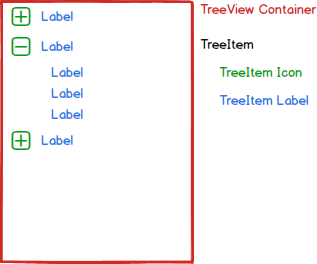

# TreeView Component Specification

A typed React TreeView component. The TreeView is a generic container in the sense that it can work with any kind of data and be styled according to a specific implementation.

* [Elements](#elements)
* [Internal Implementation](#internal-implementation)
  * [TreeItem](#treeitem)
  * [ItemRenderer](#default-itemrenderer)
* [Properties](#properties)
* [Methods](#methods)
* [Input Handling](#input-handling)
* [Examples](#examples)

## Elements



## Internal Implementation

### TreeItem

The TreeItem is used internally for representing nodes.

#### Properties

| Name | Type | Default | Required | Description |
| -- | -- | -- | -- | -- |
| expanded | enum (not observable): [true, false, pending] | false | No | Shows child nodes if true or collapses them if false. Pending states |
| selected | boolean (not observable) | false | No | Node is selected or not |
| enabled | boolean | true | No | Enables or disables a node. A disabled node cannot be expanded/collapsed directly (search can do it) or traversed using keyboard, or selected. |
| data | Object | none | Yes | Reference to the data object for the item |

### ItemRenderer

The default ItemRenderer supplied with the tree. Draws an arrow icon (if relevant) with the title for each node.


The itemRenderer is responsible adding the 3 tree events to each node it renders.

#### Properties

| Name | Type | Default | Required | Description |
| -- | -- | -- | -- | -- |
| item | TreeItem | none | Yes | The root node to render |

#### Style

Supports the following style states for each node (note that some styles will appear in conjunction):
* hover

    
* expanded true/false/pending

    
* selected

    
* enabled

    

The following static styles should be used:

| Name | Description |
| -- | -- |
| root | The root class for the node |
| icon | The style for the arrow icon which appears only if child nodes are available |
| title | The style for the node title |

## Properties

The TreeView implements the OptionList intefarface (dataSource, dataScheme and itemRenderer props).

| Name | Type | Default | Required | Description |
| -- | -- | -- | -- | -- |
| selectedItem | Object reference | null | No | The selected object, by default none is selected |
| keyboardNavigation | boolean | true | No | When enabled, user can traverse the tree using keyboard arrow keys |
| loadOnDemand | boolean | false | No | Whether parent nodes are populated with children before they are expanded. |
| loadMethod | func (params: item of type TreeItem), returns promise or list of Objects | null | no | The method used to load the children of a node when loadOnDemand is true |
| filter | func: (params: item of type Object) | default function | No | The default function searches according to the node title with exact prefix matching.|
| onSelect | func | null | no | Triggered when a selection has been changed |
| onExpand | func | null | no | Triggered when a node is expanded |
| onCollapse | func | null | no | Triggered when a node is collapsed |

## Methods

| Name | Parameters | Description |
| -- | -- | --
| collapse | item: Object (required) | Collapses all nodes under a provided node |
| collapseAll | none | Collapses all the tree nodes |
| expand | item: TreeItem (required) | Expands all nodes under a provided node |
| expandAll | boolean deep (default) or shallow | Expands all the tree nodes |
| selectItem | item: Object (required) | Selects an item in the three |

## Accessibility

### Roles

* Root role - tree
* Child node role - treeitem

### Aria Attributes

### Focus

## Input Handling

### Keyboard Navigation

* Home -> highlights ths first item in the TreeView
* End -> highlights the last item in the TreeView
* Enter -> Selects current highlighted item (does not expand it though)
* Up arrow -> highlights previous item
* Down arrow -> highlights next item
* Left arrow ->
  * if child then highlights parent
  * if parent then collapses it
* Right arrow ->
  * expands item and highlights it
  * if item was already expanded then highlights the first child

## Stages of development

Where relevant show code examples to be used in the documentation later on.

* Render a tree (one icon, several nodes hierarchy) using the default renderer -> able to select nodes

### Examples
```
const treeData: TreeItemData[] = [
    { label: 'Food Menu', children: [
        { label: 'Salads', children: [
            { label: 'Greek Salad' },
            { label: 'Israeli Salad' },
            { label: 'Caesar Salad' }
        ]},
        { label: 'Steaks', children: [
            { label: 'Fillet Steak' },
            { label: 'Sirloin Steak' }
        ]},
        { label: 'Desserts', children: [
            { label: 'Pancakes' },
            { label: 'Muffin' },
            { label: 'Waffle' },
            { label: 'Cupcake' }
        ]}
    ]}
];
```
* Renders a tree view
```
<TreeView dataSource={data} />
```
* Renders a tree view with the ability to select an item
```
const parentState = {
  selectedItem: Object;
};

function onSelectItem(selectedItem) {
  this.state.selectedItem = selectedItem;
}

<TreeView dataSource={data} selectedItem={this.state.selectedItem} onSelectItem={this.onSelectItem.bind(this)} />
```


* Render a tree (like above) with ability to expand/collapse nodes
* Render a tree (one icon, several nodes hierarchy) using the traverse children and a non-default item renderer that has a type for a parent node and different type for all children
```
const data = [
    {

      "id": 1,
      "name": "Felix",
      "mood": "crazy",
      "owner": { "id": 5, "name": "Pat Sullivan" }
      "kittens": [
          {
            "name": "Son1",
            "mood": "reasonable"
          },
          {
            "name": "Daughter1",
            "mood": "un-reasonable"
          }
      ]

    },
    {
      "id": 2,
      "name": "Gorbachev",
      "mood": "awesome",
      "owner": { "id": 6, "name": "Aaron Patterson" }
    }
  ];
```
* Render a tree which shows keyboard navigation working
* Filter tree items (by defualt: using string query)
* Filter tree items (using a custom search function)
* Lazy loading -> implement the loadMethod and pending state


* Create a directory view in a tree (load a directory, show files, ...) -> a demo project


